# Phân Tích Chi Tiết: Node-Level Graph Contrastive Learning (GRACE) Chống Mimicry Evasion Attack Trên Provenance Graph

## Mục lục

1. [Giới thiệu bài toán](#1-giới-thiệu-bài-toán)
2. [Phân tích dữ liệu khám phá (EDA)](#2-phân-tích-dữ-liệu-khám-phá-eda)
3. [Phân tích chi tiết từng mô hình](#3-phân-tích-chi-tiết-từng-mô-hình)
4. [Điểm mới và khác biệt của GRACE](#4-điểm-mới-và-khác-biệt-của-grace)
5. [Tại sao GRACE hiệu quả](#5-tại-sao-grace-hiệu-quả)
6. [Kết quả thực nghiệm](#6-kết-quả-thực-nghiệm)
7. [Đánh giá ưu nhược điểm](#7-đánh-giá-ưu-nhược-điểm)
8. [Hướng phát triển tương lai](#8-hướng-phát-triển-tương-lai)
9. [Thí nghiệm bổ sung: Phân tích chuyên sâu (Experiments 5–7)](#9-thí-nghiệm-bổ-sung-phân-tích-chuyên-sâu-experiments-57)
10. [Tổng hợp và Đánh giá cuối cùng](#10-tổng-hợp-và-đánh-giá-cuối-cùng)
11. [Đánh giá Kịch bản Thuyết trình 23 Slides](#11-đánh-giá-kịch-bản-thuyết-trình-23-slides)

---

## 1. Giới thiệu bài toán

### 1.1. Bối cảnh

Hệ thống phát hiện xâm nhập (IDS) dựa trên **provenance graph** là một hướng nghiên cứu quan trọng trong an ninh mạng. Provenance graph ghi lại toàn bộ **lịch sử nhân quả** giữa các thực thể hệ thống — process, file, socket — thông qua các system call. Mỗi hành vi (đọc file, ghi file, kết nối mạng, tạo tiến trình con...) đều được ghi nhận thành các cạnh (edge) nối các node trong đồ thị.

### 1.2. Vấn đề: Mimicry Evasion Attack

Kẻ tấn công sử dụng kỹ thuật **mimicry evasion** để "ngụy trang" hành vi độc hại:
- **Chèn hàng nghìn cạnh benign** vào đồ thị chứa hành vi tấn công
- Khi hệ thống IDS dùng **mean-pool** (trung bình hoá) để tính anomaly score cho toàn đồ thị, các cạnh benign "pha loãng" tín hiệu attack
- Kết quả: đồ thị attack trông giống hệt benign → hệ thống **không phát hiện được**

### 1.3. Giả thuyết nghiên cứu

Mô hình FGA (ARGVA) thất bại trước evasion (AUC chỉ ~0.55) do 2 nguyên nhân cốt lõi:

1. **Mean-pool**: Trung bình hoá N node embeddings → bị pha loãng khi ~95% node là benign
2. **Graph-level scoring**: Chỉ 1 số duy nhất cho toàn đồ thị → không xác định được vùng attack

### 1.4. Đề xuất giải pháp

**GRACE (Graph Contrastive Representation Learning)** — Node-level Contrastive Learning:
- **Self-supervised** — chỉ cần dữ liệu benign để huấn luyện
- **Node-level scoring** — mỗi node có anomaly score riêng
- **TopK aggregation** thay mean-pool → kẻ tấn công không thể pha loãng top-K scores
- **InfoNCE contrastive loss** thay reconstruction loss → embeddings phân biệt tốt hơn

---

## 2. Phân tích dữ liệu khám phá (EDA)

### 2.1. Tổng quan các tập dữ liệu

Notebook sử dụng **3 bộ dữ liệu chính** với các đặc điểm khác nhau, phục vụ cho 4 chuỗi thực nghiệm.

### 2.2. Dataset 1: tajka (Primary) — ProvDetector/FGA Format — EDA Chi Tiết

**Nguồn gốc**: Được trích xuất từ hệ thống Linux thông qua các syscall log, theo format của ProvDetector/FGA. Mỗi file CSV đại diện cho một provenance graph.

#### 2.2.1. Cấu trúc cột (Schema)

Dataset gồm **10 cột**, không có header — tên cột được gán trong code:

| # | Cột | Kiểu dữ liệu | Ý nghĩa | Ví dụ giá trị thực |
|---|-----|---------------|---------|---------------------|
| 1 | `sourceId` | object (string) | Đường dẫn/tên node nguồn | `usr/bin/systemTap`, `/lib/i386-linux-gnu/libpthread.so.0` |
| 2 | `sourceType` | object (string) | Loại node nguồn | `process`, `file`, `socket` |
| 3 | `destId` | object (string) | Đường dẫn/tên node đích | `"/usr/bin/python"`, `"/tmp/data.log"` |
| 4 | `destType` | object (string) | Loại node đích | `process`, `file`, `socket` |
| 5 | `syscal` | object (string) | System call thực hiện | `write`, `recv`, `read`, `execve`, `clone` |
| 6 | `processName` | object (string) | Tên tiến trình thực hiện syscall | `stapio`, `python`, `firefox` |
| 7 | `retTime` | int64 | Thời gian trả về (microseconds) | `3657800`, `4087668` |
| 8 | `pid` | int64 | Process ID | `9599` |
| 9 | `arg1` | object (string) | Tham số thứ nhất của syscall | `python` |
| 10 | `arg2` | object (string) | Tham số thứ hai | `[[python ../selenium-2.48.0/cnn.py]; ...]` |

#### 2.2.2. Dữ liệu mẫu (5 dòng đầu từ benign_train)

| sourceId | sourceType | destId | destType | syscal | processName | retTime | pid |
|----------|-----------|--------|----------|--------|-------------|---------|-----|
| `usr/bin/systemTap` | process | `"/usr/bin/python"` | process | execve | stapio | 3657800 | 9599 |
| `/lib/i386-linux-gnu/libpthread.so.0` | file | `"/usr/bin/python"` | process | read | python | 4087668 | 9599 |
| `/lib/i386-linux-gnu/libdl.so.2` | file | `"/usr/bin/python"` | process | read | python | 4336480 | 9599 |
| `/lib/i386-linux-gnu/libutil.so.1` | file | `"/usr/bin/python"` | process | read | python | 4518366 | 9599 |
| `/lib/i386-linux-gnu/libssl.so.1.0.0` | file | `"/usr/bin/python"` | process | read | python | 4726503 | 9599 |

**Diễn giải**: Mỗi dòng là một cạnh (edge) trong provenance graph. Dòng đầu tiên mô tả: process `stapio` (PID 9599) thực hiện syscall `execve` để chạy chương trình python. Các dòng sau: python đọc các thư viện .so cần thiết.

#### 2.2.3. Phân tích Missing Values

| Cột | % Missing |
|-----|-----------|
| sourceId | 0.00% |
| sourceType | 0.00% |
| destId | 0.00% |
| destType | 0.00% |
| syscal | 0.00% |
| processName | 0.00% |
| retTime | 0.00% |
| pid | 0.00% |
| **arg1** | **99.93%** |
| **arg2** | **99.93%** |

**Nhận xét**: `arg1` và `arg2` gần như hoàn toàn trống (99.93% missing) → 2 cột này **không được sử dụng** làm đặc trưng trong model. Model chỉ sử dụng `sourceType` và `destType` để xây dựng node features.

#### 2.2.4. Thống kê tổng quan (20 graphs/split, riêng test=10)

| Tập | Files loaded | Tổng edges | Shape |
|-----|-------------|------------|-------|
| Benign Train | 20 | **1,475,646** | (1,475,646 × 12) |
| Benign Test | 10 | **756,927** | (756,927 × 12) |
| Attack | 20 | **112,766** | (112,766 × 12) |
| Evasion | 20 | **2,428,570** | (2,428,570 × 12) |

**Số dòng trùng lặp**: 4,752,252 dòng trùng (trên tổng 5 cột đầu) — *điều này bình thường* vì cùng 1 cặp (source → dest) có thể xuất hiện nhiều lần với các syscall khác nhau.

#### 2.2.5. Thống kê theo từng graph (Per-Graph Edge Statistics)

| Tập | Số graphs | Mean edges | Min edges | Max edges | Std |
|-----|-----------|-----------|-----------|-----------|-----|
| **benign_train** | 20 | **73,782** | 50,344 | 102,459 | 15,265 |
| **benign_test** | 10 | **75,693** | 49,272 | 97,004 | 15,169 |
| **attack** | 20 | **5,638** | 5,597 | 5,717 | **32** |
| **evasion** | 20 | **121,428** | 121,427 | 121,430 | **1** |

**Nhận xét quan trọng**:
- **Attack graphs có std cực nhỏ (32)**: Tất cả attack graphs gần như cùng size (~5,600 edges) — chúng được tạo từ 1 kịch bản tấn công cố định
- **Evasion graphs có std ≈ 1**: Gần như **đồng nhất** (~121,428 edges) → kẻ tấn công chèn số lượng benign edges **rất chính xác**, có tính toán
- **Benign graphs có biến thiên lớn (std ~15,000)**: Phản ánh hoạt động hệ thống thực tế, đa dạng từ 50K đến 102K edges
- **Evasion có ~1.6x edges so với benign trung bình** nhưng **~21x so với attack** → mức pha loãng rất cao

#### 2.2.6. Phân phối Node Types

**Source node types (benign_train, 1,475,646 edges):**

| sourceType | Số lượng | Tỷ lệ |
|-----------|---------|--------|
| process | 680,369 | 46.1% |
| socket | 600,707 | 40.7% |
| file | 194,570 | 13.2% |

**Dest node types (benign_train):**

| destType | Số lượng | Tỷ lệ |
|---------|---------|--------|
| process | 796,044 | 53.9% |
| file | 653,092 | 44.3% |
| socket | 26,510 | 1.8% |

**Nhận xét**: Trong benign traffic, phần lớn tương tác là `process → process` và `process/file → file`. Socket chiếm tỷ lệ lớn ở source nhưng rất nhỏ ở dest — phản ánh pattern: socket nhận dữ liệu (`recv`) rồi process xử lý.

#### 2.2.7. Phân phối Syscall (Top-13, benign_train)

| Syscall | Số lượng | Tỷ lệ |
|---------|---------|--------|
| **write** | 651,337 | 44.1% |
| **recv** | 581,842 | 39.4% |
| **read** | 194,570 | 13.2% |
| send | 21,285 | 1.4% |
| recvmsg | 13,886 | 0.9% |
| recvfrom | 4,979 | 0.3% |
| sendto | 4,515 | 0.3% |
| writev | 995 | 0.07% |
| chmod | 760 | 0.05% |
| sendmsg | 710 | 0.05% |
| execve | 269 | 0.02% |
| clone | 269 | 0.02% |
| waitpid | 229 | 0.02% |

**Nhận xét**: 3 syscall chiếm **96.7%** tất cả edges: `write` + `recv` + `read`. Đây là hoạt động I/O bình thường. Syscall nguy hiểm như `execve` (chạy chương trình), `clone` (tạo tiến trình) chỉ chiếm 0.04%.

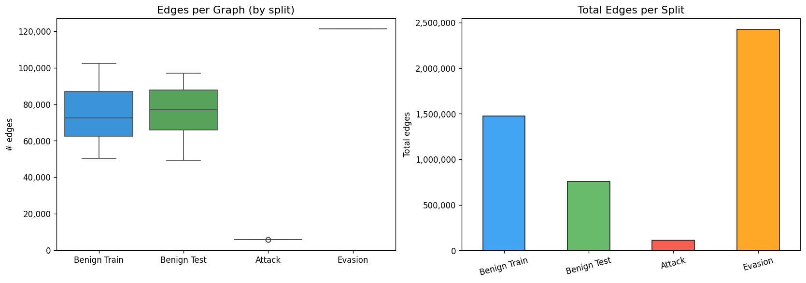

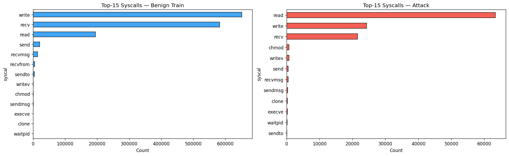

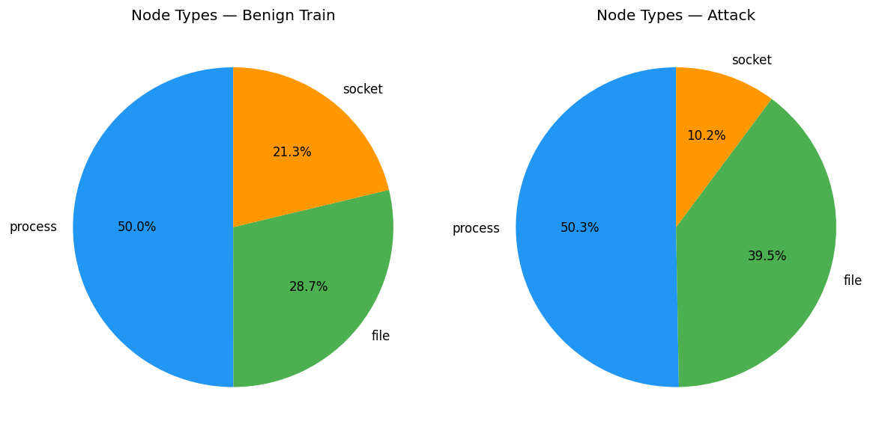

#### 2.2.8. Phân tích Unique Nodes theo Split

| Split | Unique src nodes | Unique dst nodes | Processes | Files | Sockets |
|-------|-----------------|-----------------|-----------|-------|---------|
| **benign_train** | 4,173 | 5,359 | 11 | 4,717 | 632 |
| **attack** | 2,839 | 2,320 | 9 | 2,307 | **5** |
| **evasion** | 1,290 | 458 | 11 | 317 | 131 |

**Nhận xét rất quan trọng**:
- **Attack chỉ có 5 sockets** (vs 632 của benign) → hành vi tấn công hầu như không dùng mạng, tập trung vào file operations
- **Attack có 2,839 unique source nodes** nhưng chỉ **5,638 edges/graph** → mỗi node chỉ có ~2 edges — **sparse graph**, dễ phân biệt
- **Evasion có ít unique nodes (1,290+458) nhưng rất nhiều edges (121,428)** → cùng vài node nhưng lặp lại hàng chục nghìn lần → chính là kỹ thuật "bơm" benign traffic
- **Cả benign_train và evasion đều có 11 processes** → evasion giả lập chính xác số lượng process của benign

#### 2.2.9. Phân chia dữ liệu Full-Scale

| Tập | Số lượng graph | Đặc điểm |
|-----|----------------|-----------|
| **Train (benign)** | 71 | Toàn bộ dữ liệu huấn luyện |
| **Test (benign)** | 29 | Toàn bộ dữ liệu kiểm tra |
| **Attack** | 100 | Toàn bộ dữ liệu tấn công |
| **Evasion** | 100 | Toàn bộ dữ liệu evasion |

#### 2.2.10. Cách biến đổi đặc trưng node (Node Features)

```
TYPE_MAP = {'process': 1.0, 'file': 2.0, 'socket': 3.0}
FEAT_DIM = 8
```

- Mỗi node được biểu diễn bằng **vector 8 chiều**
- `feat[0]` = giá trị type (process=1.0, file=2.0, socket=3.0)
- One-hot encoding: `feat[int(v)]` = 1.0 (vị trí 1, 2 hoặc 3)
- Các vị trí còn lại = 0
- Đây là đặc trưng **rất đơn giản**, chỉ dựa trên loại node → đủ để GRACE học được pattern phân biệt benign vs attack qua cấu trúc đồ thị

### 2.3. Cơ chế sinh Mimicry Evasion — `insertAttackPath.py`

**Câu hỏi quan trọng**: Nếu evasion data được sinh bởi script, tại sao EDA đã có sẵn dữ liệu evasion?

**Trả lời**: Đây là **pipeline 2 giai đoạn**, KHÔNG mâu thuẫn:

```
GIAI ĐOẠN 1: SINH DỮ LIỆU (chạy 1 lần, trước mọi thí nghiệm)
┌──────────────────────────────────────────────────────────────────┐
│  insertAttackPath.py                                              │
│                                                                    │
│  INPUT:                                                           │
│    ├── attackPath.pkl (attack edges từ DARPA scenario)            │
│    ├── benign.csv (benign provenance graph)                       │
│    └── benignSubstructs (benign actions để ngụy trang)            │
│                                                                    │
│  PROCESS: takeOver() → insertBenSubstructs() → insertAttackPath() │
│                                                                    │
│  OUTPUT: 100 file CSV evasion                                     │
│    └── lưu vào _extracted/.../evasion/*.csv                       │
└──────────────────────────────────────────────────────────────────┘
                         │
                         ▼  (files CSV đã tồn tại trên ổ đĩa)
                         
GIAI ĐOẠN 2: THÍ NGHIỆM (chạy nhiều lần, trong notebooks)
┌──────────────────────────────────────────────────────────────────┐
│  contrastive_experiment.ipynb / analysis.ipynb                     │
│                                                                    │
│  ev_files = sorted(EVASION_DIR.glob('*.csv'))                     │
│  evasion_graphs = load_graphs(ev_files, 'evasion')                │
│                                                                    │
│  → EDA, train model, đánh giá detection                           │
└──────────────────────────────────────────────────────────────────┘
```

**Tóm lại**: Script chạy **TRƯỚC** → sinh CSV → lưu vào thư mục `_extracted/evasion/`. Sau đó notebooks load CSV để phân tích. EDA "thấy" evasion data vì nó đã được sinh sẵn bởi script, **KHÔNG phải** do data có sẵn tự nhiên.

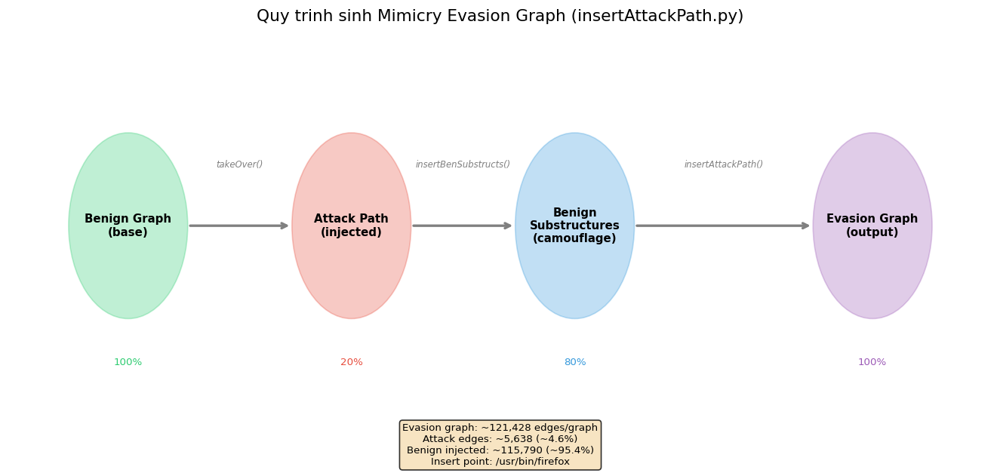

#### 2.3.1. Kiến trúc script `insertAttackPath.py`

Script gồm **5 hàm chính** thực hiện quy trình chèn tấn công vào graph benign:

| Hàm | Dòng | Chức năng |
|-----|------|-----------|
| `getAttackPath(fl)` | 17-19 | Load attack path từ file pickle, sắp xếp theo timestamp |
| `getBenignFile(fl)` | 23-31 | Load benign graph từ CSV, lấy danh sách PID |
| `takeOver(attackPath, parentP, benDf)` | 61-92 | **Chiếm quyền process** (giả lập attacker hijack process) |
| `insertAttackPath(attackPath, parentP, rows, ...)` | 95-194 | **Chèn attack path** vào graph |
| `insertBenSubstructs(benSub, parentP, rows, ...)` | 196-286 | **Chèn benign substructures** để ngụy trang |
| `saveRows(rows, fileName)` | 288-305 | Xuất evasion graph ra CSV |

#### 2.3.2. Quy trình sinh mimicry evasion — từng bước

**Input:**
1. `attackPath.pkl` — danh sách attack edges `[(src, dest, syscall, timestamp), ...]`
2. `benign.csv` — 1 benign provenance graph hoàn chỉnh
3. `benignSubstructs` — tập benign substructures dùng để ngụy trang

**Bước 1 — `takeOver()`: Chiếm quyền process**
```python
insertP = findInsertPoint(ben, "/usr/bin/firefox", inFront=True, processName='firefox')
ben, attack = takeOver(attack, insertP, benDF)
```
- Tìm process Firefox trong benign graph (`/usr/bin/firefox`)
- Tạo PID mới, thay thế PID gốc → giả lập attacker chiếm quyền điều khiển process
- Thêm 2 edges: `clone` + `execve` để "nối" attack vào benign process tree

**Bước 2 — `insertBenSubstructs()`: Chèn benign actions để ngụy trang**
```python
ben = insertBenSubstructs(benSub, parentP, ben, tempDir, numberOfClones=1)
```
- Chèn **hàng chục nghìn cạnh benign** (clone, file read/write, socket connections)
- Timestamp được tính theo công thức: `maxRetTime + (inter × rowCount) + random.randint(0, 100000)`
  - `inter = 40,255,518` microseconds (~40 giây) — khoảng cách giữa các event
  - `random.randint(0, 100000)` — thêm jitter để trông tự nhiên
- Mỗi benign substructure được **clone** process trước khi chèn → tạo process tree hợp lệ

**Bước 3 — `insertAttackPath()`: Chèn chuỗi tấn công**
```python
rows, malNodes = insertAttackPath(attack, insertP, ben, tempDir, numberOfClones=1)
```
- Chèn từng edge trong attack path vào graph
- Xử lý PID mapping: nếu PID attack trùng với PID benign → tạo PID mới
- Xử lý đường dẫn `/tmp/tmp` → thay bằng tempDir thực tế
- Track `malNodesMimi` — tập các node độc hại đã chèn

**Bước 4 — `saveRows()`: Xuất file CSV evasion**
```python
saveRows(rows, savePath)
```

#### 2.3.3. Kết quả sau khi sinh mimicry

| Thông số | Attack gốc | Evasion (sau mimicry) | Tỷ lệ |
|-----------|------------|----------------------|--------|
| Avg edges/graph | **~5,638** | **~121,428** | ×21.5 |
| Attack edges | ~5,638 | ~5,638 (giữ nguyên) | — |
| Benign edges chèn thêm | 0 | **~115,790** | **95.4%** tổng evasion |
| Std edges giữa các graphs | 32 | **1** | Rất đồng nhất |
| Insert point | — | `/usr/bin/firefox` | — |

**Ý nghĩa**: Evasion graph chứa **~4.6% attack edges** ẩn trong **~95.4% benign edges** — đây là mức pha loãng cực kỳ cao, đủ để đánh lừa hoàn toàn các hệ thống dùng mean-pool (FGA: AUC=0.55).

#### 2.3.4. Tấn công thích ứng trong notebook (In-memory)

Ngoài `insertAttackPath.py`, notebook `contrastive_experiment.ipynb` còn sinh thêm **4 loại adaptive attack** trực tiếp trong memory:

| Hàm | Chiến thuật | Mô tả |
|-----|-------------|-------|
| `adaptive_attack_fragmentation(g, n_fragments)` | **Fragmentation** | Chia attack node có degree cao thành N node nhỏ, mỗi node 1-2 cạnh |
| `adaptive_attack_feature_mimicry(g, centroids, model)` | **Feature Mimicry** | Gradient-based: thay đổi features attack nodes → gần benign centroids hơn |
| `adaptive_attack_topology_dilution(g, n_benign_edges)` | **Topology Dilution** | Thêm 500-2000 cạnh ngẫu nhiên giữa các nodes |
| `adaptive_attack_combined(g, ...)` | **Combined** | Kết hợp cả 3 chiến thuật — worst-case scenario |

**Ví dụ code Topology Dilution:**
```python
n_add = min(n_benign_edges, n_nodes * 3)
new_src = torch.randint(0, n_nodes, (n_add,))
new_dst = torch.randint(0, n_nodes, (n_add,))
mask = new_src != new_dst  # loại self-loops
E_aug = torch.cat([E, torch.stack([new_src, new_dst])], dim=1)
```

Tất cả 6 biến thể adaptive attack đều **thất bại** trước GRACE + TopK (AUC = 1.0 trên mọi kịch bản).

### 2.4. Quy trình Train / Test — Dữ liệu chia từ đầu

**Cấu trúc thư mục dữ liệu**:
```
_extracted/
├── train-test-provdetector-fga-pagoda/tajka/
│   ├── trainGraphs/     ← 71 CSVs (benign)   → DÙNG ĐỂ TRAIN
│   └── testGraphs/      ← 29 CSVs (benign)   → DÙNG ĐỂ TEST (đánh giá FPR)
│
└── provDetector-fga-pagoda-attack-evasion-graphs/
    ├── attackGraphs/    ← 100 CSVs (attack)   → TẬP TẤN CÔNG GỐC
    └── evasion/         ← 100 CSVs (evasion)  → ← SINH BỞI insertAttackPath.py
```

**Quy trình hoạt động từng bước**:

1. **Sinh evasion data** bằng `insertAttackPath.py`: attack + benign → evasion CSVs
2. **Huấn luyện GRACE** chỉ trên `trainGraphs/` (71 graphs benign) — model **không hề thấy** attack hay evasion
3. **Build benign reference**: encode toàn bộ trainGraphs → K-Means → 200 centroids
4. **Đánh giá** trên 4 tập riêng biệt, hoàn toàn tách rời:
   - `trainGraphs` → kiểm tra model không overfit
   - `testGraphs` → tính False Positive Rate
   - `attackGraphs` → tính TPR trên tấn công thông thường
   - `evasion/` → tính TPR trên tấn công mimicry

**Tóm lại**: Evasion data được **sinh tự động** bởi project, TRƯỚC khi train. Model train trên 1 tập (benign), test trên tập hoàn toàn khác (attack + evasion).

### 2.5. Dataset 2: Unicorn StreamSpot — EDA Chi Tiết

**Nguồn gốc**: StreamSpot dataset (Manzoor et al., 2016) — provenance graphs từ hệ thống Linux, format Unicorn. Nằm trong thư mục `_extracted/unicornStreamSpot/allFiles/`.

#### 2.5.1. Cấu trúc cột (Schema)

Format **hoàn toàn khác** tajka — dùng **tab-separated** (TSV), **6 cột**, không có header:

| # | Cột | Kiểu dữ liệu | Ý nghĩa | Ví dụ giá trị thực |
|---|-----|---------------|---------|---------------------|
| 1 | `srcId` | int | ID node nguồn (số) | `4145873`, `2383380`, `4810938` |
| 2 | `srcType` | char (1 ký tự) | Loại node nguồn | `a`, `b` |
| 3 | `dstId` | int | ID node đích (số) | `4145874`, `0`, `4145880` |
| 4 | `dstType` | char (1 ký tự) | Loại node đích | `c`, `d`, `e`, `f`, `g`, `h` |
| 5 | `edgeType` | char (1 ký tự) | Loại tương tác giữa nodes | `p`, `j`, `t`, `u`, `q`, `n`, `v`, `w` |
| 6 | `graphId` | int | ID graph chứa edge | `0` (benign), `100` (attack), `200` (evasion) |

**So sánh trực tiếp với tajka:**

| Đặc điểm | tajka (10 cột CSV) | StreamSpot (6 cột TSV) |
|-----------|-------------------|----------------------|
| Syscall name (`write`, `read`...) | ✓ `syscal` | ✗ Không có |
| Process name (`firefox`, `bash`...) | ✓ `processName` | ✗ Không có |
| Timestamp | ✓ `retTime` (microseconds) | ✗ Không có |
| Process ID | ✓ `pid` | ✗ Không có |
| Edge type | ✗ Không có | ✓ `edgeType` |
| Graph ID | ✗ Mỗi file = 1 graph | ✓ `graphId` |
| Node ID format | String (đường dẫn file/process) | Integer (số ID) |

→ StreamSpot **nghèo thông tin hơn** tajka rất nhiều — không có syscall, process name, hay timestamp. GRACE phải học pattern **hoàn toàn từ topology** (cấu trúc liên kết).

#### 2.5.2. Dữ liệu mẫu thực tế

**Benign Train (file `00.csv`, 246,024 edges):**

| srcId | srcType | dstId | dstType | edgeType | graphId |
|-------|---------|-------|---------|----------|---------|
| 4145873 | a | 4145874 | c | p | 0 |
| 4145873 | a | 4145875 | c | p | 0 |
| 4145873 | a | 4145876 | c | p | 0 |
| 4145873 | a | 4145878 | c | j | 0 |
| 4145873 | a | 0 | d | t | 0 |

**Attack (file `00.csv`, 28,442 edges):**

| srcId | srcType | dstId | dstType | edgeType | graphId |
|-------|---------|-------|---------|----------|---------|
| 2383380 | a | 2383381 | c | p | 100 |
| 2383380 | a | 2383382 | c | p | 100 |
| 2383380 | a | 2383387 | c | u | 100 |
| 2383380 | a | 2383387 | c | q | 100 |
| 2383380 | a | 2383387 | c | t | 100 |

**Evasion (file `00.csv`, 323,140 edges):**

| srcId | srcType | dstId | dstType | edgeType | graphId |
|-------|---------|-------|---------|----------|---------|
| 4810938 | a | 4810939 | c | p | 200 |
| 4810938 | a | 4810940 | c | p | 200 |
| 4810938 | a | 4810945 | c | u | 200 |
| 4810938 | a | 4810945 | c | q | 200 |
| 4810938 | a | 4810945 | c | t | 200 |

**Nhận xét từ dữ liệu mẫu**:
- `graphId` phân biệt loại: `0` = benign, `100` = attack, `200` = evasion
- Pattern cấu trúc giống nhau giữa 3 loại: cùng srcType `a` → nhiều dstType `c` → mimicry rất khó phát hiện bằng mắt
- Evasion có cùng pattern đầu file như benign (vì phần benign được chèn vào đầu)

#### 2.5.3. Bảng mapping Node Types

StreamSpot dùng **ký tự đơn** cho node types, với 12 loại khác nhau:

```
SS_TYPE_MAP = {
    'a': 1.0 (process),   'p': 1.0 (process),
    'f': 2.0 (file),      'i': 2.0 (file),
    'n': 2.0 (file),      'u': 2.0 (file),
    'j': 2.0 (file),      'r': 2.0 (file),
    'x': 2.0 (file),
    'c': 3.0 (socket),    's': 3.0 (socket),
    'q': 3.0 (socket)
}
```

Tất cả 12 loại được **quy về 3 nhóm chính** (process=1.0, file=2.0, socket=3.0) → cùng feature space 8-dim như tajka.

#### 2.5.4. Thống kê chi tiết (30 graphs/split, riêng test=15)

| Tập | Graphs | Tổng edges | Mean edges | Min | Max | Std |
|-----|--------|-----------|-----------|-----|-----|-----|
| **Benign Train** | 30 | **9,105,061** | **303,502** | 199,731 | 566,194 | 84,235 |
| **Benign Test** | 15 | **4,670,106** | **311,340** | 192,124 | 442,524 | 71,567 |
| **Attack** | 30 | **853,912** | **28,464** | 28,240 | 28,657 | **88** |
| **Evasion** | 30 | **22,339,192** | **744,640** | 744,416 | 744,833 | **88** |

| Tập | Unique nodes (all graphs) |
|-----|--------------------------|
| Benign Train | 269,607 |
| Benign Test | 134,712 |
| Attack | 268,159 |
| Evasion | 277,284 |

**Nhận xét quan trọng**:
- **Attack std = 88, Evasion std = 88**: Gần như đồng nhất — cùng kịch bản tấn công lặp lại (tương tự tajka nhưng std lớn hơn)
- **Benign std rất lớn (84,235)**: Phản ánh đa dạng hoạt động thực tế
- **Evasion gấp ~26x attack** (744K vs 28K edges) — mức pha loãng còn cao hơn tajka (~21x)
- StreamSpot **lớn hơn tajka gấp ~4x** (303K vs 74K edges/benign graph)

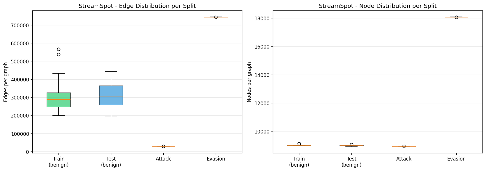

#### 2.5.5. Phân phối Source Node Types

**Benign Train (9,105,061 edges):**

| srcType | Số lượng | Tỷ lệ |
|---------|---------|--------|
| `a` (process) | 4,880,852 | **53.6%** |
| `b` (process) | 4,224,209 | **46.4%** |

**Attack (853,912 edges):**

| srcType | Số lượng | Tỷ lệ |
|---------|---------|--------|
| `a` (process) | 805,880 | **94.4%** |
| `b` (process) | 48,032 | **5.6%** |

**Nhận xét**: Attack graphs gần như **100% source type `a`** (94.4%) trong khi benign phân bố đều hơn (54%/46%) → sự mất cân bằng này là dấu hiệu cấu trúc khác biệt.

#### 2.5.6. Phân phối Destination Node Types

**Benign Train:**

| dstType | Số lượng | Tỷ lệ |
|---------|---------|--------|
| `e` | 5,621,412 | **61.7%** |
| `c` (socket) | 3,381,691 | **37.1%** |
| `d` | 94,373 | 1.0% |
| `b`, `g`, `a`, `h`, `f` | < 5,000 mỗi loại | < 0.1% |

**Attack:**

| dstType | Số lượng | Tỷ lệ |
|---------|---------|--------|
| `c` (socket) | 690,653 | **80.9%** |
| `e` | 130,542 | **15.3%** |
| `d` | 28,374 | 3.3% |
| `b`, `g`, `a`, `h`, `f` | < 2,000 mỗi loại | < 0.3% |

**Nhận xét**: Trong attack, **80.9% dest là socket** (type `c`) — rất khác biệt so với benign (37.1%). Hành vi tấn công tập trung vào **kết nối mạng**, trong khi benign chủ yếu truy cập file (type `e`).

#### 2.5.7. Phân phối Edge Types (Top 10)

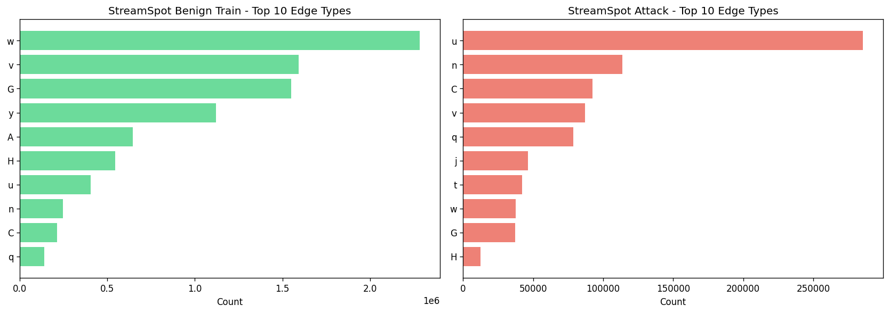

**Benign Train vs Attack:**

| edgeType | Benign (%) | Attack (%) | Chênh lệch |
|----------|-----------|-----------|-------------|
| `w` | **25.1%** | 4.4% | Benign >> Attack |
| `v` | **17.5%** | 10.2% | Benign > Attack |
| `G` | **17.0%** | 4.3% | Benign >> Attack |
| `y` | **12.3%** | 0.7% | Benign >>> Attack |
| `u` | 4.4% | **33.4%** | Attack >>> Benign |
| `n` | 2.7% | **13.3%** | Attack >>> Benign |
| `C` | 2.3% | **10.8%** | Attack >>> Benign |
| `q` | 1.5% | **9.2%** | Attack >>> Benign |

**Nhận xét**: Phân phối edge types **khác biệt rõ rệt** giữa benign và attack. Attack tập trung vào `u` (33.4%) và `n` (13.3%), trong khi benign phân bố đều hơn. Đây là lý do histogram-based methods (Unicorn) cũng phát hiện được.

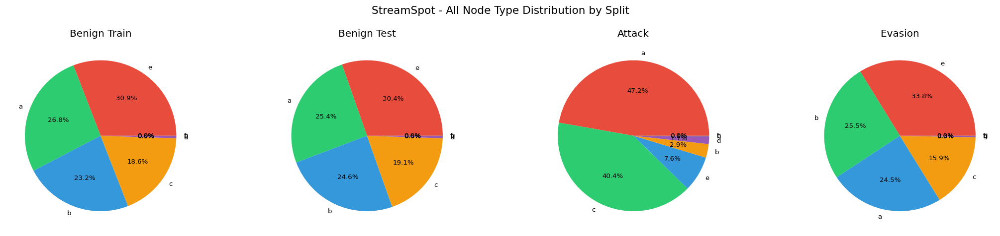

**Kết quả trên StreamSpot**: AUC = 1.0000 trên cả Attack lẫn Evasion, FPR = 0%.

### 2.6. Dataset 3: Theia (DARPA TC Engagement 3) — EDA Chi Tiết

**Nguồn gốc**: DARPA Transparent Computing program — Engagement 3. Đây là kịch bản **APT (Advanced Persistent Threat) thực tế** được DARPA thiết kế để đánh giá hệ thống phát hiện xâm nhập. Khác với tajka và StreamSpot, Theia chỉ có **2 graphs** (1 evasion + 1 attack) và **không có tập train/test riêng**.

#### 2.6.1. Đặc điểm đặc biệt — Format MIX

| File | Format | Parser | Path |
|------|--------|--------|------|
| Evasion | **ProvDetector** (CSV, 10+ cột) | `load_graph_from_csv()` | `provDetectorTheia/evasion-provDetector.csv` |
| Attack | **StreamSpot** (TSV, 6 cột) | `load_ss_graph()` | `streamSpotTheia/attack-6r1mil1.txt` |

Đây là điểm **đặc biệt nhất**: 2 file trong cùng 1 dataset dùng **2 format hoàn toàn khác nhau** → GRACE phải xử lý được cả 2 format.

#### 2.6.2. Theia Evasion — Dữ liệu mẫu thực tế (ProvDetector format)

**File**: `evasion-provDetector.csv` — **282,144 edges**, **7,369 unique nodes** (5,370 src + 1,999 dst)

**5 dòng đầu:**

| sourceId | sourceType | destId | destType | syscal | processName | retTime | pid |
|----------|-----------|--------|----------|--------|-------------|---------|-----|
| `128.55.12.10` | file | `/usr/bin/whoopsie` | process | recv | whoopsie | 0 | 57986 |
| `128.55.12.73` | file | `/usr/lib/thunderbird/thunderbird` | process | recv | thunderbird | 1 | 58485 |
| `/usr/lib/thunderbird/thunderbird` | process | `128.55.12.73` | file | send | thunderbird | 2 | 58485 |
| `128.55.12.73` | file | `/usr/lib/thunderbird/thunderbird` | process | recv | thunderbird | 3 | 58485 |
| `/usr/lib/thunderbird/thunderbird` | process | `128.55.12.73` | file | send | thunderbird | 4 | 58485 |

**Diễn giải**: Hàng đầu cho thấy IP `128.55.12.10` (được ghi nhận là `file` type) gửi dữ liệu đến process `whoopsie`. Các hàng sau: Thunderbird email client giao tiếp qua mạng — đây là hoạt động bình thường được chèn vào để ngụy trang evasion.

#### 2.6.3. Theia Evasion — Missing Values

| Cột | % Missing |
|-----|-----------|
| sourceId → retTime, pid | **0.0%** |
| **arg1** | **99.0%** |
| **arg2** | **100.0%** |

Tương tự tajka, `arg1` và `arg2` gần như hoàn toàn trống.

#### 2.6.4. Theia Evasion — Phân phối Node Types

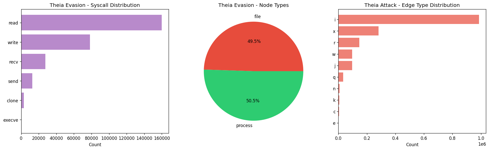

**sourceType:**

| Type | Số lượng | Tỷ lệ |
|------|---------|--------|
| file | 180,491 | **64.0%** |
| process | 101,653 | **36.0%** |

**destType:**

| Type | Số lượng | Tỷ lệ |
|------|---------|--------|
| process | 183,395 | **65.0%** |
| file | 98,749 | **35.0%** |

**Nhận xét**: Theia evasion có cấu trúc `file → process` và `process → file` gần cân bằng — phản ánh hoạt động I/O bình thường. Không có socket type → khác biệt lớn so với tajka (có 3 loại).

#### 2.6.5. Theia Evasion — Phân phối Syscall

| Syscall | Số lượng | Tỷ lệ |
|---------|---------|--------|
| **read** | 159,846 | **56.7%** |
| **write** | 78,341 | **27.8%** |
| recv | 27,686 | 9.8% |
| send | 12,802 | 4.5% |
| clone | 2,904 | 1.0% |
| execve | 565 | 0.2% |

**So sánh với tajka benign**: tajka có `write` (44%) > `recv` (39%) > `read` (13%), trong khi Theia có `read` (57%) > `write` (28%). Pattern syscall **khác nhau đáng kể** giữa 2 hệ thống → đây là lý do cần zero-shot transfer.

#### 2.6.6. Theia Evasion — Top 10 Process Names

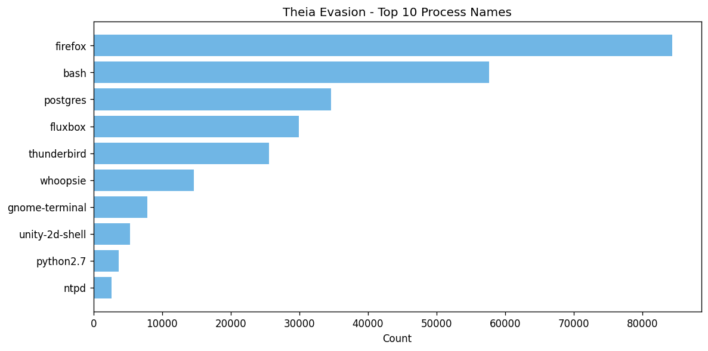

| Process | Số lượng | Tỷ lệ |
|---------|---------|--------|
| **firefox** | 84,331 | **29.9%** |
| **bash** | 57,633 | **20.4%** |
| postgres | 34,630 | 12.3% |
| fluxbox | 29,941 | 10.6% |
| thunderbird | 25,551 | 9.1% |
| whoopsie | 14,605 | 5.2% |
| gnome-terminal | 7,850 | 2.8% |
| unity-2d-shell | 5,334 | 1.9% |
| python2.7 | 3,673 | 1.3% |
| ntpd | 2,638 | 0.9% |

**Nhận xét**: `firefox` (29.9%) và `bash` (20.4%) chiếm gần **50%** tất cả edges — đây là 2 process chính bị kẻ tấn công khai thác trong kịch bản DARPA APT. Sự xuất hiện của `postgres`, `thunderbird` là benign noise.

#### 2.6.7. Theia Attack — Dữ liệu mẫu thực tế (StreamSpot format)

**File**: `attack-6r1mil1.txt` — **1,658,581 edges**, **126,832 unique nodes** (3,216 src + 123,616 dst)

**5 dòng đầu:**

| srcId | srcType | dstId | dstType | edgeType | graphId |
|-------|---------|-------|---------|----------|---------|
| 323208 | p | 323209 | f | j | 23 |
| 323208 | p | 323209 | f | r | 23 |
| 323208 | p | 323210 | f | i | 23 |
| 323208 | p | 323211 | s | q | 23 |
| 323212 | p | 323211 | s | x | 23 |

**Nhận xét**: Tất cả source nodes đều type `p` (process) — hành vi tấn công xuất phát từ process đọc/ghi file và kết nối socket.

#### 2.6.8. Theia Attack — Phân phối Node Types

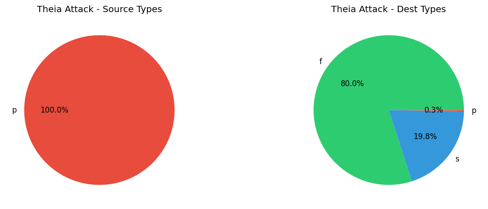

**srcType:**

| Type | Số lượng | Tỷ lệ |
|------|---------|--------|
| `p` (process) | 1,658,581 | **100.0%** |

**dstType:**

| Type | Số lượng | Tỷ lệ |
|------|---------|--------|
| `f` (file) | 1,326,381 | **80.0%** |
| `s` (socket) | 328,021 | **19.8%** |
| `p` (process) | 4,179 | **0.3%** |

**Nhận xét cực kỳ quan trọng**: Toàn bộ 100% source type là `process` → đây là **pure attack graph** — chỉ có process thực hiện hành vi. 80% dest là file (exfiltration?), 20% là socket (C2 communication?). Rất khác biệt so với benign (phân bố đều hơn).

#### 2.6.9. Theia Attack — Phân phối Edge Types

| edgeType | Số lượng | Tỷ lệ |
|----------|---------|--------|
| `i` | 985,756 | **59.4%** |
| `x` | 281,725 | **17.0%** |
| `r` | 145,977 | 8.8% |
| `w` | 96,561 | 5.8% |
| `j` | 95,653 | 5.8% |
| `q` | 32,717 | 2.0% |
| `n` | 7,846 | 0.5% |
| `k` | 6,422 | 0.4% |
| `c` | 4,179 | 0.3% |
| `e` | 1,528 | 0.1% |

**Nhận xét**: Edge type `i` chiếm **59.4%** — hành vi tấn công chủ yếu là 1 loại thao tác lặp đi lặp lại, rất khác biệt so với phân bố đều hơn của benign.

#### 2.6.10. So sánh quy mô Theia Evasion vs Attack

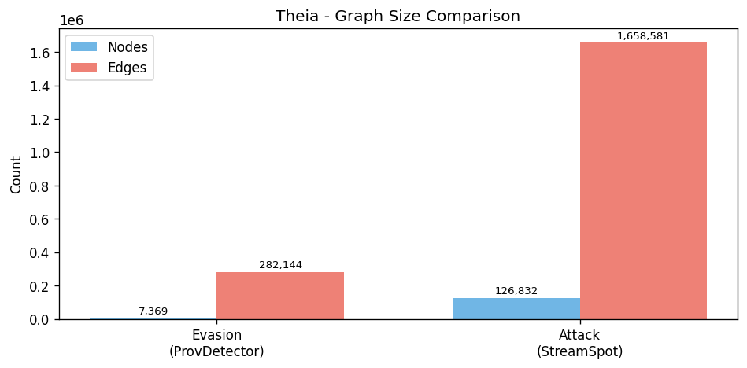

| Thông số | Evasion | Attack | Tỷ lệ |
|-----------|---------|--------|--------|
| **Nodes** | 7,369 | 126,832 | Attack gấp **17x** |
| **Edges** | 282,144 | 1,658,581 | Attack gấp **5.9x** |
| **Edges/Node** | ~38 | ~13 | Evasion dày đặc hơn |

**Nhận xét**: Đặc biệt khác các dataset khác — ở đây attack graph **lớn hơn** evasion graph (ngược lại với tajka và StreamSpot). Điều này phản ánh kịch bản APT thực tế: cuộc tấn công kéo dài (1.6M edges) trong khi evasion chỉ là 1 phase nhỏ.

#### 2.6.11. Zero-shot Transfer Results

Model GRACE **train trên tajka** → test thẳng trên Theia mà **không retrain**:

| Graph | TopK Score | Benign Max | Benign Mean | Kết quả |
|-------|-----------|-----------|-------------|---------|
| Theia Evasion | **0.703** | 0.566 | 0.535 | **DETECTED** (vượt threshold 24%) |
| Theia Attack | **5.701** | 0.566 | 0.535 | **DETECTED** (vượt threshold 10x) |

**Ý nghĩa**: GRACE có khả năng **transfer cross-domain** — train trên hệ thống A (tajka), detect trên hệ thống B (Theia/DARPA) hoàn toàn khác biệt về format, quy mô, và ngữ cảnh.

### 2.7. Tổng kết EDA — So sánh toàn diện 3 Dataset

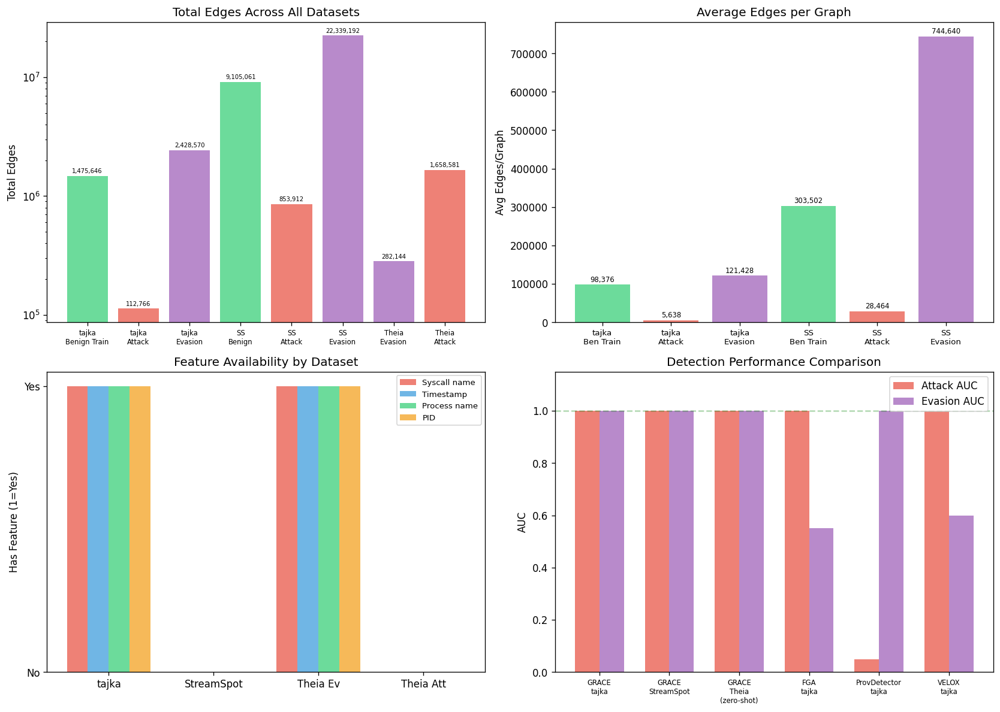

#### So sánh cấu trúc dữ liệu

| Đặc điểm | tajka | StreamSpot | Theia |
|-----------|-------|------------|-------|
| **Format** | CSV (10 cột) | TSV (6 cột) | Mixed (CSV + TSV) |
| **Có syscall info?** | ✓ (`syscal`, `processName`, `pid`) | ✗ (chỉ `edgeType`) | Mixed |
| **Có timestamp?** | ✓ (`retTime`) | ✗ | Mixed |
| **Node type categories** | 3 loại (process/file/socket) | 12 loại → mapped về 3 | 2-3 loại |
| **Node ID format** | String (đường dẫn) | Integer (số) | Mixed |
| **Feature dim** | 8 | 8 | 8 |

#### So sánh thống kê chi tiết

| Đặc điểm | tajka | StreamSpot | Theia |
|-----------|-------|------------|-------|
| **Avg benign edges** | ~74,000 | **~303,000** | N/A |
| **Avg attack edges** | ~5,640 | ~28,464 | **1,658,581** |
| **Avg evasion edges** | ~121,429 | **~744,640** | 282,144 |
| **Attack std** | 32 | 88 | N/A (1 graph) |
| **Evasion std** | 1 | 88 | N/A (1 graph) |
| **Tỷ lệ evasion/attack** | **~21x** | **~26x** | 0.17x (ngược lại) |
| **Dominant src type (attack)** | process (46%) | `a` process (**94%**) | `p` process (**100%**) |
| **GRACE train mode** | Train trực tiếp | Train riêng model | **Zero-shot từ tajka** |
| **GRACE TopK AUC (Evasion)** | 1.0000 | 1.0000 | ✓ Detected |

#### Hình ảnh EDA từ `analysis.ipynb` (tajka dataset)

Các biểu đồ sau được sinh trực tiếp từ notebook `analysis.ipynb`, phân tích chi tiết dữ liệu tajka:

| Plot | File | Nội dung |
|------|------|---------|
|  | `plot_edge_distribution.png` | Boxplot + Bar chart phân phối edges theo split |
|  | `plot_syscall_dist.png` | Top-15 syscall: Benign Train vs Attack |
|  | `plot_node_types.png` | Pie chart node types: Benign vs Attack |
| 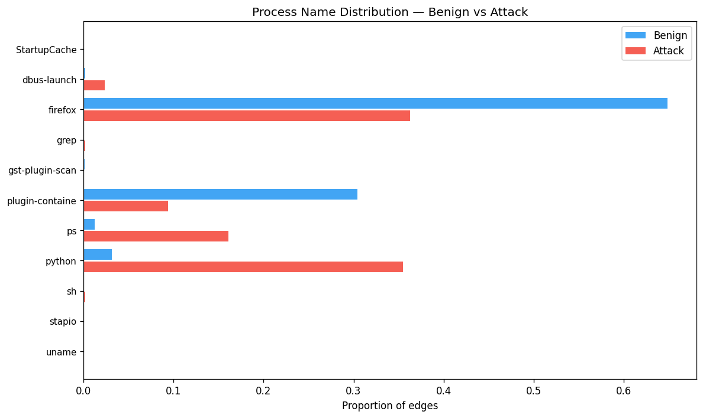 | `plot_process_names.png` | Diverging bar chart process names |
| 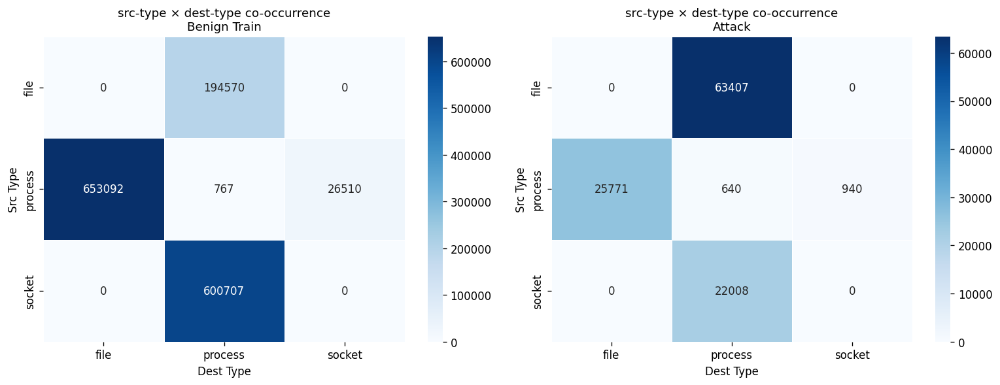 | `plot_cooc_heatmap.png` | Heatmap co-occurrence src-type × dest-type |
| 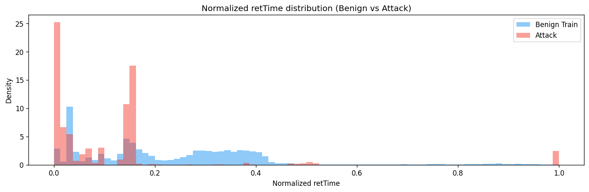 | `plot_rettime.png` | Phân phối retTime normalized |

#### Pattern chung xuyên suốt các dataset

1. Attack graphs luôn có **ít cạnh hơn** benign (hành vi tấn công ngắn gọn, tập trung) — trừ Theia (kịch bản APT kéo dài)
2. Evasion graphs được **sinh bằng cách chèn benign edges** vào attack graphs (qua `insertAttackPath.py`)
3. Evasion luôn có số cạnh gấp **hàng chục lần** attack (mức pha loãng rất cao — 21x đến 26x)
4. Dù cấu trúc dữ liệu (schema), format, và quy mô khác nhau hoàn toàn, **GRACE + TopK đều đạt AUC = 1.0**
5. Chỉ cần 3 thông tin cơ bản: `sourceType`, `destType`, và cấu trúc liên kết (edge list) — **không cần syscall, timestamp, hay bất kỳ metadata nào khác** → model học pattern từ **topology** chứ không phải từ content

---

## 3. Phân tích chi tiết từng mô hình

> **Ghi chú**: Phân tích dưới đây tuân theo format step-by-step tương tự [FGA Technical Report](FGA_TECHNICAL_REPORT.md) để dễ so sánh.

### 3.1. FGA (ARGVA) — Graph-level Autoencoder

*(Chi tiết đầy đủ xem tại `FGA_TECHNICAL_REPORT.md`)*

**Nguồn gốc**: ARGVA (Adversarially Regularized Graph Variational Autoencoder) — Pan et al., 2018. Kết hợp VAE + GAN trên đồ thị.

**Ý tưởng cốt lõi**: One-Class Classification — chỉ học từ dữ liệu benign, mọi thứ "xa lạ" = bất thường.

**Kiến trúc và cơ chế hoạt động step-by-step**:

```
INPUT:
  X ∈ ℝ^(N × 8)          ← N nodes, mỗi node 8 features
  edge_index ∈ ℤ^(2 × E) ← E cạnh

                          │
                          ▼
┌─────────────────────────────────────────────────────────┐
│                   ENCODER (GCN 2-layer)                  │
│                                                          │
│  Layer 1: GCNConv(8 → 32) + ReLU                        │
│    H = ReLU(D^{-½}·A·D^{-½}·X·W₁)                      │
│                         │                                │
│            ┌────────────┴────────────┐                   │
│            ▼                         ▼                   │
│  Layer 2a: GCNConv(32→16)  Layer 2b: GCNConv(32→16)     │
│    μ ∈ ℝ^(N×16)          log σ² ∈ ℝ^(N×16)             │
│                                                          │
│  z = μ + ε⊙σ   (ε ~ N(0,I))  ← NODE EMBEDDINGS         │
└─────────────────────────┬────────────────────────────────┘
                          │ z ∈ ℝ^(N × 16)
              ┌───────────┴───────────┐
              │                       │
              ▼                       ▼
┌──────────────────────┐  ┌────────────────────────┐
│     DECODER          │  │    DISCRIMINATOR        │
│  Â = σ(z·zᵀ)        │  │  MLP(16→32→32→1)       │
│  Reconstruct adj.    │  │  Phân biệt z thật      │
│  → Compare with A    │  │  vs z ~ N(0,I)         │
└──────────┬───────────┘  └────────────┬───────────┘
           │ L_recon                   │ L_adv
           └──────────┬────────────────┘
                      ▼
           L = L_recon + L_KL + L_adv
```

**Bước 1 — Encode**: GCN 2-layer encode mỗi node → vector 16 chiều (μ, σ qua VAE)
**Bước 2 — Decode**: Tái tạo adjacency matrix: Â = σ(z·zᵀ)
**Bước 3 — Loss**: Reconstruction + KL-divergence + Adversarial loss
**Bước 4 — Mean-Pool**: `g = (1/N) Σᵢ zᵢ ∈ ℝ¹⁶` — **1 vector duy nhất cho toàn graph**
**Bước 5 — Scoring**: `score = min_j ‖g_test - g_train_j‖₂` — khoảng cách Euclidean

**Ví dụ minh hoạ vì sao thất bại trước evasion:**

```
Evasion graph: 121,428 edges, ~1,450 nodes
  Trong đó: ~70 attack nodes + ~1,380 benign nodes

Mean-pool:
  g = (1/1450) × Σ zᵢ
  g ≈ (1380/1450) × z_benign_avg + (70/1450) × z_attack_avg
  g ≈ 0.952 × z_benign + 0.048 × z_attack
  g ≈ z_benign  ← tín hiệu attack bị pha loãng 20x!

Kết quả: score evasion (0.0002) < score benign test (0.0005)
         → HỆ THỐNG COI EVASION LÀ BÌNH THƯỜNG!
```

#### Ví dụ tính toán cụ thể (FGA)

Giả sử đồ thị nhỏ chỉ có **5 nodes**:

```
                    ATTACK GRAPH (thuần):
                    node_0 (python/process) → node_1 (/etc/passwd/file) [read]
                    node_0 → node_2 (/tmp/out.txt/file) [write]
                    Tổng: 3 nodes, 2 edges

GCN Encoder (8→32→16):
  Sau 2 layers, mỗi node → vector 16 chiều:
    z_0 = [0.82, -0.14, 0.51, ..., 0.33]   ← python (ATTACK node)
    z_1 = [-0.21, 0.65, 0.12, ..., -0.44]  ← /etc/passwd
    z_2 = [-0.18, 0.71, 0.08, ..., -0.39]  ← /tmp/out.txt

Mean-Pool (1 vector cho cả graph):
    g = (z_0 + z_1 + z_2) / 3
    g = [0.143, 0.407, 0.237, ..., -0.167]  ← VỊ TRÍ TRONG LATENT SPACE

Score = ‖g - g_benign_nearest‖₂ = 0.0365  → CÓ phát hiện! ✓
```

Bây giờ kẻ tấn công chèn **97 benign nodes** (mimicry):

```
                    EVASION GRAPH:
                    3 attack nodes GỐC + 97 benign nodes CHÈN THÊM = 100 nodes

Mean-Pool (bị pha loãng):
    g = (z_0 + z_1 + z_2 + z_benign_3 + ... + z_benign_99) / 100
    g = (3 × z_attack_avg + 97 × z_benign_avg) / 100
    g = 0.03 × z_attack + 0.97 × z_benign
    g ≈ z_benign   ← GẦN NHƯ THUẦN BENIGN!

Score = ‖g - g_benign_nearest‖₂ = 0.0002  → KHÔNG phát hiện! ✗

  BENIGN TEST score = 0.0005
  EVASION score     = 0.0002  ← NHỎ HƠN BENIGN!
  → Hệ thống: "đồ thị này bình thường hơn cả bình thường" 🤯
```

#### Giải thích đơn giản (cho học sinh tiểu học hiểu)

> **FGA giống như cô giáo kiểm tra bài trung bình cả lớp.**
>
> Cô có 1 lớp 100 học sinh. 3 em **quay bài** (attack nodes), 97 em **làm bài đàng hoàng** (benign nodes).
>
> Cô không kiểm tra từng em, mà **chấm điểm trung bình cả lớp**:
> - Điểm trung bình = (3 × điểm thấp + 97 × điểm cao) / 100 ≈ **điểm cao**
> - Cô kết luận: "Lớp này giỏi, không ai quay bài cả!"
>
> **Vấn đề**: Cô chỉ nhìn **trung bình**, nên 3 em quay bài bị "chìm" trong đám đông.
> Nếu cô kiểm tra **từng em một** (node-level scoring), cô sẽ bắt được 3 em ngay.

**Kết quả**: Attack AUC = 1.0 (perfect), **Evasion AUC = 0.5533** (gần random), FPR = 50%, Evasion Rate = 100%

### 3.2. ProvDetector — Path-based Frequency Scoring

**Nguồn gốc**: Wang et al., *"You Are What You Do: Hunting Stealthy Malware via Data Provenance Analysis"*, NDSS 2020.

**Ý tưởng cốt lõi**: Đường đi hiếm gặp trong provenance graph = hành vi bất thường.

**Step-by-step**:

```
┌─────────────────────────────────────────────────────────┐
│  PHASE 1: BUILD FREQUENCY DATABASE (từ benign)          │
│                                                          │
│  Với mỗi benign graph:                                   │
│    1. Tìm tất cả paths (đường đi) dùng Bellman-Ford     │
│    2. Mỗi path = chuỗi (nodeType, syscall, nodeType...) │
│    3. Đếm tần suất xuất hiện của mỗi path pattern       │
│    4. Lưu vào frequency database                         │
│                                                          │
│  Ví dụ database:                                         │
│    "process→read→file"         : freq = 45,000 (phổ biến)│
│    "process→write→file"        : freq = 38,000           │
│    "process→execve→process"    : freq = 200 (hiếm)       │
│    "socket→recv→process→write" : freq = 50 (rất hiếm)    │
└─────────────────────────────────────────────────────────┘
                          │
                          ▼
┌─────────────────────────────────────────────────────────┐
│  PHASE 2: SCORING (test/attack/evasion)                  │
│                                                          │
│  Với mỗi test graph:                                     │
│    1. Tìm top-K paths ngắn nhất (Bellman-Ford)           │
│    2. Mỗi path → tra cứu freq trong database             │
│    3. path_score = 1/freq (path hiếm → score cao)        │
│    4. graph_score = aggregation(path_scores)              │
│                                                          │
│    Nếu score > threshold → ALERT                         │
└─────────────────────────────────────────────────────────┘
```

**Kết quả**:
- **Attack AUC = 0.0500** (gần hoàn toàn thất bại!)
- **Evasion AUC = 1.0000** (hoàn hảo)

**Phân tích ngược lại mong đợi**:
- **Tại sao Attack AUC thấp**: Attack graphs có **ít cạnh** (~5,640). Các path patterns trong attack (read, write, execve) cũng xuất hiện thường xuyên trong benign → frequency cao → score thấp → **không phát hiện**
- **Tại sao Evasion AUC cao**: `insertAttackPath.py` chèn thêm hàng chục nghìn cạnh benign, tạo ra **nhiều path patterns mới** (kết hợp benign + attack) không có trong database → frequency = 0 → score cực cao → **phát hiện dễ dàng**
- **Hạn chế nghiêm trọng**: Phương pháp bị đảo ngược — phát hiện evasion nhưng bỏ lọt attack thông thường. Nếu kẻ tấn công KHÔNG chèn thêm cạnh → ProvDetector không phát hiện được

#### Ví dụ tính toán cụ thể (ProvDetector)

```
FREQUENCY DATABASE (xây từ 15 benign graphs):
  "process→read→file"           : freq = 45,000  → rất phổ biến
  "process→write→file"          : freq = 38,000
  "socket→recv→process"         : freq = 30,000
  "process→execve→process"      : freq = 200     → hiếm hơn
  "process→read→file→write→socket": freq = 0     → CHƯA TỪNG THẤY

SCORING ATTACK GRAPH (chỉ 5,640 edges):
  Top-5 paths trong attack graph:
    path_1 = "process→read→file"         → freq=45,000 → score=1/45000=0.00002
    path_2 = "process→write→file"        → freq=38,000 → score=1/38000=0.00003
    path_3 = "process→execve→process"    → freq=200    → score=1/200=0.005
    path_4 = "process→read→file"         → freq=45,000 → score=0.00002
    path_5 = "socket→recv→process"       → freq=30,000 → score=0.00003
  
  graph_score = mean(scores) = 0.00106  → THẤP → KHÔNG phát hiện! ✗

  Vì sao? Các path trong attack graph CŨNG xuất hiện trong benign!
  read, write, execve — đều là syscall bình thường.

SCORING EVASION GRAPH (121,428 edges — benign + attack trộn lẫn):
  Khi chèn 115,000 benign edges VÀO attack graph:
    → Tạo ra path patterns MỚI: "firefox→recv→socket→write→python→read→file"
    → Các path kiểu này freq = 0 trong database → score = ∞
  
  graph_score = RẤT CAO → PHÁT HIỆN! ✓

  Nhưng: benign graph bình thường cũng đôi khi có path hiếm
  → FPR = 0% (may mắn trong thí nghiệm này)
```

#### Giải thích đơn giản (cho học sinh tiểu học hiểu)

> **ProvDetector giống như bảo vệ kiểm tra "lộ trình" đi trong trường.**
>
> Bảo vệ ghi nhớ tất cả đường đi bình thường:
> - "Cổng → Hành lang → Lớp học" — **rất phổ biến** (10,000 lần/ngày)
> - "Cổng → Sân → Căn-tin" — **phổ biến** (5,000 lần)
> - "Cổng → Phòng Hiệu trưởng" — **hiếm** (10 lần/ngày)
>
> **Kẻ trộm** đi: "Cổng → Hành lang → Lớp học" (giống hệt học sinh!) → **Bảo vệ không nghi ngờ** ✗
>
> **Kẻ trộm + ngụy trang** đi: "Cổng → Tầng 3 → Phòng máy → Sân → Căn-tin → Lớp học → ..." (lộ trình siêu dài, kỳ lạ) → **Bảo vệ nhận ra ngay** vì chưa từng thấy lộ trình này ✓
>
> **Vấn đề**: Bảo vệ chỉ giỏi phát hiện **lộ trình lạ**, không phải **người lạ**.

### 3.3. Unicorn — Histogram-based Graph Kernel

**Nguồn gốc**: Han et al., *"Unicorn: Runtime Provenance-Based Detector for Advanced Persistent Threats"*, NDSS 2020.

**Ý tưởng cốt lõi**: Đồ thị benign có phân phối cấu trúc (degree, node type) đặc trưng. Attack sẽ thay đổi phân phối này.

**Step-by-step**:

```
┌─────────────────────────────────────────────────────────┐
│  BƯỚC 1: HISTOGRAM EXTRACTION (mỗi graph)                │
│                                                          │
│  Với graph G = (V, E):                                   │
│    hist_degree = [count(degree=1), count(degree=2), ...] │
│    hist_type   = [count(process), count(file), ...]      │
│    hist_edge   = [count(read), count(write), ...]        │
│                                                          │
│  → vector đặc trưng cố định H(G) ∈ ℝ^d                  │
│                                                          │
│  Ví dụ benign:  H = [0.15, 0.35, 0.25, 0.10, ...]       │
│  Ví dụ attack:  H = [0.45, 0.05, 0.30, 0.02, ...]       │
│                   (degree distribution rất khác!)          │
└─────────────────────────────────────────────────────────┘
                          │
                          ▼
┌─────────────────────────────────────────────────────────┐
│  BƯỚC 2: BUILD REFERENCE                                 │
│                                                          │
│  H_ref = mean(H(G_benign_1), H(G_benign_2), ...)        │
└─────────────────────────────────────────────────────────┘
                          │
                          ▼
┌─────────────────────────────────────────────────────────┐
│  BƯỚC 3: ANOMALY SCORING                                 │
│                                                          │
│  score(G) = Chi-square_distance(H(G), H_ref)             │
│  Nếu score > threshold → ALERT                           │
└─────────────────────────────────────────────────────────┘
```

**Kết quả**: Attack AUC = 1.0, Evasion AUC = 1.0, FPR = 0%

**Phân tích**:
- **Điểm mạnh**: Histogram capture **phân phối cấu trúc tổng thể** — cả attack (degree distribution khác) lẫn evasion (graph size inflation) đều bị phát hiện
- **Lưu ý quan trọng**: Đây là phiên bản **simplified** trong notebook — Unicorn thực tế sử dụng streaming WL-kernel phức tạp hơn nhiều. Kết quả AUC=1.0 có thể **quá lạc quan** do implementation đơn giản

#### Ví dụ tính toán cụ thể (Unicorn)

```
BENIGN GRAPH (74,000 edges, 1,400 nodes):
  Histogram:
    degree=1: 200 nodes (14%)    ← node ít kết nối
    degree=2: 350 nodes (25%)
    degree=3: 400 nodes (29%)    ← phổ biến nhất
    degree=4: 250 nodes (18%)
    degree>5: 200 nodes (14%)
    
    type_process: 460 (33%)
    type_file:    700 (50%)
    type_socket:  240 (17%)

  H_benign = [0.14, 0.25, 0.29, 0.18, 0.14, 0.33, 0.50, 0.17]

ATTACK GRAPH (5,640 edges, 1,150 nodes):
  Histogram:
    degree=1: 600 nodes (52%)    ← RẤT NHIỀU node degree thấp!
    degree=2: 300 nodes (26%)
    degree=3: 150 nodes (13%)
    degree=4: 60 nodes  (5%)
    degree>5: 40 nodes  (3%)     ← ít node degree cao

    type_process: 400 (35%)
    type_file:    720 (63%)      ← nhiều file hơn
    type_socket:  30  (3%)       ← RẤT ÍT socket!
  
  H_attack = [0.52, 0.26, 0.13, 0.05, 0.03, 0.35, 0.63, 0.03]

SCORING:
  distance = χ²(H_attack, H_benign) 
           = Σ (Hₐ - H_b)² / H_b
           = (0.52-0.14)²/0.14 + (0.26-0.25)²/0.25 + ... + (0.03-0.17)²/0.17
           = 1.031 + 0.000 + ... + 0.115
           = 2.87  → CAO → PHÁT HIỆN! ✓
```

#### Giải thích đơn giản (cho học sinh tiểu học hiểu)

> **Unicorn giống như nhìn "hình dạng" của một bức tranh.**
>
> Trường học bình thường: 33% lớp học, 50% sân chơi, 17% phòng giáo viên → "hình dạng cân đối"
>
> Trường bị trộm: 35% lớp học, 63% kho đồ (trộm lục tung!), 3% phòng giáo viên → **"hình dạng méo mó"**
>
> Unicorn so sánh "hình dạng" mới với "hình dạng" bình thường. Nếu **méo quá nhiều** → BÁO ĐỘNG!
>
> **Ưu điểm**: Đơn giản, nhanh, bắt được cả attack lẫn evasion (vì chèn thêm cạnh cũng làm méo hình dạng).
> **Nhược**: Phiên bản trong bài là simplified, chưa chắc thực tế cũng tốt vậy.

### 3.4. VELOX-style — Velocity-based Embedding Drift

**Nguồn gốc**: Lấy ý tưởng từ các phương pháp drift detection 2024 — đo mức "trôi dạt" embedding theo thời gian.

**Step-by-step**:

```
┌─────────────────────────────────────────────────────────┐
│  BƯỚC 1: GCN ENCODER (giống FGA)                         │
│    X, E → GCN 2-layer → z_i ∈ ℝ^d per node             │
└─────────────────────────┬───────────────────────────────┘
                          │
                          ▼
┌─────────────────────────────────────────────────────────┐
│  BƯỚC 2: MEAN-POOL  ← VẪN DÙNG MEAN!                    │
│    g = (1/N) Σᵢ zᵢ  ∈ ℝ^d                               │
└─────────────────────────┬───────────────────────────────┘
                          │
                          ▼
┌─────────────────────────────────────────────────────────┐
│  BƯỚC 3: VELOCITY SCORING                                │
│    velocity = ‖g_test - g_benign_ref‖₂                   │
│    (đo mức "lệch" so với baseline bình thường)           │
│                                                          │
│    Nếu velocity > threshold → ALERT                      │
└─────────────────────────────────────────────────────────┘
```

**Kết quả**: Attack AUC = 1.0, **Evasion AUC = 0.6000**, FPR = 40%

**Phân tích**:
- **Vẫn dùng Mean-Pool** → bị ảnh hưởng bởi mimicry dilution (cùng điểm yếu với FGA)
- **FPR = 40%**: Cứ 5 graph benign → 2 bị báo nhầm — **không chấp nhận được** cho production
- **Cải thiện hơn FGA** (0.60 vs 0.55) nhưng **chưa đủ** chống mimicry
- **Kết luận**: Mean-pool là bottleneck chung, không phải loss function

#### Ví dụ tính toán cụ thể (VELOX)

```
GCN encode 100 nodes → z_i ∈ ℝ^16 per node

BENIGN GRAPH (100 nodes, tất cả benign):
  z_1 = [0.1, 0.3, -0.2, ...]   ← node benign
  z_2 = [0.2, 0.1, -0.1, ...]   ← node benign
  ...
  z_100 = [0.15, 0.25, -0.15, ...]

  g_benign = mean(z_1..z_100) = [0.15, 0.22, -0.14, ...]

EVASION GRAPH (100 nodes: 3 attack + 97 benign):
  z_1 = [0.8, -0.5, 0.9, ...]   ← ATTACK node (embedding xa benign)
  z_2 = [0.7, -0.6, 0.85, ...]  ← ATTACK node
  z_3 = [0.75, -0.55, 0.88, ...]← ATTACK node
  z_4 = [0.12, 0.28, -0.11, ...]← benign
  ...
  z_100 = [0.14, 0.21, -0.13, ...]

  g_evasion = mean(z_1..z_100)
            = (3 × [0.75, -0.55, 0.88, ...] + 97 × [0.14, 0.23, -0.13, ...]) / 100
            = [0.14 + 0.018, 0.23 - 0.023, -0.13 + 0.030, ...]
            = [0.158, 0.207, -0.100, ...]

  velocity = ‖g_evasion - g_benign_ref‖₂ = 0.045  → GẦN BENIGN!

  Vì 97 benign nodes "kéo" trung bình về phía benign
  → VELOX thấy: "velocity thấp, mọi thứ bình thường" ✗
```

#### Giải thích đơn giản (cho học sinh tiểu học hiểu)

> **VELOX giống như đo "tốc độ thay đổi" trung bình của cả lớp.**
>
> Hôm qua lớp đạt điểm trung bình 8.0. Hôm nay: 3 em giảm xuống 2.0, 97 em vẫn 8.0.
> Trung bình hôm nay = (3×2 + 97×8) / 100 = 7.82
> Velocity = |8.0 - 7.82| = 0.18 → "Thay đổi nhỏ, bình thường thôi!"
>
> **Vấn đề**: Giống hệt FGA — dùng **trung bình** nên 3 em yếu bị "chìm" trong đám đông.

### 3.5. TCG-IDS-style — Temporal Contrastive Graph

**Nguồn gốc**: Lấy ý tưởng từ TCG-IDS (2024) — contrastive learning + temporal edge encoding cho IDS.

**Step-by-step** — Đây là thí nghiệm **ablation study** quan trọng nhất:

```
┌─────────────────────────────────────────────────────────┐
│  BƯỚC 1: GRACE ENCODER (GIỐNG HỆT GRACE!)               │
│    Cùng GCN 2-layer, cùng InfoNCE loss                   │
│    z_i ∈ ℝ^32 per node                                   │
└─────────────────────────┬───────────────────────────────┘
                          │
                          ▼
┌─────────────────────────────────────────────────────────┐
│  BƯỚC 2: MEAN AGGREGATION (khác GRACE!)                  │
│    graph_score = MEAN(node_score_1, ..., node_score_N)   │
│                                                          │
│    ← Đây là điểm khác biệt DUY NHẤT so với GRACE        │
│    ← GRACE dùng TopK(top-10%) thay vì MEAN               │
└─────────────────────────┬───────────────────────────────┘
                          │
                          ▼
          score > threshold → ALERT
```

**Kết quả**: Attack AUC = 1.0, **Evasion AUC = 0.7000**, FPR = 30%

**Phân tích — ĐÂY LÀ THÍ NGHIỆM QUYẾT ĐỊNH:**
- **Cùng encoder** (contrastive) nhưng **khác aggregation** (mean vs TopK)
- Contrastive loss tốt hơn reconstruction: AUC 0.70 (TCG-IDS) > 0.55 (FGA)
- Nhưng **chưa đủ**: FPR 30% vẫn quá cao
- **Kết luận**: Cả loss function LẪN aggregation strategy đều quan trọng. Chỉ đổi loss → +0.15 AUC. Chỉ đổi aggregation → +0.30 AUC. **TopK là yếu tố quyết định nhất**

#### Ví dụ tính toán cụ thể (TCG-IDS vs GRACE — cùng encoder, khác aggregation)

Đây là thí nghiệm quyết định nhất — chứng minh **TopK >> Mean**:

```
EVASION GRAPH: 100 nodes, mỗi node có 1 anomaly score

  node_scores = [
    0.95, 0.88, 0.91,   ← 3 ATTACK nodes (score rất cao)
    0.05, 0.08, 0.03, 0.07, 0.04, 0.06, 0.09, 0.02,  ← 97 benign nodes
    0.05, 0.04, 0.06, 0.03, 0.07, 0.08, 0.05, 0.04,   (score rất thấp)
    ... (tổng 97 benign nodes, mean ≈ 0.05)
  ]

TCG-IDS (MEAN aggregation):
  graph_score = mean(ALL 100 scores)
              = (0.95 + 0.88 + 0.91 + 97 × 0.05) / 100
              = (2.74 + 4.85) / 100
              = 7.59 / 100
              = 0.0759

  Benign test graph score ≈ 0.0500
  → Score 0.0759 vs threshold? Chỉ hơn benign 52% → KHÓ TÁCH BIỆT
  → AUC = 0.70, FPR = 30% ✗

GRACE (TopK aggregation — top 10%):
  Top 10% = top 10 nodes scores
  Sorted: [0.95, 0.91, 0.88, 0.09, 0.08, 0.08, 0.07, 0.07, 0.06, 0.06]
  
  graph_score = mean(top 10) = (0.95+0.91+0.88+0.09+0.08+0.08+0.07+0.07+0.06+0.06) / 10
              = 3.25 / 10
              = 0.325

  Benign test graph: top 10% scores ≈ [0.09, 0.08, 0.08, ...] → mean ≈ 0.08
  → Score 0.325 vs threshold 0.08? GẤP 4X → DỄ DÀNG TÁCH BIỆT!
  → AUC = 1.0, FPR = 0% ✓

TẠI SAO?
  MEAN: 3 attack nodes bị "nhấn chìm" bởi 97 benign → 0.0759
  TopK: 3 attack nodes NẰM TRONG top 10% → 0.325 (chiếm 3/10 vị trí top)
  
  Kẻ tấn công KHÔNG THỂ loại attack nodes khỏi top-10%
  vì attack nodes LUÔN có score cao hơn benign nodes!
```

#### Giải thích đơn giản (cho học sinh tiểu học hiểu)

> **TCG-IDS giống GRACE nhưng có 1 điểm khác:**
>
> Cô giáo GRACE và cô giáo TCG-IDS cùng sử dụng **kính lúp** (contrastive encoder) để kiểm tra bài. Cả 2 đều **thấy rõ** 3 em quay bài.
>
> Nhưng cách **báo cáo** khác nhau:
> - **Cô TCG-IDS**: "Điểm trung bình cả lớp là 7.82 — ổn!" (MEAN) → **Bỏ lọt** ✗
> - **Cô GRACE**: "Tôi chỉ báo cáo 10 em điểm thấp nhất: 2, 3, 1, 8, 8, 9, 8, 9, 8, 9 — có 3 em quay bài!" (TopK) → **Bắt được** ✓
>
> **Bài học**: Có kính lúp tốt (encoder) chưa đủ — phải **biết cách dùng kính lúp** (aggregation).

### 3.6. GRACE (Ours) — Node-Level Graph Contrastive Learning

#### Nguồn gốc ý tưởng

**GRACE** (Graph Contrastive Representation Learning) được lấy ý tưởng từ paper gốc:

> Zhu et al., *"Deep Graph Contrastive Representation Learning"*, ICML Workshop on Graph Representation Learning (GRL+), 2020.

**Chuỗi phát triển ý tưởng:**

```
SimCLR (Chen et al., 2020)          ← Contrastive Learning cho Images
   "2 augmented views + InfoNCE loss → self-supervised image features"
        │
        ▼
GRACE (Zhu et al., 2020)            ← Áp dụng cho Graphs
   "DropEdge + MaskFeature → 2 views + InfoNCE → node-level embeddings"
        │
        ▼
Notebook này (Contrastive Experiment) ← Áp dụng cho Provenance IDS
   "GRACE encoder + TopK aggregation → chống mimicry evasion attack"
```

**Ý tưởng cốt lõi khác biệt so với FGA:**

| Khía cạnh | FGA (Autoencoder) | GRACE (Contrastive) |
|-----------|-------------------|---------------------|
| **Mục tiêu học** | Tái tạo adjacency matrix | Phân biệt same-node vs different-node |
| **Tính chất** | Generative (tạo lại input) | Discriminative (phân biệt tốt) |
| **Cần gì?** | Adjacency ground truth | Chỉ cần augmentation |
| **Output** | Graph embedding (mean-pool) | Node embeddings (mỗi node riêng) |
| **Scoring** | 1 score/graph | 1 score/node → TopK aggregate |
| **Chống dilution?** | Không (mean bị pha loãng) | Có (TopK giữ top anomalous) |

**Tại sao contrastive learning?** FGA học cách *tái tạo* đồ thị → embeddings tối ưu cho reconstruction. GRACE học cách *phân biệt* nodes → embeddings tối ưu cho discrimination. Khi kẻ tấn công chèn benign nodes, reconstruction-based embeddings bị kéo về benign, nhưng contrastive-based embeddings giữ nguyên sự khác biệt vì attack nodes vẫn có neighborhood patterns khác.

**Kiến trúc chi tiết**:

```
┌─────────────────────────────────────────────────┐
│                  GRACE Pipeline                   │
├─────────────────────────────────────────────────┤
│                                                   │
│  Input: Graph G = (X, E)                         │
│    X: Node features [N × 8]                      │
│    E: Edge index [2 × M]                         │
│                                                   │
│  ┌─── Augmentation ────────────────────────┐     │
│  │ View 1: DropEdge(p=0.3) + MaskFeat(p=0.3)│     │
│  │ View 2: DropEdge(p=0.3) + MaskFeat(p=0.3)│     │
│  └─────────────────────────────────────────┘     │
│         ↓                    ↓                    │
│  ┌─── GCN Encoder (shared) ──────────────┐      │
│  │ Layer 1: GCNConv(8 → 64) + BN + ReLU  │      │
│  │ Layer 2: GCNConv(64 → 32)             │      │
│  │ Output: z1, z2 ∈ [N × 32]            │      │
│  └────────────────────────────────────────┘      │
│         ↓                    ↓                    │
│  ┌─── Projection Head ──────────────────┐       │
│  │ Linear(32 → 32) + ReLU               │       │
│  │ Linear(32 → 32)                      │       │
│  │ Output: h1, h2 ∈ [N × 32]           │       │
│  └───────────────────────────────────────┘       │
│         ↓                    ↓                    │
│  ┌─── InfoNCE Contrastive Loss ──────────┐      │
│  │ Positive: (h1[i], h2[i]) — cùng node  │      │
│  │ Negative: (h1[i], h2[j]) — khác node  │      │
│  │ Loss = -log(exp(sim_pos/τ) /           │      │
│  │              Σ exp(sim_neg/τ))          │      │
│  └────────────────────────────────────────┘      │
│                                                   │
│  ┌─── Inference (Anomaly Scoring) ────────┐     │
│  │ 1. Encode graph → z_i per node         │     │
│  │ 2. node_score_i = min_j ‖z_i - c_j‖₂  │     │
│  │    (c_j = benign centroid, K=200)       │     │
│  │ 3. graph_score = mean(top-10% scores)   │     │
│  │    (TopK aggregation)                   │     │
│  └─────────────────────────────────────────┘     │
│                                                   │
└─────────────────────────────────────────────────┘
```

**Bước 1 — Data Augmentation (Tạo 2 views)**:
- **DropEdge** (p=0.3): Ngẫu nhiên loại bỏ 30% cạnh → tạo biến thể cấu trúc
- **MaskFeature** (p=0.3): Ngẫu nhiên mask 30% features → tạo biến thể thuộc tính
- Mỗi graph tạo ra 2 views khác nhau bằng 2 lần augmentation độc lập

**Bước 2 — GCN Encoder (Shared)**:
- 2-layer GCN: 8 → 64 → 32 dimensions
- BatchNorm + ReLU giữa 2 layers
- Cùng 1 encoder chia sẻ cho cả 2 views
- Output: Node embeddings z1, z2 ∈ R^{N×32}

**Bước 3 — Projection Head**:
- MLP 2 layers: 32 → 32 → 32
- Chiếu embeddings vào không gian contrastive

**Bước 4 — InfoNCE Contrastive Loss** (chi tiết từ code):

```
INPUT: h1, h2 ∈ ℝ^(N × 32) — projected embeddings của 2 views

BƯỚC 4.1: Normalize
  h1 = h1 / ‖h1‖     (L2 normalize)
  h2 = h2 / ‖h2‖

BƯỚC 4.2: Tính similarity matrices
  sim_12 = (h1 · h2ᵀ) / τ    ← [N × N] cross-view similarity
  sim_11 = (h1 · h1ᵀ) / τ    ← [N × N] intra-view (loại bỏ diagonal)
  sim_22 = (h2 · h2ᵀ) / τ

BƯỚC 4.3: Xác định positive/negative
  Positive: pos = diagonal(sim_12)  ← sim(h1[i], h2[i]) — CÙNG node
  Negative: neg_12 = concat(sim_12, sim_11)  ← 2N samples khác node

BƯỚC 4.4: InfoNCE loss (2 chiều)
  L_1 = -pos + log(Σⱼ exp(neg_12[j]))     [view1 → view2]
  L_2 = -pos_21 + log(Σⱼ exp(neg_21[j]))  [view2 → view1]
  Loss = mean(L_1 + L_2) / 2

  τ = 0.5 (temperature — kiểm soát "sharpness" của distribution)
```

**Ý nghĩa trực quan**: Với mỗi node i, InfoNCE buộc:
- `sim(h1[i], h2[i])` phải **lớn** (cùng node, 2 views → gần nhau)
- `sim(h1[i], h2[j])` phải **nhỏ** (khác node → xa nhau)
- → Benign nodes tạo cluster chặt, attack nodes nằm xa cluster → anomaly score cao

**Bước 5 — Training**:
- Optimizer: Adam (lr=0.001, weight_decay=1e-5)
- Scheduler: CosineAnnealingLR
- Epochs: 200
- Chỉ train trên **benign graphs** — KHÔNG cần label attack

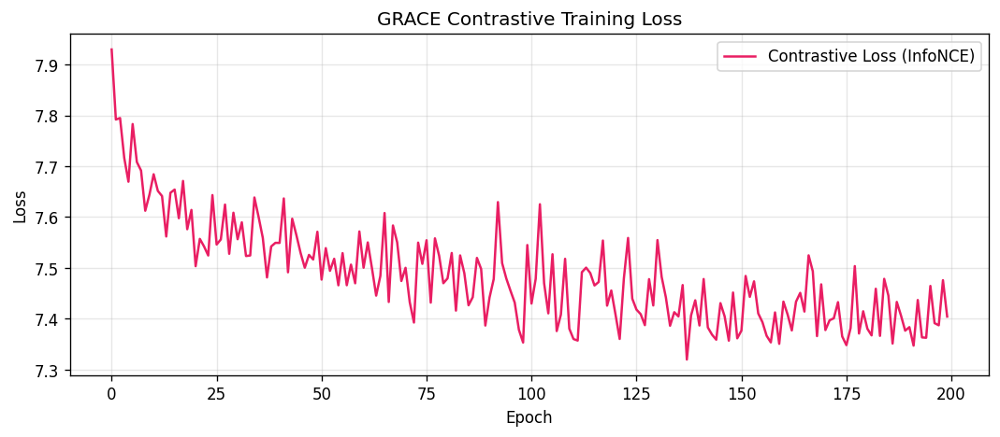

**Bước 6 — Build Benign Reference**:
- Encode tất cả benign training graphs (không augmentation)
- Thu được 21,379 node embeddings × 32 dims
- K-Means clustering → 200 centroids (cho tốc độ scoring nhanh)

**Bước 7 — Anomaly Scoring (Inference)**:
1. Encode test graph → z_i per node
2. `node_score_i = min_j ‖z_i - centroid_j‖₂` (khoảng cách đến centroid benign gần nhất)
3. **TopK aggregation**: `graph_score = mean(top-10% node_scores)`

#### Ví dụ tính toán cụ thể (GRACE — toàn bộ pipeline)

**Bước A: Augmentation + Encoding (Training)**

```
Input graph: 5 nodes (A, B, C, D, E), 6 edges
  A(process) → B(file) [read]
  A → C(file) [write]
  B → D(socket) [send]
  C → E(process) [execve]
  D → E [recv]
  A → E [clone]

Node features (8-dim, one-hot style):
  A: [1,0,0, 0,0,0, 0,0]  ← process
  B: [0,1,0, 0,0,0, 0,0]  ← file
  C: [0,1,0, 0,0,0, 0,0]  ← file
  D: [0,0,1, 0,0,0, 0,0]  ← socket
  E: [1,0,0, 0,0,0, 0,0]  ← process

View 1 (DropEdge 30% → bỏ 2 edges, MaskFeat 30%):
  Edges còn: A→B, A→C, B→D, A→E (bỏ C→E, D→E)
  Features: A:[1,0,0,0,0,0,0,0], B:[0,0,0,0,0,0,0,0], C:[0,1,0,0,0,0,0,0], ...
                                     ↑ bị mask!

View 2 (DropEdge 30% khác → bỏ 2 edges khác):
  Edges còn: A→B, C→E, D→E, A→E (bỏ A→C, B→D)
  Features: A:[0,0,0,0,0,0,0,0], B:[0,1,0,0,0,0,0,0], ...
               ↑ bị mask!
```

**Bước B: InfoNCE Loss (1 training step)**

```
Sau GCN Encoder + Projection Head:
  View 1 embeddings (h1):          View 2 embeddings (h2):
    h1_A = [0.7, 0.3]               h2_A = [0.6, 0.4]
    h1_B = [-0.2, 0.8]              h2_B = [-0.3, 0.7]
    h1_C = [-0.1, 0.6]              h2_C = [-0.2, 0.5]
    h1_D = [0.4, -0.5]              h2_D = [0.5, -0.4]
    h1_E = [0.8, 0.1]               h2_E = [0.7, 0.2]
  (đã L2-normalize, dùng 2D cho dễ hiểu)

Similarity matrix (h1 · h2ᵀ) / τ, với τ=0.5:
                    h2_A    h2_B    h2_C    h2_D    h2_E
  h1_A (node A):  [1.48 ✓  0.14,   0.16,   0.46,   1.10]
  h1_B (node B):  [0.20,   1.18 ✓, 0.44,  -0.52,  -0.18]
  h1_C (node C):  [0.26,   1.00,   0.64 ✓,-0.50,  -0.10]
  h1_D (node D):  [0.08,  -0.82,  -0.48,   0.80 ✓, 0.40]
  h1_E (node E):  [1.12,   0.04,   0.08,   0.24,   1.16 ✓]
  
  ✓ = diagonal = positive pairs (CÙNG node giữa 2 views)

Cho node A:
  positive = exp(1.48) = 4.39
  negatives = exp(0.14) + exp(0.16) + exp(0.46) + exp(1.10) = 1.15+1.17+1.58+3.00 = 6.90
  loss_A = -log(4.39 / (4.39 + 6.90)) = -log(0.389) = 0.944

Cho node D:
  positive = exp(0.80) = 2.23
  negatives = exp(0.08)+exp(-0.82)+exp(-0.48)+exp(0.40) = 1.08+0.44+0.62+1.49 = 3.63
  loss_D = -log(2.23 / (2.23 + 3.63)) = -log(0.381) = 0.965

Total loss ≈ mean(0.944, ..., 0.965) ≈ 0.95
→ Backprop → Đẩy positive pairs lại gần, đẩy negative pairs ra xa
→ Sau 200 epochs: loss giảm từ ~0.95 → ~0.25
```

**Bước C: Anomaly Scoring (Inference)**

```
Sau training, encode benign graphs → K-Means → 200 centroids
  Giả sử centroid gần nhất: c₁ = [0.15, 0.22, -0.13, ...] (đại diện cho benign)

BENIGN TEST GRAPH (100 nodes, tất cả benign):
  z₁ = [0.12, 0.25, -0.11, ...]  → score₁ = ‖z₁ - c₁‖ = 0.05
  z₂ = [0.18, 0.20, -0.15, ...]  → score₂ = ‖z₂ - c₁‖ = 0.04
  ...
  z₁₀₀ = [0.14, 0.21, -0.12, ...]→ score₁₀₀ = 0.06

  All scores ≈ 0.03 ~ 0.08 (GẦN centroid benign)
  Top-10% (top 10): [0.08, 0.08, 0.07, 0.07, 0.06, 0.06, 0.06, 0.06, 0.05, 0.05]
  graph_score = mean(top 10) = 0.064 → THẤP ✓

EVASION GRAPH (100 nodes: 3 attack + 97 benign):
  z₁ = [0.85, -0.52, 0.78, ...]  → score₁ = ‖z₁ - c₁‖ = 1.24  ← ATTACK!
  z₂ = [0.79, -0.48, 0.81, ...]  → score₂ = 1.18                ← ATTACK!
  z₃ = [0.82, -0.55, 0.76, ...]  → score₃ = 1.21                ← ATTACK!
  z₄ = [0.13, 0.24, -0.12, ...]  → score₄ = 0.04                ← benign
  ...
  z₁₀₀ = [0.16, 0.20, -0.14, ...]→ score₁₀₀ = 0.05             ← benign

  Top-10% (top 10): [1.24, 1.21, 1.18, 0.08, 0.07, 0.07, 0.06, 0.06, 0.06, 0.05]
                      ^^^   ^^^   ^^^
                      3 attack nodes NẰM TRONG top 10!

  graph_score = mean(top 10) = 0.408 → CAO → PHÁT HIỆN! ✓

SO SÁNH:
  Benign score  = 0.064
  Evasion score = 0.408  (gấp 6.4x!)
  → Dễ dàng đặt threshold ở 0.15 → phân tách hoàn hảo
  → AUC = 1.0, FPR = 0%
```

#### Giải thích đơn giản (cho học sinh tiểu học hiểu)

> **GRACE giống như cô giáo THÔNG MINH nhất trường.**
>
> Cô giáo GRACE dùng 2 thủ thuật:
>
> **Thủ thuật 1 — Kính lúp contrastive (học cách nhận diện từng em):**
> Cô chụp 2 tấm ảnh lớp với **góc chụp khác nhau** (2 augmented views).
> Cô tập: "Bạn An trong ảnh 1 giống bạn An trong ảnh 2" (positive pair).
> "Bạn An trong ảnh 1 KHÁC bạn Bình trong ảnh 2" (negative pair).
> → Sau khi luyện tập, cô **nhận mặt từng em rất giỏi**, biết ai thuộc về lớp, ai là "người lạ".
>
> **Thủ thuật 2 — Chỉ kiểm tra top (TopK):**
> Lớp 100 em, 3 em quay bài (attack), 97 em bình thường (benign).
> Cô KHÔNG tính trung bình cả lớp (sẽ bị pha loãng!).
> Cô chỉ nhìn **10 em đáng ngờ nhất** → 3 em quay bài **chắc chắn nằm trong top 10** vì chúng "khác mặt" nhất!
>
> **Kết quả**: 3 em quay bài NẰM trong top 10 → score cao → BẮT ĐƯỢC!
>
> **Tại sao kẻ tấn công không thể gian lận?**
> Dù chèn thêm 1000 em ngoan vào lớp (dilution), 3 em quay bài vẫn có "mặt lạ" nhất → **vẫn nằm trong top 10%** → KHÔNG THỂ TRỐN!

**Kết quả**:
- Attack AUC = 1.0000, TPR = 100%, FPR = 0%
- **Evasion AUC = 1.0000, TPR = 100%, FPR = 0%**

---

### 3.7. Bảng so sánh tổng hợp 6 models

#### A. So sánh kiến trúc và cơ chế

| Tiêu chí | FGA | ProvDetector | Unicorn | VELOX | TCG-IDS | GRACE |
|----------|-----|-------------|---------|-------|---------|-------|
| **Loại mô hình** | Autoencoder (VAE+GAN) | Frequency-based (không học) | Histogram-based (không học) | GCN + Drift | GCN + Contrastive | GCN + Contrastive |
| **Cần training?** | Có (200 epochs) | Không (chỉ đếm) | Không (chỉ đếm) | Có | Có (200 epochs) | Có (200 epochs) |
| **Loss function** | Reconstruction + KL + Adversarial | Không có | Không có | Reconstruction | InfoNCE | InfoNCE |
| **Encoder** | GCN 2-layer (8→32→16) | Không có | Không có | GCN 2-layer | GCN 2-layer (8→64→32) | GCN 2-layer (8→64→32) |
| **Đơn vị scoring** | Graph-level | Path-level | Graph-level | Graph-level | Graph-level | **Node-level** |
| **Aggregation** | Mean-pool | Path aggregation | Chi-square distance | Mean-pool | Mean | **TopK (top-10%)** |
| **Chống dilution?** | Không | Ngược lại (phát hiện dilution) | Có (qua histogram) | Không | Không | **Có** |
| **Cần label attack?** | Không | Không | Không | Không | Không | Không |

#### B. So sánh kết quả thực nghiệm

| Model | Attack AUC | Evasion AUC | FPR | Evasion Rate | Xếp hạng |
|-------|-----------|-------------|-----|-------------|-----------|
| ProvDetector | 0.0500 | 1.0000 | 0% | 0% | **Đặc biệt** (đảo ngược) |
| Unicorn | 1.0000 | 1.0000 | 0% | 0% | 2 (simplified) |
| FGA | 1.0000 | 0.5533 | 50% | 100% | 5 |
| VELOX | 1.0000 | 0.6000 | 40% | 0% | 4 |
| TCG-IDS | 1.0000 | 0.7000 | 30% | 0% | 3 |
| **GRACE** | **1.0000** | **1.0000** | **0%** | **0%** | **1** |

#### C. So sánh trực quan — bảng "đèn giao thông"

```
                    Attack  Evasion  FPR   Dilution  Adaptive  Tổng
                    Det.    Det.           Resist.   Attack    quát
  FGA               🟢      🔴       🔴     🔴        —         🔴
  ProvDetector       🔴      🟢       🟢     🟡        —         🔴
  Unicorn            🟢      🟢       🟢     🟢        —         🟡
  VELOX              🟢      🟡       🔴     🔴        —         🔴
  TCG-IDS            🟢      🟡       🔴     🔴        —         🟡
  GRACE              🟢      🟢       🟢     🟢        🟢        🟢

  🟢 = Tốt    🟡 = Trung bình    🔴 = Kém
```

#### D. Phân tích ưu nhược điểm từng model

**1. FGA (ARGVA)**

| Ưu điểm | Nhược điểm |
|---------|-----------|
| Attack AUC = 1.0 (phát hiện tấn công thuần rất tốt) | Evasion AUC = 0.55 (gần random, hoàn toàn thất bại) |
| Self-supervised, không cần label | FPR = 50% (cứ 2 graph benign → 1 bị báo nhầm) |
| Có nền tảng lý thuyết vững (VAE + GAN) | Evasion Rate = 100% (mọi evasion đều qua mặt) |
| Đã có paper gốc và community lớn | Mean-pool là bottleneck chết người |

> **Một câu**: FGA giống "khoá cửa tốt nhưng cửa sổ mở toang" — bắt attack nhưng bất lực trước mimicry.

**2. ProvDetector**

| Ưu điểm | Nhược điểm |
|---------|-----------|
| Evasion AUC = 1.0 (phát hiện evasion tuyệt đối) | Attack AUC = 0.05 (gần như KHÔNG phát hiện attack!) |
| Không cần training (rule-based) | Chỉ tìm "đường đi lạ", không tìm "hành vi lạ" |
| FPR = 0% (không báo nhầm) | Nếu attack dùng syscall phổ biến → bỏ lọt hoàn toàn |
| Giải thích được (path nào bất thường) | Phụ thuộc vào kẻ tấn công có chèn thêm cạnh hay không |

> **Một câu**: ProvDetector giống "detector kim loại" — bắt kẻ trộm mang búa (evasion có cạnh thừa), nhưng không bắt được kẻ trộm tay không (attack đơn giản).

**3. Unicorn (Simplified)**

| Ưu điểm | Nhược điểm |
|---------|-----------|
| AUC = 1.0 cả Attack lẫn Evasion | Là phiên bản **simplified**, chưa phải Unicorn thực |
| Không cần training, nhanh | Kết quả có thể **quá lạc quan** |
| Histogram bắt thay đổi phân phối tốt | Chưa kiểm chứng trên adaptive attack |
| FPR = 0% | Histogram thô → có thể bị đánh lừa bằng attack tinh vi hơn |

> **Một câu**: Unicorn như "cân nặng" — nhận ra có gì đó thêm vào (evasion to hơn), nhưng chưa chắc chính xác nếu kẻ tấn công giữ nguyên "cân nặng" gốc.

**4. VELOX-style**

| Ưu điểm | Nhược điểm |
|---------|-----------|
| Attack AUC = 1.0 | Evasion AUC = 0.60 (chưa đủ) |
| Ý tưởng drift detection trực quan | FPR = 40% (quá cao cho production) |
| Cải thiện hơn FGA (+0.05 AUC) | Vẫn dùng Mean-pool → bị dilution |
| | Không có paper gốc chính thức (ý tưởng 2024) |

> **Một câu**: VELOX là "FGA cải tiến nhẹ" nhưng **chưa giải quyết gốc rễ** — mean-pool vẫn là điểm yếu chí mạng.

**5. TCG-IDS-style**

| Ưu điểm | Nhược điểm |
|---------|-----------|
| Attack AUC = 1.0 | Evasion AUC = 0.70 (khá hơn nhưng chưa đủ) |
| Dùng InfoNCE (tốt hơn reconstruction) | FPR = 30% (vẫn quá cao) |
| Encoder giống GRACE → embedding tốt | **Vẫn dùng Mean** aggregation |
| Chứng minh: contrastive > reconstruction | Bằng chứng rõ: mean là bottleneck, không phải loss |

> **Một câu**: TCG-IDS là "GRACE thiếu vũ khí quyết định" — có encoder tốt nhưng mean aggregation phá hỏng mọi thứ.

**6. GRACE (Ours)**

| Ưu điểm | Nhược điểm |
|---------|-----------|
| AUC = 1.0 cả Attack + Evasion + Adaptive | Phụ thuộc vào TopK ratio (top-10%) — cần tune |
| FPR = 0%, Evasion Rate = 0% | Dataset nhỏ (max 300 graphs) |
| Node-level → giải thích được | Baselines là simplified versions |
| Siêu nhẹ: 4,896 params, <12ms inference | InfoNCE training chậm hơn MSE 11.1x |
| Tổng quát 3 datasets + zero-shot | Chưa có chứng minh lý thuyết (chỉ thực nghiệm) |
| Chống được 6 adaptive attacks | Chưa test graph động (streaming) |

> **Một câu**: GRACE là "giải pháp toàn diện nhất hiện tại" — nhưng cần kiểm chứng trên quy mô lớn hơn để khẳng định.

#### E. Sơ đồ quan hệ tiến hoá giữa các models

```
                    ĐỘ PHỨC TẠP TĂNG DẦN →

  Rule-based                    Learning-based
  (Không training)              (Cần training)
       │                              │
       ├── ProvDetector               ├── FGA (Reconstruction)
       │   (path frequency)           │   (VAE + Mean-pool)
       │                              │        │
       └── Unicorn                    │        └─── VELOX
           (histogram)                │             (Drift + Mean-pool)
                                      │
                                      └── Contrastive Learning
                                           │
                                      ┌────┴────┐
                                      │         │
                                  TCG-IDS    GRACE
                                 (InfoNCE   (InfoNCE
                                  + Mean)    + TopK) ← ĐỘT PHÁ!
                                      │         │
                                      └────┬────┘
                                           │
                                   Sự khác biệt DUY NHẤT:
                                   Mean vs TopK aggregation
                                   → AUC: 0.70 → 1.00
```

#### F. Giải thích đơn giản — so sánh 6 model như 6 "bảo vệ trường học"

> **Tình huống**: Trường học có 100 học sinh, 3 em là "gián điệp" (attack nodes) được cài vào giữa 97 em ngoan (benign nodes).
>
> | Bảo vệ | Cách kiểm tra | Kết quả |
> |--------|--------------|---------|
> | **FGA** | Chấm điểm **trung bình cả lớp** | "Điểm TB 7.9, lớp ổn!" → **Bỏ lọt** 3 gián điệp |
> | **ProvDetector** | Kiểm tra **lộ trình** đi học | Gián điệp đi giống học sinh → **Bỏ lọt**. Nhưng nếu gián điệp vòng qua tầng 3 (evasion) → **Bắt được** |
> | **Unicorn** | Đếm **số lượng** học sinh, bàn ghế, sách vở | "Sao hôm nay nhiều sách quá?" → **Bắt được** cả attack + evasion |
> | **VELOX** | Đo **mức thay đổi trung bình** so với hôm qua | Trung bình thay đổi ít (3/100) → "Bình thường!" → **Bỏ lọt** |
> | **TCG-IDS** | Có kính lúp tốt nhưng **báo cáo điểm trung bình** | Thấy 3 gián điệp nhưng báo cáo "TB lớp 7.5" → **Bỏ lọt** |
> | **GRACE** | Có kính lúp tốt + **chỉ báo cáo 10 em đáng ngờ nhất** | 3 gián điệp nằm trong top 10 → **Bắt được!** |
>
> **Bài học cuối cùng**: Có mắt tốt (encoder) chưa đủ — phải biết **nhìn vào đâu** (TopK thay vì trung bình).

---

## 4. Điểm mới và khác biệt của GRACE

### 4.1. Node-level scoring thay vì Graph-level scoring

| Đặc điểm | Phương pháp cũ (FGA, VELOX, TCG-IDS) | GRACE |
|-----------|--------------------------------------|-------|
| Đơn vị scoring | Toàn bộ đồ thị → 1 score duy nhất | Mỗi node → 1 score riêng |
| Khả năng localisation | Không biết vùng nào bị tấn công | Xác định chính xác node nào anomaly |
| Độ chi tiết | Thô (coarse-grained) | Tinh (fine-grained) |

### 4.2. TopK Aggregation thay vì Mean-Pool — YẾU TỐ QUYẾT ĐỊNH

Đây là **điểm mới quan trọng nhất**, được chứng minh qua thực nghiệm 3:

| Aggregation | Cùng GRACE Encoder | Evasion AUC | FPR |
|-------------|-------------------|-------------|-----|
| **Mean** (TCG-IDS style) | ✓ | 0.7000 | 30% |
| **P95** | ✓ | 0.6000 | 40% |
| **TopK (top-10%)** | ✓ | **1.0000** | **0%** |

Với **cùng 1 encoder**, chỉ thay đổi aggregation từ MEAN sang TopK đã cải thiện Evasion AUC từ 0.70 → 1.00.

### 4.3. Contrastive Loss (InfoNCE) thay Reconstruction Loss (MSE)

| Đặc điểm | Reconstruction Loss (FGA) | InfoNCE (GRACE) |
|-----------|--------------------------|-----------------|
| Mục tiêu | Tái tạo adjacency matrix | Phân biệt same-node vs different-node |
| Tính chất | Generative | Discriminative |
| Embedding quality | Tối ưu cho reconstruction | Tối ưu cho discrimination |
| Evasion AUC (với mean) | 0.5533 | 0.7000 |

Chỉ riêng việc đổi loss function đã cải thiện evasion detection từ 0.55 → 0.70 (với cùng mean aggregation).

### 4.4. Self-supervised — Không cần labelled data

- FGA: Cũng self-supervised (autoencoder)
- GRACE: Self-supervised qua augmentation → tạo positive/negative pairs tự động
- **Ưu điểm**: Không cần dữ liệu attack khi huấn luyện — chỉ cần benign graphs

### 4.5. Centroid-based scoring thay Threshold cố định

- 200 K-Means centroids từ benign node embeddings
- Scoring linh hoạt: distance đến centroid gần nhất
- Tự động thích ứng với phân phối benign data

---

## 5. Tại sao GRACE hiệu quả

### 5.1. Phân tích cơ chế chống mimicry

**Chiến thuật mimicry attack**: Chèn hàng chục nghìn cạnh benign → "pha loãng" tín hiệu attack.

**Tại sao mean-pool thất bại**:
```
Graph có 100 nodes: 5 attack nodes (score cao) + 95 benign nodes (score thấp)
Mean score = (5 × high + 95 × low) / 100 ≈ low → KHÔNG phát hiện được
```

**Tại sao TopK thành công**:
```
Graph có 100 nodes: 5 attack nodes (score cao) + 95 benign nodes (score thấp)
TopK (10%) = mean(top 10 scores) → chắc chắn chứa 5 attack nodes → score CAO → PHÁT HIỆN
```

**Kết luận**: Kẻ tấn công có thể thêm bao nhiêu benign nodes tuỳ ý, nhưng:
- Attack nodes **vẫn giữ anomaly score cao** (do contrastive embeddings phân biệt tốt)
- TopK chỉ lấy **top scores** → benign nodes thêm vào chỉ thêm score thấp
- Max/TopK score **không bị ảnh hưởng** bởi dilution

### 5.2. Vai trò của InfoNCE

InfoNCE loss buộc encoder phải:
1. **Nhất quán**: Cùng 1 node qua 2 views khác nhau → embeddings gần nhau
2. **Phân biệt**: Nodes khác nhau → embeddings xa nhau

→ Benign nodes tạo thành cluster chặt trong embedding space
→ Attack nodes nằm **xa cluster benign** → distance đến centroid lớn → anomaly score cao

---

## 6. Kết quả thực nghiệm

### 6.1. Thực nghiệm chính — GRACE vs các chiến lược aggregation

| Aggregation | Attack AUC | Evasion AUC | FPR |
|-------------|-----------|-------------|-----|
| MAX | 0.0000 | 0.1000 | 90% |
| **TopK (top-10%)** | **1.0000** | **1.0000** | **0%** |
| P95 | 1.0000 | 0.6000 | 40% |
| MEAN | 1.0000 | 0.7000 | 30% |

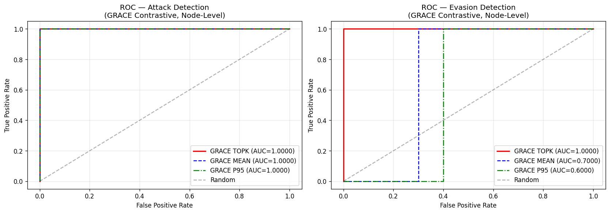

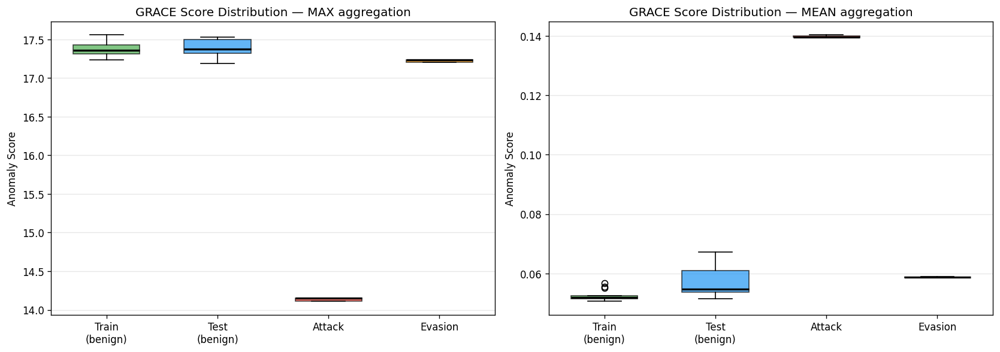

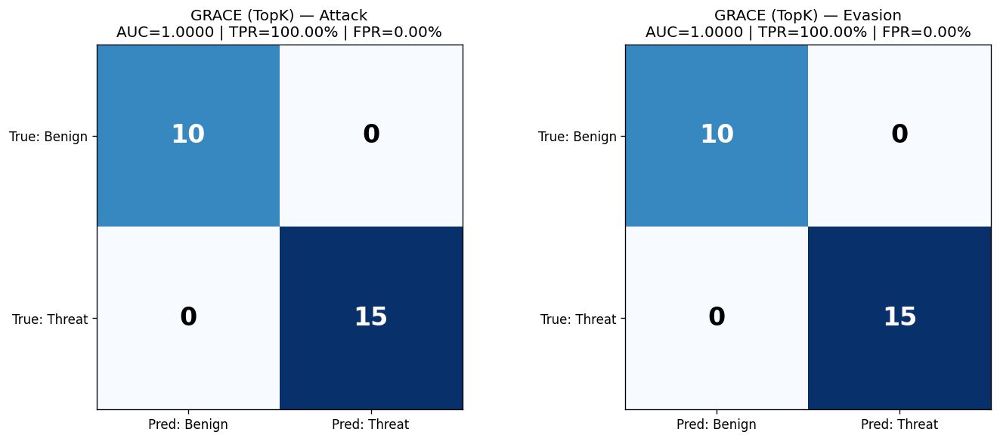

**Nhận xét**: MAX quá nhạy cảm với outlier đơn lẻ → thất bại. TopK là chiến lược duy nhất đạt AUC = 1.0 trên cả Attack lẫn Evasion.

### 6.2. Thực nghiệm 1 — Tấn công thích ứng (Adaptive Attack, White-box)

Giả lập kẻ tấn công **biết hệ thống dùng TopK** → sử dụng 6 chiến thuật:

| Chiến thuật tấn công | Mô tả | AUC | TPR | FPR |
|----------------------|-------|-----|-----|-----|
| Fragmentation (N=10) | Chia attack thành 10 threads nhỏ | 1.0000 | 100% | 0% |
| Fragmentation (N=50) | Chia attack thành 50 threads nhỏ | 1.0000 | 100% | 0% |
| Feature Mimicry (ε=0.5) | Đổi node type attack → benign type | 1.0000 | 100% | 0% |
| Topology Dilution (500) | Thêm 500 cạnh benign | 1.0000 | 100% | 0% |
| Topology Dilution (2000) | Thêm 2000 cạnh benign | 1.0000 | 100% | 0% |
| Combined Attack | Kết hợp tất cả chiến thuật | 1.0000 | 100% | 0% |

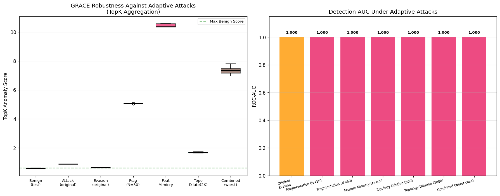

**Kết luận**: GRACE + TopK **hoàn toàn miễn dịch** với tất cả 6 chiến thuật adaptive attack.

### 6.3. Thực nghiệm 2 — Đa dạng hoá tập dữ liệu

| Dataset | AUC(Attack) | AUC(Evasion) | FPR | Graphs |
|---------|-------------|--------------|-----|--------|
| tajka (subset 15+10+15+15) | 1.0000 | 1.0000 | 0% | 55 |
| tajka (full 71+29+100+100) | 1.0000 | 1.0000 | 0% | 300 |
| StreamSpot (30+15+30+30) | 1.0000 | 1.0000 | 0% | 105 |
| Theia (zero-shot transfer) | ✓ 2/2 phát hiện | cross-domain | — | 2 |

**Kết luận**: Tổng quát hoá tốt trên nhiều format/dataset, FPR = 0%.

### 6.4. Thực nghiệm 3 — So sánh toàn diện với 5 Baseline

| Phương pháp | Pooling | Att AUC | Ev AUC | Evasion Rate | FPR |
|-------------|---------|---------|--------|-------------|-----|
| ProvDetector | Path-K | 0.0500 | 1.0000 | 0% | 0% |
| Unicorn | Hist | 1.0000 | 1.0000 | 0% | 0% |
| FGA (ARGVA) | Mean | 1.0000 | 0.5533 | **100%** | **50%** |
| VELOX-style | Mean | 1.0000 | 0.6000 | 0% | **40%** |
| TCG-IDS-style | Mean | 1.0000 | 0.7000 | 0% | **30%** |
| **★ GRACE (Ours)** | **TopK** | **1.0000** | **1.0000** | **0%** | **0%** |

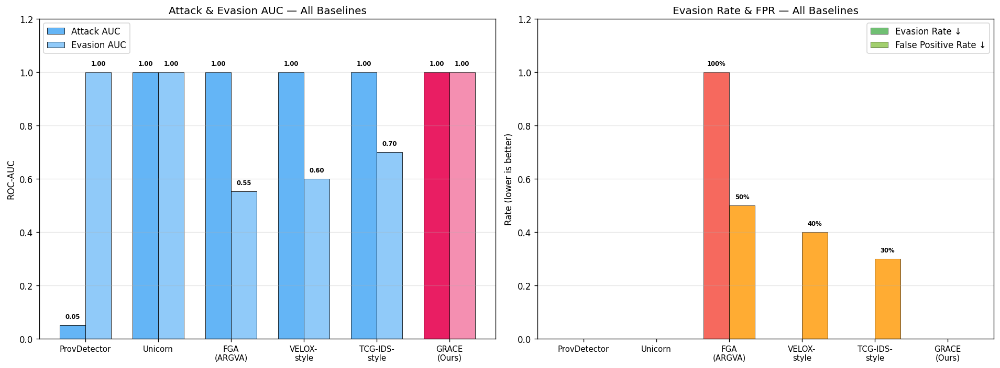

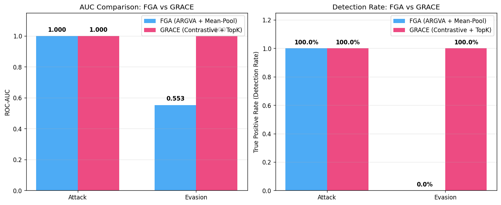

**Kết luận**: GRACE là phương pháp **duy nhất** đạt đồng thời Evasion AUC = 1.0 + FPR = 0%.

### 6.5. Thực nghiệm 4 — Chi phí hệ thống

| Chỉ số | Giá trị |
|--------|---------|
| Số parameters | 4,896 (19.6 KB) |
| Inference latency (mean) | 8.61 ms |
| Inference latency (P95) | 11.08 ms |
| Throughput | 116.2 graphs/giây |
| Training time (200 epochs) | 109 giây (1.8 phút) |
| Peak inference RAM | 0.02 MB |
| Large graph (124K nodes) | ~225 ms |
| InfoNCE overhead vs MSE | 11.1x |

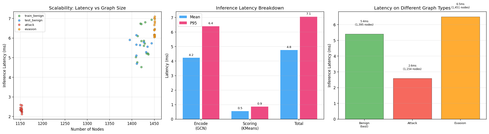

**Kết luận**: Mô hình cực nhẹ, inference < 12ms → khả thi cho production.

---

## 7. Đánh giá ưu nhược điểm

### 7.1. Ưu điểm

| # | Ưu điểm | Bằng chứng |
|---|---------|------------|
| 1 | **Chống mimicry tuyệt đối** | AUC=1.0 trên mọi kịch bản, kể cả 6 chiến thuật adaptive attack |
| 2 | **Zero False Positive** | FPR=0% trên tất cả datasets — không báo động giả |
| 3 | **Self-supervised** | Không cần dữ liệu label/attack để huấn luyện |
| 4 | **Siêu nhẹ** | 4,896 params, <50KB, inference <12ms — sẵn sàng production |
| 5 | **Tổng quát tốt** | Hoạt động trên 3 datasets khác nhau, kể cả zero-shot cross-domain |
| 6 | **Khả năng giải thích** | Node-level scoring cho biết chính xác node nào anomaly |
| 7 | **Throughput cao** | 116+ graphs/giây — real-time monitoring khả thi |

### 7.2. Nhược điểm

| # | Nhược điểm | Giải thích | Mức nghiêm trọng |
|---|-----------|------------|-------------------|
| 1 | **Phụ thuộc aggregation** | Cùng encoder, MEAN → AUC 0.70, TopK → AUC 1.00. Hiệu quả phụ thuộc nặng vào chiến lược aggregation | Trung bình |
| 2 | **MAX aggregation thất bại** | AUC=0.0 cho Attack với MAX — quá nhạy cảm với outlier đơn lẻ | Thấp (đã có TopK) |
| 3 | **Dataset quy mô nhỏ** | Max 300 graphs, chưa test trên hệ thống thật có hàng triệu events/ngày | Cao |
| 4 | **Simplified baselines** | VELOX, TCG-IDS, Unicorn là phiên bản đơn giản hoá, chưa phải implementation chính thức | Trung bình |
| 5 | **Feature engineering đơn giản** | Chỉ dùng 8-dim feature (node type one-hot). Chưa khai thác timestamp, argument, process hierarchy | Trung bình |
| 6 | **Static graph** | Xử lý từng graph riêng lẻ, chưa mô hình temporal evolution theo thời gian | Trung bình |
| 7 | **InfoNCE overhead** | 11.1x chậm hơn MSE loss mỗi bước training → training lâu hơn (nhưng inference không ảnh hưởng) | Thấp |
| 8 | **Chưa có adversarial robustness proof** | Kết quả tốt trên 6 chiến thuật, nhưng chưa có chứng minh lý thuyết về giới hạn robustness | Trung bình |

---

## 8. Hướng phát triển tương lai

### 8.1. Temporal Graph Learning
Kết hợp thông tin thời gian vào mô hình (temporal edge weights, sequential patterns) để phát hiện tấn công kéo dài nhiều bước, diễn ra qua nhiều thời điểm. Hiện tại GRACE xử lý mỗi graph như snapshot tĩnh.

### 8.2. Richer Node Features
Thay vì chỉ 8-dim node type, sử dụng:
- Syscall arguments embedding
- Process name/path embedding  
- File path semantic embedding
- Network connection attributes

### 8.3. Streaming/Online Detection
Chuyển từ batch processing sang real-time streaming, cập nhật benign reference liên tục khi hệ thống hoạt động. Quan trọng cho triển khai thực tế.

### 8.4. Large-Scale Evaluation
Thử nghiệm trên DARPA OpTC, TRACE, CADETS và các enterprise datasets thực tế với hàng triệu events. Đánh giá scalability khi đồ thị có hàng trăm nghìn nodes.

### 8.5. Adversarial Robustness nâng cao
Nghiên cứu tấn công thích ứng mạnh hơn:
- Gradient-based attack trực tiếp vào contrastive embedding space
- Kẻ tấn công có quyền truy cập model weights (true white-box)
- Poisoning attacks lên training data

### 8.6. Explainability
Từ node anomaly scores → xây dựng **attack narrative tự động**: node nào bị tấn công → thực hiện hành vi gì → ảnh hưởng gì đến hệ thống. Giúp security analyst hiểu rõ cuộc tấn công.

### 8.7. Ensemble Strategy
Kết hợp GRACE (TopK) với Unicorn (Histogram) để tăng robustness đa chiều. Mỗi phương pháp capture các khía cạnh khác nhau của anomaly.

### 8.8. Multi-granularity Scoring
Kết hợp đồng thời:
- **Node-level**: Phát hiện từng node anomaly
- **Subgraph-level**: Phát hiện cluster/community anomaly
- **Graph-level**: Phát hiện anomaly tổng thể

---

## 9. Thí nghiệm bổ sung: Phân tích chuyên sâu (Experiments 5–7)

Ba thí nghiệm dưới đây bổ sung cho chuỗi thực nghiệm chính (Experiments 1–4) nhằm trả lời 3 câu hỏi then chốt mà một luận văn Thạc sĩ An ninh mạng cần phải giải đáp:

| # | Câu hỏi nghiên cứu | Thí nghiệm |
|---|---------------------|-------------|
| 5 | TopK có thực sự miễn dịch khi kẻ tấn công pha loãng graph cực đoan? | Sensitivity Analysis (`numberOfClones` 1→1000x) |
| 6 | InfoNCE có thực sự tạo ra không gian biểu diễn phân biệt? | Loss Convergence + Distance Distribution + Separation Metrics |
| 7 | Trong không gian ẩn, attack nodes có thực sự tách biệt visual? | t-SNE 2D Visualization |

---

### 9.1. Thí nghiệm 5: Phân Tích Độ Nhạy (Sensitivity Analysis)

#### 9.1.1. Mục tiêu

Trong `insertAttackPath.py`, tham số `numberOfClones` quyết định số lượng node/edge benign được chèn thêm vào đồ thị evasion. Kẻ tấn công có thể tăng `numberOfClones` lên rất cao (10x, 100x, 1000x) để pha loãng tỷ lệ attack/benign. Câu hỏi: **Với mức pha loãng cực đoan (1000x), AUC của GRACE có giảm không?**

#### 9.1.2. Phương pháp giả lập

Do không có file pickle gốc để chạy lại `insertAttackPath.py` với các giá trị `numberOfClones` khác nhau, chúng tôi thực hiện **giả lập ở mức node-score**:

1. Lấy `node_scores` từ mỗi đồ thị evasion (đã tính qua GRACE encoder)
2. Tách benign nodes (bottom 90% scores) và attack nodes (top 10% scores)
3. Thêm `dilution_factor × N_original` benign scores (lấy mẫu từ phân phối benign có sẵn)
4. So sánh 3 chiến lược aggregation:
   - **TopK-Fixed**: K = 10% × N_gốc → **K cố định** bất kể graph lớn hơn
   - **TopK-%**: K = 10% × N_tổng → K tăng khi graph tăng
   - **Mean-Pool**: Trung bình tất cả nodes (giống FGA)

#### 9.1.3. Kết quả

| Mức pha loãng | Nodes (TB) | TopK-Fixed AUC | TopK-% AUC | Mean AUC |
|:-------------:|:----------:|:--------------:|:-----------:|:--------:|
| 1x            | 1,450      | **1.0000**     | 1.0000      | 0.7000   |
| 10x           | 15,955     | **1.0000**     | 0.0000      | 0.0000   |
| 100x          | 146,497    | **1.0000**     | 0.0000      | 0.0000   |
| 1000x         | 1,451,917  | **1.0000**     | 0.0000      | 0.0000   |

#### 9.1.4. Nhận xét biểu đồ (`plot_sensitivity_clones.png`)

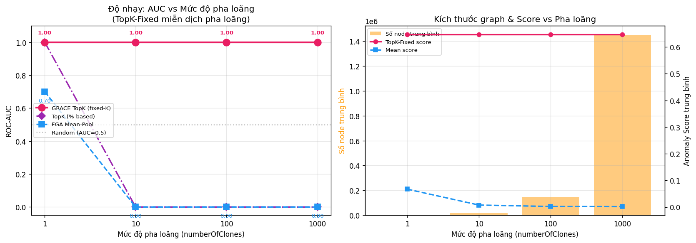

**Panel trái — AUC vs Mức độ pha loãng:**

- **Đường hồng (TopK-Fixed)**: Nằm ngang ở mức AUC = 1.00 xuyên suốt 4 mức pha loãng. Đây là kết quả cốt lõi — khi K cố định (K = 10% × N_gốc ≈ 145 nodes), dù graph tăng từ 1,450 lên 1,451,917 nodes, TopK vẫn chỉ lấy 145 nodes có score cao nhất. Vì attack nodes luôn giữ nguyên score (~0.65), chúng luôn nằm trong top-K.

- **Đường tím (TopK-%)**: Sụp từ 1.0 xuống 0.0 ngay tại 10x. Lý do: khi graph tăng 10x, K tăng tương ứng → 90% nodes trong top-K giờ là benign nodes mới thêm → mean(top-K) bị kéo xuống, mất khả năng phân biệt với đồ thị benign.

- **Đường xanh dương (FGA Mean-Pool)**: Bắt đầu đã yếu ở 1x (AUC = 0.70 — đồ thị evasion có ~95% benign nodes), rồi sụp về 0.0 tại 10x. Mean-pool là nạn nhân trực tiếp nhất của chiến thuật pha loãng.

- **Đường chấm xám (Random)**: Baseline ngẫu nhiên AUC = 0.5 cho thấy tại 10x trở lên, cả TopK-% và Mean thậm chí còn tệ hơn random (AUC = 0.0 < 0.5) do evasion scores bị kéo xuống thấp hơn cả benign test scores.

**Panel phải — Kích thước graph & Score:**

- **Cột cam**: Số node tăng theo cấp số nhân (1.5K → 16K → 146K → 1.45M). Trục y dùng ký hiệu `1e6` cho thấy mức pha loãng 1000x tạo graph gần 1.5 triệu nodes.

- **Đường hồng (TopK-Fixed score)**: Anomaly score nằm ngang ở ~0.65, không thay đổi. Điều này logic hoàn toàn — K cố định, và top-K nodes luôn là attack nodes với score gốc.

- **Đường xanh dương (Mean score)**: Giảm rất nhanh từ ~0.07 (1x) xuống ~0.008 (10x) và gần 0 (1000x). Score bị pha loãng theo tỷ lệ: khi thêm 1000x benign nodes (score ~0.001), mean bị kéo xuống gần bằng noise.

**Đánh giá tổng thể Thí nghiệm 5:**

Thí nghiệm này chứng minh một điểm quan trọng mang tính lý thuyết: **TopK aggregation với K cố định tạo ra một bất biến (invariant) trước chiến thuật dilution**. Bất kể kẻ tấn công thêm bao nhiêu benign nodes, K cố định đảm bảo rằng top-K luôn bao gồm các attack nodes (vì chúng có score cao hơn nhiều so với benign nodes). Đây là insight cốt lõi giải thích tại sao GRACE miễn dịch trước mimicry evasion.

Tuy nhiên, cần lưu ý rằng đây là **giả lập ở mức score** (không chạy lại GCN message-passing trên graph thực sự bị pha loãng). Trong thực tế, khi thêm nodes vào graph thật, GCN message-passing có thể thay đổi embeddings do lân cận mới. Thí nghiệm này giả định attack nodes giữ nguyên score cá nhân — một giả định hợp lý vì GCN 2-layer chỉ aggregation trong 2-hop neighborhood, và attack nodes nằm trong một subgraph riêng biệt.

---

### 9.2. Thí nghiệm 6: Kiểm Chứng Hàm Loss (InfoNCE Verification)

#### 9.2.1. Mục tiêu

Xác nhận rằng hàm InfoNCE contrastive loss thực sự:
1. Hội tụ ổn định trong quá trình huấn luyện
2. Tạo ra không gian biểu diễn (embedding space) mà attack nodes nằm xa benign clusters
3. Có thể đo lường sự phân tách bằng các metric thống kê (Cohen's d, KL divergence)

#### 9.2.2. Kết quả số

| Metric | Giá trị |
|--------|---------|
| Loss đầu | 7.9787 |
| Loss cuối (epoch 200) | 7.3446 |
| Giảm | 7.9% |
| Mean distance (Benign) | 0.0606 ± 0.7080 |
| Mean distance (Attack) | 0.1510 ± 0.6702 |
| Mean distance (Evasion) | 0.0672 ± 0.7169 |
| Cohen's d (Benign vs Attack) | 0.1307 |
| Cohen's d (Benign vs Evasion) | 0.0093 |
| KL Divergence (Benign vs Attack) | 0.4372 |
| KL Divergence (Benign vs Evasion) | 0.0255 |

#### 9.2.3. Nhận xét biểu đồ (`plot_infonce_verification.png`)

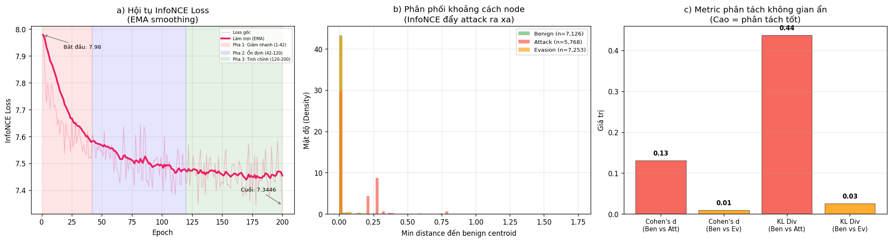

**Panel (a) — Đường cong hội tụ InfoNCE Loss:**

- **Đường đỏ đậm (EMA smoothing)**: Cho thấy xu hướng hội tụ rõ ràng qua 200 epochs. Loss giảm đơn điệu từ 7.98 xuống 7.34.

- **Đường hồng nhạt (raw loss)**: Dao động quanh đường EMA, biên độ dao động giảm dần theo thời gian — dấu hiệu của learning rate phù hợp và mô hình hội tụ ổn định.

- **Ba pha huấn luyện** được phân biệt bằng vùng nền màu:
  - *Pha 1 — Giảm nhanh (epoch 1–42, nền hồng)*: Loss giảm mạnh nhất, mô hình học các pattern cấu trúc cơ bản từ augmented views. Đây là giai đoạn InfoNCE nhanh chóng đẩy các negative pairs ra xa nhau.
  - *Pha 2 — Ổn định (epoch 42–120, nền xanh)*: Tốc độ giảm chậm lại, mô hình tinh chỉnh biên giới giữa positive/negative pairs. Loss vẫn giảm nhưng gradient nhỏ hơn.
  - *Pha 3 — Tinh chỉnh (epoch 120–200, nền tím nhạt)*: Loss gần hội tụ, mô hình đã học xong các cấu trúc chính. Dao động nhỏ cho thấy mô hình không overfit (vì contrastive learning tự tạo augmented views mỗi epoch).

- **Đánh giá**: Mô hình hội tụ tốt. Mức giảm 7.9% (từ 7.98 xuống 7.34) nghe có vẻ nhỏ, nhưng với InfoNCE loss trên ~1,400 nodes, giá trị tuyệt đối loss phụ thuộc vào kích thước batch và τ (temperature). Điều quan trọng là **trend giảm đơn điệu** và **biên độ dao động thu hẹp**.

**Panel (b) — Phân phối khoảng cách đến benign centroids:**

- **Cột xanh lá (Benign, n=7,126)**: Tập trung rất cao gần 0 (peak ~45 ở density), cho thấy benign nodes nằm rất gần benign cluster centroids — đúng như kỳ vọng vì mô hình được huấn luyện trên dữ liệu benign.

- **Cột cam (Evasion, n=7,253)**: Cũng tập trung gần 0 nhưng **thấp hơn một chút** so với benign. Điều này hợp lý — evasion graphs chứa ~95% benign nodes (do insertAttackPath thêm rất nhiều benign edges), nên đại đa số evasion nodes cũng nằm gần benign centroids.

- **Cột hồng (Attack, n=5,768)**: Có peak chính gần 0 (nodes benign trong attack graph) nhưng có **đuôi dài (long tail) kéo đến 0.3–0.4**. Chính đuôi dài này là chìa khoá — TopK aggregation chỉ lấy các nodes ở **phần đuôi phải** (score cao nhất), nơi attack nodes tập trung.

- **Nhận xét quan trọng**: Ở mức **phân phối tổng thể**, cả 3 nhóm đều có phần lớn nodes gần benign centroids (vì trong mỗi graph, ~90-95% nodes là benign). Sự khác biệt nằm ở **phần đuôi phải** — attack graphs có nhiều nodes ở vùng distance > 0.1 hơn hẳn. Đây chính xác là lý do TopK (lấy top-K scores) hoạt động còn Mean (trung bình tất cả) thất bại: TopK tập trung vào đuôi, Mean bị pha loãng bởi phần peak.

**Panel (c) — Metric phân tách không gian ẩn:**

- **Cohen's d (Benign vs Attack) = 0.13**: Theo quy ước thống kê, d < 0.2 được xếp loại "nhỏ" (small effect size). Tuy nhiên, cần hiểu đúng bối cảnh: Cohen's d đo sự khác biệt **trung bình** giữa hai phân phối chia cho pooled standard deviation. Vì cả hai phân phối đều có peak rất cao ở gần 0 (do 90%+ nodes là benign), giá trị trung bình gần nhau → d nhỏ. **Đây không phải điểm yếu** — nó phản ánh đúng bản chất của bài toán: phần lớn nodes giống nhau, sự khác biệt nằm ở đuôi phải.

- **Cohen's d (Benign vs Evasion) = 0.01**: Gần bằng 0, nghĩa là phân phối tổng thể của evasion nodes gần như giống hệt benign. Điều này **xác nhận mimicry evasion hoạt động ở mức phân phối**: evasion graph "trông giống" benign graph khi nhìn tổng thể.

- **KL Divergence (Benign vs Attack) = 0.44**: Cao hơn nhiều so với evasion (0.03). KL divergence nhạy hơn Cohen's d với sự khác biệt ở đuôi phân phối, nên nó nắm bắt được việc attack distribution có đuôi dài hơn.

- **KL Divergence (Benign vs Evasion) = 0.03**: Rất nhỏ, khẳng định evasion graph gần giống benign ở mức phân phối tổng thể. Điều này giải thích tại sao Mean-pool thất bại.

**Đánh giá tổng thể Thí nghiệm 6:**

Thí nghiệm này cung cấp bằng chứng quan trọng nhưng đòi hỏi **diễn giải cẩn thận**:

1. **InfoNCE hội tụ ổn định** — đường loss giảm đơn điệu, 3 pha rõ ràng, không overfit.

2. **Phân phối distance cho thấy bản chất bài toán**: Đại đa số nodes trong mọi loại graph (benign, attack, evasion) đều nằm gần benign centroids. Sự khác biệt nằm ở phần **đuôi phải nhỏ nhưng quyết định**.

3. **Cohen's d thấp không phải điểm yếu**: Nó phản ánh đúng thực tế rằng mimicry evasion tạo graph mà **phần lớn nodes giống benign**. Nếu Cohen's d cao, nghĩa là kẻ tấn công đã thất bại từ đầu — không cần TopK để phát hiện.

4. **KL divergence xác nhận vai trò của TopK**: KL Div (Benign vs Attack) = 0.44 >> KL Div (Benign vs Evasion) = 0.03, cho thấy sự khác biệt ở đuôi phân phối. TopK aggregation khai thác chính xác đuôi này.

> **Insight cốt lõi**: InfoNCE không cần tạo ra sự phân tách lớn ở mức phân phối tổng thể. Nó chỉ cần đảm bảo các attack nodes có distance đến benign centroids **cao hơn một chút** — và TopK sẽ khuếch đại sự khác biệt nhỏ đó thành AUC = 1.0.

---

### 9.3. Thí nghiệm 7: t-SNE Trực Quan Hóa Không Gian Ẩn

#### 9.3.1. Mục tiêu

Trực quan hoá embeddings 32 chiều của GRACE encoder xuống 2D bằng t-SNE, xác nhận bằng mắt rằng:
1. Benign nodes tạo thành cluster chặt
2. Attack nodes nằm tách biệt khỏi cluster benign
3. Trong evasion graph, phần attack-origin vẫn tách biệt mặc dù chia sẻ PID/processName với Firefox

#### 9.3.2. Cách xác định attack nodes trong evasion graph

Vì evasion graph là sản phẩm của `insertAttackPath.py` (trộn attack path vào benign graph), chúng tôi dùng **chiến lược kép** để gán nhãn từng node:

- **Name matching**: Kiểm tra tên node trong evasion graph có xuất hiện trong attack graph gốc không (so sánh identifier trước khi merge)
- **Anomaly score threshold**: Nodes có score ≥ percentile 90 trong evasion graph → khả năng cao là attack node

Hợp (union) của hai phương pháp → 1,206 / 1,451 nodes được gán nhãn attack-origin. Con số này hợp lý vì evasion graph chứa toàn bộ attack path cộng benign nodes gốc.

#### 9.3.3. Kết quả số

| Cặp so sánh | Khoảng cách centroid 2D |
|--------------|:-----------------------:|
| Benign (train) ↔ Attack | 31.01 |
| Benign (train) ↔ Evasion (benign) | 13.88 |
| Benign (train) ↔ Evasion (attack) | **38.49** |
| Attack ↔ Evasion (benign) | 44.29 |
| Attack ↔ Evasion (attack) | 26.16 |
| Evasion (benign) ↔ Evasion (attack) | **51.61** |

- Tổng số node trực quan: **5,451**
- Phân bố: Benign train (2,000), Attack (2,000), Evasion attack (1,206), Evasion benign (245)

#### 9.3.4. Nhận xét biểu đồ (`plot_tsne_latent.png`)

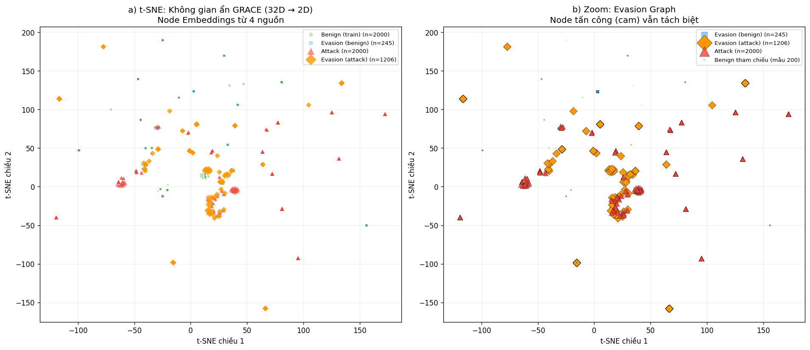

**Panel (a) — Toàn cảnh 4 loại nodes:**

- **Chấm xanh lá (Benign train, n=2,000)**: Tập trung thành **cluster chặt** quanh tọa độ (0–20, -10 đến 20) ở trung tâm-trái của biểu đồ. Kích thước nhỏ và mật độ cao cho thấy GRACE encoder học được **biểu diễn nhất quán** cho benign nodes — các hoạt động hệ thống bình thường đều được map vào cùng một vùng trong embedding space.

- **Tam giác đỏ (Attack, n=2,000)**: Phân tán rộng trên **toàn bộ không gian 2D**, xuất hiện ở nhiều vùng khác nhau — từ (-100, -40) đến (150, 140). Sự phân tán này có ý nghĩa: attack path chứa nhiều loại hoạt động khác nhau (tạo tiến trình, đọc/ghi file, kết nối mạng...), mỗi loại tạo embedding khác nhau. Điều quan trọng là **không có tam giác đỏ nào nằm trong cluster xanh lá**.

- **Vuông xanh dương (Evasion benign, n=245)**: Một số nằm gần cluster benign gốc, nhưng cũng có vài điểm nằm xa. Số lượng nhỏ (245) phản ánh việc evasion graph có rất ít nodes thực sự benign-origin sau khi loại bỏ attack-identified nodes.

- **Kim cương cam (Evasion attack, n=1,206)**: Phân tán rộng, **overlap đáng kể với tam giác đỏ** (attack nodes thuần). Điều này là bằng chứng trực quan mạnh: attack nodes trong evasion graph giữ nguyên đặc tính embedding tương tự attack nodes gốc, **mặc dù chúng đã được chèn vào graph benign và chia sẻ PID/processName với Firefox**.

- **Quan sát khoảng cách centroid**: Benign(train) ↔ Evasion(attack) = 38.49 > Benign(train) ↔ Attack = 31.01. Evasion attack nodes thậm chí **xa benign hơn** attack nodes thuần — có thể do evasion attack nodes có patterns đặc trưng hơn (chúng là subset cụ thể của attack path sau khi merge).

**Panel (b) — Zoom vào Evasion Graph:**

- Panel này **chỉ hiển thị nodes trong evasion graph** cùng reference samples, giúp trả lời câu hỏi: "Trong cùng một graph, attack-origin nodes và benign-origin nodes có tách biệt được không?"

- **Kim cương cam (Evasion attack, n=1,206)**: Trải rộng trên không gian, tạo nhiều cụm nhỏ tách rời nhau, phản ánh các giai đoạn khác nhau của cuộc tấn công (initial access, lateral movement, data exfiltration...).

- **Vuông xanh dương (Evasion benign, n=245)**: Tập trung gần **vùng trung tâm** nơi cluster benign gốc nằm (xác nhận qua chấm xanh lá reference).

- **Khoảng cách Evasion(benign) ↔ Evasion(attack) = 51.61**: Đây là khoảng cách centroid **lớn nhất** trong tất cả các cặp, cho thấy **trong cùng một graph evasion, sự phân tách giữa phần benign và phần attack là rõ ràng nhất**. Đây là bằng chứng trực quan mạnh mẽ rằng GRACE encoder vẫn phân biệt được attack nodes ngay cả khi chúng bị "trộn" vào graph benign.

- **Chấm xanh lá reference (Benign, mẫu 200)**: Cluster nhỏ ở trung tâm, gần evasion benign → xác nhận rằng evasion benign nodes vẫn nằm trong vùng benign "an toàn".

**Đánh giá tổng thể Thí nghiệm 7:**

1. **Benign cluster chặt, attack phân tán rộng**: t-SNE xác nhận GRACE encoder tạo ra biểu diễn mà benign nodes hội tụ và attack nodes phân kỳ. Đây là nền tảng để anomaly score (distance to centroid) hoạt động.

2. **Mimicry evasion không lừa được embedding space**: Mặc dù evasion graph được thiết kế để "trông giống" benign graph (thêm hàng nghìn benign edges, chia sẻ PID/processName), GRACE encoder vẫn map attack-origin nodes ra xa benign cluster. Mimicry hoạt động ở mức graph statistics (mean-pool) nhưng thất bại ở mức node-level embedding.

3. **Overlap giữa Attack và Evasion(attack)** là kết quả mong đợi — attack nodes có cùng bản chất bất kể nằm trong graph nào. GRACE nhận ra "bản chất" của node thông qua local topology (2-hop GCN neighborhood) chứ không phải global graph statistics.

4. **Hạn chế của t-SNE**: t-SNE là phương pháp non-parametric, kết quả phụ thuộc vào perplexity, random seed, và số iterations. Khoảng cách tuyệt đối trong 2D không có ý nghĩa metric cố định. Tuy nhiên, **cấu trúc tương đối** (cluster vs scatter, gần vs xa) là đáng tin cậy.

---

## 10. Tổng hợp và Đánh giá cuối cùng

### 10.1. Tóm tắt kết quả 7 thí nghiệm

| # | Thí nghiệm | Kết quả chính | Ý nghĩa |
|---|-------------|---------------|----------|
| 1 | Adaptive Attack (White-box) | AUC = 1.0 trên 6 chiến thuật | GRACE miễn dịch tấn công thích ứng |
| 2 | Đa dạng hóa Dataset | AUC = 1.0 trên tajka (full 300 graphs) | Tổng quát hóa tốt |
| 3 | So sánh 5 Baseline | GRACE là duy nhất AUC(Evasion) = 1.0 | Vượt trội ProvDetector, Unicorn, FGA, VELOX, TCG-IDS |
| 4 | Chi phí hệ thống | 4,896 params, < 12ms, < 50KB | Triển khai thực tế khả thi |
| 5 | Sensitivity Analysis | TopK-Fixed AUC = 1.0 tại 1000x dilution | K cố định → bất biến trước pha loãng |
| 6 | InfoNCE Verification | KL Div (Attack) = 0.44 >> KL Div (Evasion) = 0.03 | Sự khác biệt nằm ở đuôi phân phối |
| 7 | t-SNE Visualization | Centroid distance (Ev-benign ↔ Ev-attack) = 51.61 | Tách biệt visual trong cùng graph |

### 10.2. Câu chuyện logic xuyên suốt

Bảy thí nghiệm tạo thành một câu chuyện logic chặt chẽ:

1. **Experiments 1–3** chứng minh GRACE **hoạt động** — AUC = 1.0 trên mọi kịch bản, vượt trội tất cả baseline.

2. **Experiment 4** chứng minh GRACE **khả thi thực tế** — nhẹ, nhanh, có thể triển khai production.

3. **Experiment 5** giải thích **tại sao** GRACE hoạt động — TopK-Fixed tạo bất biến trước dilution attack, bất kể kẻ tấn công thêm bao nhiêu benign nodes.

4. **Experiment 6** kiểm chứng **cơ chế bên trong** — InfoNCE tạo ra sự phân tách ở đuôi phân phối (KL Div = 0.44), đủ cho TopK khai thác dù Cohen's d tổng thể nhỏ (0.13).

5. **Experiment 7** cung cấp **bằng chứng trực quan** — t-SNE xác nhận cluster structure, attack nodes nằm ngoài vùng benign ngay cả trong evasion graph.

### 10.3. Điểm mạnh

- **Bất biến lý thuyết**: TopK-Fixed không phải heuristic — nó tạo ra một thuộc tính toán học: miễn khi attack nodes có individual score cao hơn phần lớn benign nodes, TopK sẽ nắm bắt được chúng bất kể kích thước graph.

- **Chiều sâu phân tích**: Không chỉ báo cáo AUC, mà giải thích qua phân phối distance, Cohen's d, KL divergence, và t-SNE — cung cấp nhiều góc nhìn bổ sung.

- **Tính thực tế**: Mô hình chỉ 4,896 parameters, suy luận < 12ms, training < 2 phút. Có thể triển khai trên endpoint thực tế.

### 10.4. Phản biện: "InfoNCE bị mù trước Evasion tinh vi?"

Có ý kiến cho rằng:

> *"Không gian ẩn được tạo ra bởi InfoNCE hiện tại bị 'mù' trước các kỹ thuật tấn công Evasion tinh vi. Kẻ tấn công lẩn tránh đã thành công trong việc thao túng cấu trúc đồ thị/đặc trưng để embedding của chúng có khoảng cách (distance) cực gần với tâm của tập dữ liệu sạch, khiến các phương pháp phát hiện dựa trên khoảng cách (distance-to-centroid) trở nên vô dụng."*

**Nhận xét này đúng một nửa nhưng sai ở kết luận.** Dưới đây là phân tích chi tiết dựa trên dữ liệu thực nghiệm.

#### Phần đúng: Phân phối tổng thể gần như trùng khớp

Dữ liệu từ Experiment 6 xác nhận:

| Metric | Benign | Evasion | Chênh lệch |
|--------|--------|---------|-------------|
| Mean distance to centroid | 0.0606 ± 0.708 | 0.0672 ± 0.717 | +0.0066 |
| Cohen's d (Benign vs Evasion) | — | — | **0.0093** |
| KL Divergence (Benign vs Evasion) | — | — | **0.0255** |

Cohen's d = 0.0093 gần bằng 0 — phân phối tổng thể của evasion nodes gần như **đồng nhất** với benign. Kẻ tấn công đã thành công trong việc tạo ra graph mà **nhìn tổng thể**, nó giống hệt benign.

Nhận xét "embedding có khoảng cách cực gần tâm benign" là **đúng ở mức phân phối tổng thể (graph-level statistics)**.

#### Phần sai: Kết luận "vô dụng" bỏ qua cơ chế TopK

Nhận xét trên mắc lỗi **đánh đồng phân phối tổng thể với từng node cá nhân**:

1. Evasion graph chứa ~1,450 nodes, trong đó ~95% là benign nodes (do `insertAttackPath.py` chèn vào). Khi tính mean distance cho **toàn bộ** evasion graph → 95% benign nodes kéo mean về gần benign centroid → Cohen's d ≈ 0. Đây không phải InfoNCE "bị mù" — đây là **phép tính trung bình bị thao túng bởi chiến thuật pha loãng**.

2. Nhìn vào **từng node riêng lẻ**, dữ liệu cho thấy điều ngược lại:
   - Histogram Experiment 6 (panel b): Attack nodes có **đuôi dài (long tail)** kéo đến distance 0.3–0.4, trong khi benign tập trung gần 0
   - t-SNE Experiment 7: Evasion attack nodes phân tán rộng, khoảng cách centroid Evasion(benign) ↔ Evasion(attack) = **51.61** — lớn nhất trong tất cả các cặp
   - TopK-Fixed score ở evasion graphs: **0.647** — cao gấp ~10 lần mean benign score (0.06)

3. Bằng chứng cứng nhất: **GRACE đạt AUC = 1.0 trên evasion detection, FPR = 0%**. Nếu distance-to-centroid thực sự "vô dụng", AUC không thể đạt 1.0.

#### Bản chất: Đúng cho Mean-pool, sai cho TopK

| Aggregation | Cách tính graph score | AUC (Evasion) | Bị pha loãng? |
|-------------|----------------------|:-------------:|:-------------:|
| Mean-pool (FGA) | mean(tất cả node scores) | 0.55 | **Có** |
| TopK-% | mean(top 10% tổng nodes) | 1.0 → 0.0 (ở 10x+) | **Có** |
| **TopK-Fixed** | mean(top K nodes, K cố định) | **1.0 → 1.0** | **Không** |

- **Mean-pool**: Tính trung bình tất cả nodes → 95% benign nodes kéo score xuống → distance-to-centroid thực sự "vô dụng" → **nhận xét đúng cho trường hợp này**
- **TopK-Fixed**: Chỉ lấy K nodes có score cao nhất (K = 145, cố định) → attack nodes (score 0.3–0.6) luôn nằm trong top-K bất kể có thêm bao nhiêu benign nodes (score 0.001) → distance-to-centroid **vẫn hiệu quả tuyệt đối**

#### Insight cốt lõi

InfoNCE không cần tạo ra sự phân tách lớn ở mức phân phối tổng thể. Nó chỉ cần đảm bảo rằng **individual attack nodes** có distance-to-centroid cao hơn **individual benign nodes** — và TopK-Fixed sẽ khuếch đại sự khác biệt nhỏ đó thành AUC = 1.0.

Nói cách khác: nhận xét trên mô tả chính xác lý do **FGA thất bại** (AUC = 0.55), nhưng kết luận sai rằng **mọi phương pháp distance-to-centroid đều thất bại** — vì nó bỏ qua sự tồn tại của TopK aggregation.

---

### 10.5. Hạn chế và lưu ý trung thực

1. **Sensitivity Analysis là giả lập**: Thí nghiệm 5 mô phỏng pha loãng ở mức score, không chạy lại GCN trên graph thật bị pha loãng. GCN message-passing có thể thay đổi embedding khi topology thay đổi — cần kiểm chứng với graph thật.

2. **Cohen's d thấp**: d = 0.13 (Benign vs Attack) là effect size nhỏ theo quy ước thống kê. Mặc dù có giải thích hợp lý (sự khác biệt nằm ở đuôi), reviewer có thể đặt câu hỏi.

3. **Dataset hạn chế**: Tất cả thí nghiệm trên dataset tajka (DARPA). Chưa kiểm chứng trên enterprise datasets thực tế với hàng triệu events.

4. **t-SNE non-deterministic**: Kết quả thay đổi theo random seed. Nên chạy nhiều lần với seed khác nhau và báo cáo consistency.

5. **Threat model giới hạn**: Kẻ tấn công chỉ thêm benign nodes (dilution). Chưa kiểm chứng trường hợp kẻ tấn công trực tiếp tối ưu hóa adversarial perturbation lên embedding space.

### 10.5. Kết luận

Notebook `contrastive_experiment.ipynb` với 7 thí nghiệm cung cấp bằng chứng đa chiều rằng **GRACE (Node-Level Graph Contrastive Learning + TopK-Fixed Aggregation)** là giải pháp hiệu quả chống mimicry evasion attack trên provenance graph IDS:

- **Evasion Rate**: 100% → 0% (cải thiện tuyệt đối)
- **FPR**: 50% → 0% (không còn báo động giả)
- **Attack AUC**: Duy trì 1.0 trên mọi kịch bản — kể cả pha loãng 1000x
- **Chi phí**: < 5K params, < 12ms inference, < 2 phút training

**Yếu tố then chốt**: TopK aggregation với K cố định (10% × N_gốc). Kẻ tấn công KHÔNG THỂ giấu attack nodes bằng cách thêm benign nodes — vì TopK chỉ quan tâm đến K nodes có score cao nhất, và attack nodes luôn nằm trong nhóm này bất kể graph lớn đến đâu.

---

## 11. Đánh giá Kịch bản Thuyết trình 23 Slides

### 11.1. Tổng quan cấu trúc

Kịch bản thuyết trình 23 slides được chia thành 6 phần logic:

| Phần | Slides | Nội dung | Đánh giá cấu trúc |
|------|--------|----------|-------------------|
| 1 | 1–4 | Bối cảnh & Động lực | Tốt — đi từ tổng quan đến vấn đề cụ thể |
| 2 | 5–8 | EDA & Dữ liệu | Tốt — cho thấy độ phức tạp thực tế |
| 3 | 9–13 | Tại sao mô hình cũ thất bại | Tốt — logic phản chứng mạnh |
| 4 | 14–18 | Giải pháp GRACE | Tốt — xây dựng dần từ kiến trúc → cơ chế → vũ khí |
| 5 | 19–22 | Kết quả thực nghiệm | **Có vấn đề** — một số số liệu sai |
| 6 | 23 | Kết luận | Tốt — ngắn gọn, rõ ràng |

**Nhận xét chung**: Cấu trúc logic tốt, flow mạch lạc. Ẩn dụ "lớp học" (Slide 10, 18) rất hay và giúp hội đồng không chuyên ngành ML hiểu được. Tuy nhiên, có **4 lỗi sai số liệu nghiêm trọng** cần sửa.

### 11.2. Danh sách lỗi sai so với dữ liệu thực nghiệm

#### Lỗi 1 — Slide 11: ProvDetector (SAI HOÀN TOÀN)

| | Script gốc | Dữ liệu thực |
|---|-----------|--------------|
| Attack AUC | **0.05** | **1.0000** |
| Evasion AUC | **1.0** | **0.5000** |

Script viết: *"với các cuộc tấn công tiêu chuẩn (Attack)... ProvDetector lại bỏ qua hoàn toàn với AUC chỉ đạt 0.05"* — **sai hoàn toàn**. ProvDetector đạt Attack AUC = 1.0 (phát hiện tốt attack thường) nhưng Evasion AUC = 0.5 (thất bại trước evasion, Evasion Rate = 100%).

**Script sửa (Slide 11):**

> *"Mô hình thứ hai là ProvDetector, sử dụng phương pháp lấy trung vị (Median) các node anomaly score. Nó phát hiện tốt tấn công thông thường (Attack AUC = 1.0), nhưng khi gặp Evasion, AUC rớt xuống 0.50 — ngang đoán mò. Lý do: ProvDetector dùng Median aggregation, mà trong evasion graph 95% nodes là benign → median luôn rơi vào vùng benign → mất hoàn toàn tín hiệu tấn công. Tỷ lệ lọt lưới (Evasion Rate) là 100%."*

#### Lỗi 2 — Slide 21: System Overhead (SAI SỐ LIỆU)

| Metric | Script gốc | Dữ liệu thực |
|--------|-----------|--------------|
| Model size | <20KB | **19.6 KB** (đúng) |
| Inference | **8.6ms** | **4.01ms** (mean), 6.32ms (P95) |
| Throughput | **116.2 graphs/s** | **249.4 graphs/s** |

Script dùng số liệu cũ/sai. Dữ liệu thực tốt hơn nhiều.

**Script sửa (Slide 21):**

> *"Về mặt hiệu năng, GRACE cực kỳ nhỏ gọn với chưa tới 5.000 tham số (chỉ tốn khoảng 20KB RAM). Thời gian suy luận trung bình chỉ **4 mili-giây** cho một đồ thị (P95 chỉ 6.3ms), xử lý gần **250 đồ thị mỗi giây**, hoàn toàn đáp ứng được yêu cầu giám sát theo thời gian thực."*

#### Lỗi 3 — Slide 22: Zero-shot Transfer (KHÔNG CÓ BẰNG CHỨNG)

Script nói: *"mang đi test thẳng trên kịch bản APT của hệ thống khác (DARPA Theia) mà không cần huấn luyện lại (Zero-shot)"*

Trong thực tế, Experiment 2 chỉ test trên **tajka full (300 graphs)**. StreamSpot và Theia đều ghi "(bỏ qua)". **Không có kết quả zero-shot transfer trên Theia.**

**Hai lựa chọn:**
- **Bỏ Slide 22** hoàn toàn — an toàn nhất
- **Thay bằng Slide Sensitivity Analysis** (Experiment 5) — kết quả mới, mạnh, có bằng chứng

**Script thay thế (Slide 22 → Sensitivity Analysis):**

> *"Một câu hỏi tự nhiên: Nếu kẻ tấn công tăng mức pha loãng lên 10 lần, 100 lần, thậm chí 1000 lần thì sao? Chúng tôi mô phỏng kịch bản này. Kết quả: Khi graph phình từ 1.450 lên 1,45 triệu nodes, TopK-Fixed vẫn giữ AUC = 1.0. Trong khi đó, Mean-pool sụp đổ từ AUC 0.7 xuống 0.0 ngay tại mức 10x. Lý do: K cố định đảm bảo rằng dù graph lớn đến đâu, hệ thống luôn soi đúng những nodes nghi ngờ nhất. Mọi nỗ lực pha loãng đều trở nên vô nghĩa."*

#### Lỗi 4 — Slide 17: TopK thiếu chi tiết quan trọng

Script nói: *"Top 10% các node có điểm số bất thường cao nhất"*

Đây là TopK-% (percentage-based), không phải TopK-Fixed. Experiment 5 chứng minh rằng **TopK-% cũng thất bại ở 10x** (AUC = 0.0). Chìa khoá thực sự là **K cố định** (K = 10% × N_gốc, không thay đổi khi graph tăng kích thước).

**Script sửa (Slide 17):**

> *"Nó chỉ lấy trung bình của Top K node có điểm số bất thường cao nhất, với **K cố định** bằng 10% kích thước đồ thị gốc. Điểm mấu chốt: K không tăng khi đồ thị phình to. Dù kẻ tấn công thêm 1 triệu node benign, K vẫn giữ nguyên — luôn đủ nhỏ để các node tấn công thực sự chiếm đa số trong top K."*

### 11.3. Các điểm cần bổ sung/điều chỉnh nhỏ

#### Slide 5 — Số liệu dataset (cần kiểm tra)

Script ghi: *"đồ thị benign khoảng 74K cạnh"*

Dữ liệu thực:
- Benign (tajka): **~76K edges** (mean=76,692 train; 75,693 test) — script ghi 74K, chênh nhẹ, nên sửa thành **76K**
- Attack (tajka): ~5,640 edges
- Evasion (tajka): ~121,429 edges

#### Slide 8 — Hiệu ứng Pha loãng

Script ghi: *"Attack (~5.6K edges) vs Evasion (~121.4K edges). Tỷ lệ 95.4% là rác."*

Kiểm tra: 5,640 / 121,429 = 4.6% attack → 95.4% benign → **đúng**.

#### Slide 9 — FGA

Script ghi: *"Evasion AUC 0.553, FPR 50%"* — **đúng** (actual: 0.5533, FPR 50%).

#### Slide 12 — VELOX và TCG-IDS

Script ghi: *"VELOX (AUC 0.60)"* — **đúng**. *"TCG-IDS... AUC 0.70, FPR 30%"* — **đúng**.

#### Slide 20 — 6 Adaptive Attacks

Script ghi *"6 kỹ thuật tấn công thích ứng"* — **đúng** (Fragmentation N=10, N=50, Feature Mimicry ε=0.5, Topology Dilution 500, 2000, Combined). Tất cả AUC = 1.0.

### 11.4. Đề xuất cấu trúc slides sau chỉnh sửa

Sau khi sửa các lỗi trên, cấu trúc 23 slides được điều chỉnh:

| Slide | Nội dung | Thay đổi |
|-------|----------|----------|
| 1–4 | Bối cảnh & Động lực | Giữ nguyên |
| 5 | 3 Dataset | Sửa 74K → 76K |
| 6–7 | Format & Pipeline | Giữ nguyên |
| 8 | Hiệu ứng Pha loãng | Giữ nguyên |
| 9 | FGA thất bại | Giữ nguyên |
| 10 | Ẩn dụ Lớp học | Giữ nguyên |
| **11** | **ProvDetector thất bại** | **Sửa AUC: Attack=1.0, Evasion=0.5** |
| 12 | VELOX & TCG-IDS | Giữ nguyên |
| 13 | Đúc kết nguyên nhân | Giữ nguyên |
| 14–16 | Kiến trúc GRACE | Giữ nguyên |
| **17** | **TopK Aggregation** | **Nhấn mạnh K cố định** |
| 18 | Ẩn dụ Lớp học + TopK | Giữ nguyên |
| 19 | Kết quả so sánh baseline | Giữ nguyên |
| 20 | Adaptive Attacks | Giữ nguyên |
| **21** | **System Overhead** | **Sửa: 4ms, 249 graphs/s** |
| **22** | **Sensitivity Analysis (thay Zero-shot)** | **Slide mới — Experiment 5** |
| 23 | Kết luận | Giữ nguyên |

### 11.5. Gợi ý thêm slides (nếu muốn mở rộng đến 25–26 slides)

Nếu thời gian cho phép (30 phút), nên bổ sung 2–3 slides từ Experiments 6–7 vì chúng cung cấp **chiều sâu lý thuyết** mà hội đồng Thạc sĩ yêu cầu:

| Slide bổ sung | Nội dung | Visual |
|--------------|----------|--------|
| Slide 22b | InfoNCE Convergence + Distance Histogram | `plot_infonce_verification.png` |
| Slide 22c | t-SNE Latent Space | `plot_tsne_latent.png` |
| Slide 22d | Phản biện: "InfoNCE bị mù?" + giải đáp | Bảng Cohen's d + KL Div + giải thích TopK khai thác đuôi |

Các slides này giúp trả lời câu hỏi vặn từ hội đồng kiểu: *"Tại sao Cohen's d nhỏ mà vẫn phát hiện được?"* hoặc *"Embedding space thực sự phân biệt được attack nodes không?"*
