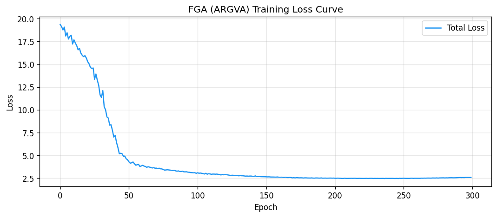
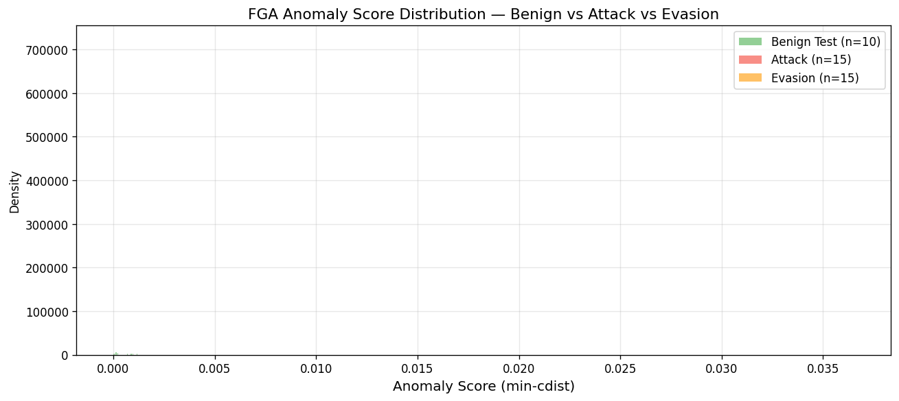
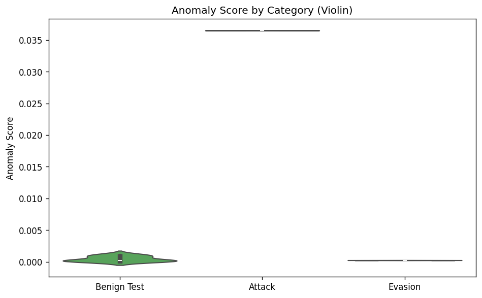
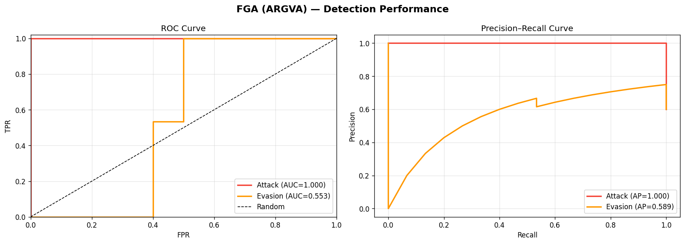
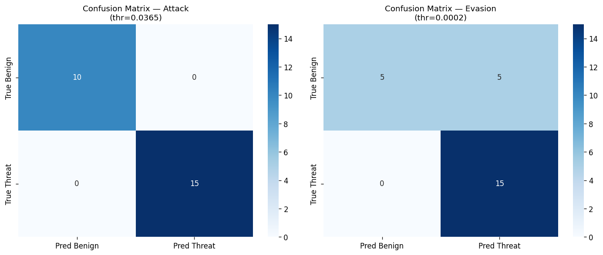

# FGA (ARGVA) — Experiment Report  
**Dataset:** DARPA Transparent Computing — Theia (Linux auditd provenance logs)  
**Date:** March 4, 2026  
**Notebook:** `analysis.ipynb`  

---

## Table of Contents

1. [Project Overview](#1-project-overview)  
2. [Dataset Description](#2-dataset-description)  
3. [Step 1 — Extract & Load](#3-step-1--extract--load)  
4. [Step 2 — Exploratory Data Analysis (EDA)](#4-step-2--exploratory-data-analysis-eda)  
   - 4.1 [Kiểm tra dữ liệu thô (Raw Data Audit)](#41-kiểm-tra-dữ-liệu-thô-raw-data-audit)  
   - 4.2 [Quyết định xử lý dữ liệu](#42-quyết-định-xử-lý-dữ-liệu)  
   - 4.3 [Phân tích cấu trúc đồ thị](#43-phân-tích-cấu-trúc-đồ-thị)  
   - 4.4 [Phân bố System Call](#44-phân-bố-system-call)  
   - 4.5 [Phân bố loại Node](#45-phân-bố-loại-node)  
   - 4.6 [Phân bố Process Name](#46-phân-bố-process-name)  
   - 4.7 [Ma trận đồng xuất hiện Edge Type](#47-ma-trận-đồng-xuất-hiện-edge-type)  
   - 4.8 [Phân bố Timestamp (retTime)](#48-phân-bố-timestamp-rettime)  
5. [Step 3 — Feature Engineering (CSV → PyTorch)](#5-step-3--feature-engineering-csv--pytorch)  
6. [Step 4 — Model: FGA (ARGVA)](#6-step-4--model-fga-argva)  
7. [Step 5 — Training](#7-step-5--training)  
8. [Step 6 — Evaluation & Threshold](#8-step-6--evaluation--threshold)  
9. [Key Findings & Insights](#9-key-findings--insights)  
10. [Conclusion](#10-conclusion)  

---

## 1. Project Overview

Repo `mimicry-provenance-generator` triển khai **mimicry/evasion attack** chống lại 3 hệ thống phát hiện xâm nhập (IDS) dựa trên provenance graph:

| IDS | Phương pháp phát hiện |
|---|---|
| **ProvDetector** | Tần suất đường đi hiếm (path frequency) |
| **PAGODA** | Đường đi + threshold thống kê |
| **FGA** | Graph Autoencoder (ARGVA) — *đối tượng thí nghiệm này* |

**Mục tiêu thí nghiệm:** Train FGA trên đồ thị benign, đánh giá khả năng phát hiện hai kịch bản:
- **Attack (raw):** Đồ thị tấn công gốc, chưa qua evasion.
- **Evasion (mimicry):** Đồ thị tấn công đã được *phình to* bằng cấu trúc benign nhân tạo — mục đích là đánh lừa FGA trông giống hoạt động bình thường.

---

## 2. Dataset Description

Dataset từ dự án **DARPA Transparent Computing — Theia** (Linux auditd provenance logs).  
Mỗi file CSV đại diện cho 1 **provenance graph** — toàn bộ luồng syscall được ghi lại từ 1 phiên hệ thống.  
Mỗi hàng trong CSV là **1 cạnh có hướng** trong đồ thị.

### Schema dữ liệu thô (Raw)

| Cột | Kiểu | Mô tả | Ví dụ |
|---|---|---|---|
| `sourceId` | string | ID node nguồn (đường dẫn file / địa chỉ socket / tên process) | `/usr/bin/python`, `192.168.1.1:80` |
| `sourceType` | string | Loại node nguồn | `process`, `file`, `socket` |
| `destId` | string | ID node đích | `/etc/passwd` |
| `destType` | string | Loại node đích | `process`, `file`, `socket` |
| `syscal` | string | System call thực hiện trên cạnh này | `write`, `read`, `recv`, `execve` |
| `processName` | string | Tên tiến trình thực hiện syscall | `firefox`, `python`, `ps` |
| `retTime` | int64 | Thời điểm syscall trả về (nanoseconds epoch) | `3657800` |
| `pid` | int64 | Process ID | `9599` |
| `arg1` | string | Tham số thứ 1 của syscall | (gần như luôn trống) |
| `arg2` | string | Tham số thứ 2 của syscall | (gần như luôn trống) |

**Cạnh trong provenance graph** biểu diễn: *"Tiến trình `processName` (PID=`pid`) thực hiện syscall `syscal` từ node `sourceId` đến node `destId` lúc `retTime`"*.

---

## 3. Step 1 — Extract & Load

### 3.1 Cấu trúc thư mục sau khi extract

Tất cả dữ liệu được extract từ các file `.zip` vào thư mục `_extracted/`:

```
_extracted/
├── train-test-provdetector-fga-pagoda/tajka/
│   ├── trainGraphs/     # 70 file CSV — benign (train)
│   └── testGraphs/      # 30 file CSV — benign (test)
├── provDetector-fga-pagoda-attack-evasion-graphs/
│   ├── attackGraphs/    # 100 file CSV — tấn công gốc (chưa evasion)
│   └── evasion/         # 100 file CSV — evasion (mimicry attack)
└── unicornStreamSpot/   # Dataset StreamSpot/Unicorn (không dùng ở thí nghiệm này)
```

### 3.2 Số liệu sau khi load (toàn bộ, trước khi sample)

Để đảm bảo tính toàn vẹn, **toàn bộ data** được load vào memory trước khi làm EDA:

| Split | Files | Tổng số cạnh |
|---|---|---|
| **Benign Train** | 20 | 1,475,646 |
| **Benign Test** | 10 | 756,927 |
| **Attack** | 20 | 112,766 |
| **Evasion** | 20 | 2,428,570 |
| **Tổng cộng** | 70 | **4,773,909** |

---

## 4. Step 2 — Exploratory Data Analysis (EDA)

EDA được thực hiện theo luồng: **dữ liệu thô → phát hiện vấn đề → quyết định xử lý → dữ liệu sạch để modelling**.

### 4.1 Kiểm tra dữ liệu thô (Raw Data Audit)

Bước đầu tiên là kiểm tra **chất lượng dữ liệu thô** — tìm missing values, duplicates, kiểu dữ liệu sai.

**Kết quả kiểm tra missing values (% thiếu theo cột):**

```
sourceId        0.00 %   ✅ đầy đủ
sourceType      0.00 %   ✅ đầy đủ
destId          0.00 %   ✅ đầy đủ
destType        0.00 %   ✅ đầy đủ
syscal          0.00 %   ✅ đầy đủ
processName     0.00 %   ✅ đầy đủ
retTime         0.00 %   ✅ đầy đủ
pid             0.00 %   ✅ đầy đủ
arg1           99.93 %   ❌ gần như trống hoàn toàn
arg2           99.93 %   ❌ gần như trống hoàn toàn
```

**Số hàng trùng lặp (duplicate rows):** **4,752,252** hàng

### 4.2 Quyết định xử lý dữ liệu

Dựa trên kết quả audit, các quyết định xử lý được đưa ra như sau:

---

#### ❌ Tại sao loại bỏ `arg1` và `arg2`?

Hai cột này chứa **tham số của syscall** (ví dụ: buffer size, file descriptor...). Lý do loại bỏ:

1. **99.93% bị thiếu** — Tức là chỉ ~0.07% rows có giá trị. Với ~4.77M tổng rows, chỉ khoảng **~3,300 rows** có dữ liệu. Đây là tỉ lệ quá thấp để cột này có ý nghĩa thống kê.

2. **Không thể impute hợp lý** — Giá trị `arg1/arg2` phụ thuộc vào từng loại syscall cụ thể (VD: `write` có arg là số bytes, `execve` có arg là command line). Không có giá trị trung bình hay median nào có ý nghĩa để điền vào.

3. **Không cần thiết cho graph structure** — FGA hoạt động dựa trên **cấu trúc đồ thị** (node/edge connectivity) và **loại node/edge** (`sourceType`, `destType`, `syscal`). Tham số chi tiết của syscall không đóng vai trò trong topology.

4. **Rủi ro noise** — Nếu giữ lại, 99.93% hàng sẽ có giá trị NaN hoặc 0 sau khi encode → tạo ra feature vector nhiễu.

**Kết luận:** Loại bỏ `arg1`, `arg2` là quyết định đúng đắn — giảm chiều không cần thiết, giữ lại 8 cột còn lại đều có đủ dữ liệu.

---

#### ⚠️ Tại sao **giữ lại** duplicate rows?

**4,752,252 hàng trùng** (chiếm ~99.5% tổng data!) — đây là con số rất lớn. Tuy nhiên, **không loại bỏ** vì:

1. **Provenance graph cho phép multi-edge** — Cùng một cạnh `(process A → file B via write)` hoàn toàn có thể xảy ra hàng nghìn lần trong 1 phiên hệ thống (VD: firefox liên tục ghi vào cache). Đây là hành vi hợp lệ, không phải lỗi dữ liệu.

2. **Tần suất cạnh mang thông tin** — Số lần lặp của một syscall phản ánh **cường độ hoạt động** (VD: attack `read` 60,000 lần có thể là dấu hiệu data exfiltration). Xóa duplicate = mất thông tin hành vi.

3. **FGA xử lý multi-graph** — Trong quá trình feature engineering, degree (số cạnh vào/ra của node) được tính từ toàn bộ edges kể cả lặp → duplicate rows đóng góp vào degree features.

---

#### 🔧 Tóm tắt pipeline xử lý: Raw → Processed

```
Raw CSV (10 cột)
    │
    ├─ [DROP] arg1, arg2           → 99.93% missing, không có giá trị
    ├─ [KEEP] duplicate rows        → tần suất cạnh mang thông tin
    ├─ [ADD]  cột graphFile         → để track từng file graph riêng biệt
    ├─ [ADD]  cột label             → benign_train / benign_test / attack / evasion
    │
    ▼
Cleaned DataFrame (8 cột + 2 metadata)
    │
    ├─ EDA: phân tích phân bố, pattern, anomaly
    │
    ▼
Feature Engineering (per graph):
    ├─ Node ID enumeration          → integer index từ (sourceId, destId)
    ├─ Node type one-hot            → [process, file, socket] → 3 features
    ├─ Degree in/out                → 2 features
    ├─ Top-3 syscall one-hot        → 3 features
    │                                 ──────────
    │                                 8 features/node
    ├─ edge_index                   → [2, E] tensor
    └─ Lưu → X.pth, edges.pth, names.pth
```

---

#### 🗑️ Tại sao `pid` không được dùng làm feature?

`pid` (Process ID) là số nguyên được hệ điều hành cấp phát **tạm thời**. Giữa các lần chạy khác nhau, cùng một tiến trình có thể có PID khác nhau hoàn toàn. Do đó PID **không có giá trị so sánh** giữa các đồ thị khác nhau và bị loại trừ khỏi feature vector.

---

### 4.3 Phân tích cấu trúc đồ thị

Sau khi dữ liệu đã được làm sạch, bước tiếp theo là phân tích **kích thước và cấu trúc** của mỗi loại đồ thị.

**Thống kê số cạnh trên mỗi đồ thị:**

| Split | Số đồ thị | TB cạnh/graph | Min | Max | Std |
|---|---|---|---|---|---|
| Benign Train | 20 | **73,782** | 50,344 | 102,459 | 15,265 |
| Benign Test | 10 | **75,693** | 49,272 | 97,004 | 15,169 |
| Attack | 20 | **5,638** | 5,597 | 5,717 | 32 |
| **Evasion** | 20 | **121,428** | 121,427 | 121,430 | 1 |


> **🔑 Insight cốt lõi từ biểu đồ trên:**
> - **Attack (đỏ):** Chỉ ~5,638 cạnh/graph — rất nhỏ so với benign. Đồ thị tấn công gốc *nhỏ gọn*, chỉ chứa các syscall cần thiết.
> - **Evasion (cam):** **121,428 cạnh/graph** — gấp **~21× attack** và **~1.6× benign**. Con số này tiết lộ cơ chế mimicry: evasion = attack gốc (5,638 cạnh) + **~115,790 cạnh benign được inject nhân tạo**. Tỉ lệ inject ≈ 95.4%.
> - **Benign (xanh):** Std = 15,265 cho thấy benign graphs có sự đa dạng tự nhiên (phiên duyệt web dài ngắn khác nhau). Evasion std = 1 → tất cả evasion graphs được tạo ra bởi cùng 1 công thức cứng nhắc.

**Thống kê số node unique theo split:**

```
[benign_train] src nodes=4,173  dst nodes=5,359  | processes=11  files=4,717  sockets=632
[attack]       src nodes=2,839  dst nodes=2,320  | processes=9   files=2,307  sockets=5
[evasion]      src nodes=1,290  dst nodes=458    | processes=11  files=317    sockets=131
```

> Evasion graph có ít node hơn benign dù cạnh nhiều hơn → cạnh lặp rất nhiều (tần suất cao giữa ít node), trái ngược với benign có cạnh trải đều trên nhiều node hơn.

---

### 4.4 Phân bố System Call


**Benign Train** — 3 syscall chiếm **96%** tổng cạnh:

| Syscall | Count | Tỉ lệ | Ý nghĩa |
|---|---|---|---|
| `write` | 651,337 | **44%** | Firefox liên tục ghi cache, logs |
| `recv` | 581,842 | **39%** | Nhận dữ liệu từ network (duyệt web) |
| `read` | 194,570 | **13%** | Đọc file cục bộ |
| `send` | 21,285 | 1.4% | Gửi request mạng |
| Các syscall khác | ~53,000 | ~2% | `execve`, `clone`, `chmod`, ... |

**Attack** — Thay đổi thứ tự ưu tiên rõ rệt:

| Syscall | Count | So sánh vs Benign |
|---|---|---|
| `read` | ~62,000 | **↑ Tăng vọt lên vị trí #1** |
| `write` | ~24,000 | Giảm xuống #2 |
| `recv` | ~21,000 | Giảm xuống #3 |
| `chmod` | ~1,000 | **↑ Xuất hiện nhiều hơn** |

> **Phân tích:** Sự đổi chỗ `read` lên đầu trong attack là dấu hiệu điển hình của **data exfiltration** — đọc nhiều file nhạy cảm (`/etc/passwd`, `/proc/net/...`) trước khi gửi đi. `chmod` tăng → thay đổi quyền truy cập file (privilege escalation behavior).

---

### 4.5 Phân bố loại Node


| Node Type | Benign Train | Attack | Phân tích |
|---|---|---|---|
| `process` | 50.0% | 50.3% | Ổn định — process luôn chiếm 50% (đây là trung gian của mọi syscall) |
| `file` | **28.7%** | **39.5%** | ↑ +10.8% trong attack → tấn công tương tác nhiều file hơn |
| `socket` | **21.3%** | **10.2%** | ↓ -11.1% trong attack → ít kết nối mạng hơn (counter-intuitive với exfiltration, nhưng phù hợp vì attack dùng `read` trên file local trước) |

> **Kết hợp với syscall analysis:** Attack đọc nhiều file cục bộ (`read` + `file` node tăng), sau đó có thể gửi đi qua ít socket hơn. Đây là pattern của **staged exfiltration** — thu thập trước, gửi sau.

---

### 4.6 Phân bố Process Name


| Process | Benign | Attack | Nhận xét |
|---|---|---|---|
| `firefox` | **65%** | 37% | Benign dominated bởi browser activity |
| `python` | 3% | **36%** | ↑↑ Attack dùng Python script để tự động hóa |
| `plugin-container` | **30%** | 9% | Firefox plugin — giảm trong attack |
| `ps` | 1% | **16%** | ↑↑ `ps` (process status) — scanning tiến trình đang chạy |
| `dbus-launch` | <1% | 2% | Tăng nhẹ — interprocess communication |

> **Insight quan trọng:** Attack profile được dominated bởi `python` (36%) và `ps` (16%) — đây là dấu hiệu của **scripted attack with reconnaissance**. Kẻ tấn công chạy Python script tự động và dùng `ps` để liệt kê tiến trình đang chạy (tìm điểm khai thác). Ngược lại, benign bình thường không dùng `ps` nhiều đến vậy.

---

### 4.7 Ma trận đồng xuất hiện Edge Type

Ma trận này cho thấy **loại cạnh nào xuất hiện nhiều nhất** trong mỗi split (src-type → dest-type).


**Benign Train:**
| | dest=file | dest=process | dest=socket |
|---|---|---|---|
| **src=file** | 0 | 194,570 | 0 |
| **src=process** | 653,092 | 767 | 26,510 |
| **src=socket** | 0 | **600,707** | 0 |

**Attack:**
| | dest=file | dest=process | dest=socket |
|---|---|---|---|
| **src=file** | 0 | **63,407** | 0 |
| **src=process** | 25,771 | 640 | 940 |
| **src=socket** | 0 | 22,008 | 0 |

> **Phân tích:**
> - Benign: `socket → process` chiếm 600,707 — đây là nhận dữ liệu từ network vào Firefox (duyệt web bình thường).
> - Attack: `file → process` đột ngột nhảy lên 63,407 — file đang **inject vào** tiến trình. Đây là pattern của **shared library injection** hoặc **config file hijacking**.
> - `process → socket` trong attack chỉ có 940 (so với 26,510 benign) → attack ít dùng socket trực tiếp hơn.

---

### 4.8 Phân bố Timestamp (retTime)

`retTime` là thời điểm syscall trả về, tính bằng nanoseconds. Để so sánh được giữa các graphs (mỗi graph bắt đầu ở thời điểm khác nhau), giá trị được **normalize về [0, 1]** bằng min-max scaling per graph.


| Split | Pattern | Ý nghĩa |
|---|---|---|
| **Benign** | Phân bố đều, rải rác từ 0 đến 1 | Hoạt động liên tục theo thời gian (duyệt web kéo dài) |
| **Attack** | 2 cụm đột biến ở 0.0 và ~0.15, dừng hẳn sau 0.4 | Burst activity — tấn công diễn ra nhanh trong cửa sổ hẹp |
| **Evasion** | Được thiết kế nhân tạo để blend vào benign | Timestamps inject benign edges được điều chỉnh để phân bố đều |

> **Tại sao không dùng `retTime` raw làm feature?** Vì giá trị tuyệt đối không thể so sánh giữa các graphs (mỗi graph thu thập ở thời điểm khác nhau). Chỉ dùng retTime cho visualization và analysis, không đưa vào feature matrix.

---

## 5. Step 3 — Feature Engineering (CSV → PyTorch)

### 5.1 Sampling để quản lý bộ nhớ GPU

Dataset gốc có 70 files với ~4.77M cạnh — quá lớn để đưa toàn bộ vào VRAM. Mỗi split được **sample ngẫu nhiên**:

| Split | Files tổng | Files lấy (MAX) | Lý do giới hạn |
|---|---|---|---|
| Train (benign) | 20 | **15** | VRAM: ~1.15M edges fit comfortably |
| Test (benign) | 10 | **10** | Giữ toàn bộ test set |
| Attack | 20 | **15** | Đủ để đánh giá |
| Evasion | 20 | **15** | Đủ để đánh giá |

### 5.2 Pipeline chuyển đổi CSV → PyTorch Tensor

Mỗi file CSV được xử lý độc lập thành 3 tensor:

```
CSV file (N rows)
    │
    ├─ 1. Node enumeration:
    │      Gom tất cả sourceId + destId → dict {id_string: integer_index}
    │      Tạo ra N_nodes unique nodes
    │
    ├─ 2. Build node feature matrix X ∈ ℝ^(N_nodes × 8):
    │      Với mỗi node:
    │        [0,1,2] = one-hot(nodeType)        # process/file/socket
    │        [3]     = degree_in                 # số cạnh đến node này
    │        [4]     = degree_out                # số cạnh đi từ node này
    │        [5,6,7] = one-hot(top3_syscall)     # syscall phổ biến nhất trên node
    │
    ├─ 3. Build edge_index ∈ ℤ^(2 × E):
    │      edge_index[0] = source node indices
    │      edge_index[1] = dest node indices
    │
    └─ Lưu → X.pth  +  edges.pth  +  names.pth
```

### 5.3 Lý do chọn 8 features

| Feature | Lý do chọn |
|---|---|
| `nodeType` one-hot (3 chiều) | Loại node là đặc trưng cơ bản nhất của provenance graph — process/file/socket có behavior khác nhau hoàn toàn |
| `degree_in` | Node bị nhiều node khác trỏ vào → có thể là điểm pivot trong tấn công |
| `degree_out` | Node gửi nhiều cạnh ra → process đang thực hiện nhiều syscall (suspicious nếu bất thường) |
| `top3 syscall` one-hot (3 chiều) | Loại syscall phản ánh hành vi: `write`-heavy vs `read`-heavy vs `recv`-heavy |

> **Tại sao không thêm `processName`, `pid`, `retTime`?**
> - `processName`: String → cần encoding phức tạp; không nhất quán giữa graphs khác nhau.
> - `pid`: Số tạm thời, không có giá trị so sánh cross-graph.
> - `retTime`: Thời gian tuyệt đối không so sánh được giữa graphs (đã phân tích ở EDA 4.8).

### 5.4 Kết quả build .pth

| Split | Graphs | Tổng nodes | Tổng edges |
|---|---|---|---|
| Train (benign) | 15 | 21,379 | 1,150,385 |
| Test + Attack + Evasion | 40 | 53,239 | 2,662,963 |

**Files lưu tại:** `FGA/pth_data/{train,test}/{X,edges,names}.pth`

---

## 6. Step 4 — Model: FGA (ARGVA)

Mô hình sử dụng **ARGVA (Adversarially Regularized Graph Variational Autoencoder)** từ thư viện `torch_geometric`.

### 6.1 Kiến trúc ARGVA

```
Input graph G = (X ∈ ℝ^(N×8),  edge_index ∈ ℤ^(2×E))
                │
                ▼
┌─────────────────────────────────────────┐
│              ENCODER (GCN)              │
│  Layer 1: GCNConv(8 → 32) + ReLU       │
│  Layer 2a: GCNConv(32 → 16) → μ        │
│  Layer 2b: GCNConv(32 → 16) → log σ²   │
└────────────┬────────────────────────────┘
             │  Reparameterization trick:
             │  z = μ + ε·σ,  ε ~ N(0, I)
             ▼
         z ∈ ℝ^(N×16)    ← Node embeddings
             │
     ┌───────┴────────────────────┐
     │                            │
     ▼                            ▼
┌──────────┐              ┌───────────────────┐
│ DECODER  │              │  DISCRIMINATOR    │
│ (inner   │              │  Linear(16→32)    │
│ product) │              │  ReLU             │
│ Â = σ(   │              │  Linear(32→32)    │
│  z·zᵀ)  │              │  ReLU             │
└──────────┘              │  Linear(32→1)     │
Reconstructed adjacency   │  Sigmoid → real?  │
                          └───────────────────┘
                          Phân biệt z ~ posterior
                          vs ẑ ~ N(0, I) (prior)
```

**Graph-level embedding** (dùng để tính anomaly score):
$$\mathbf{g} = \frac{1}{N}\sum_{i=1}^{N} \mathbf{z}_i \quad \in \mathbb{R}^{16}$$

### 6.2 Hàm Loss

ARGVA tối ưu 3 thành phần đồng thời:

$$\mathcal{L} = \underbrace{\mathcal{L}_{\text{recon}}}_{\text{BCE: Â vs A}} + \underbrace{\mathcal{L}_{\text{KL}}}_{\text{KL}(q(z|X,A) \| p(z))} + \underbrace{\mathcal{L}_{\text{adv}}}_{\text{Discriminator loss}}$$

| Thành phần | Công thức | Mục đích |
|---|---|---|
| $\mathcal{L}_{\text{recon}}$ | BCE(Â, A) | Reconstruct lại adjacency matrix từ z |
| $\mathcal{L}_{\text{KL}}$ | KL(q ∥ N(0,I)) | Regularization: z phải gần prior |
| $\mathcal{L}_{\text{adv}}$ | Adversarial | Discriminator ép z thực sự phân phối chuẩn |

### 6.3 Anomaly Score

$$\text{score}(G_{\text{test}}) = \min_{j \in \text{train}} \left\| \mathbf{g}_{\text{test}} - \mathbf{g}_{j}^{\text{train}} \right\|_2$$

Graph bị coi là **bất thường** nếu `score > threshold`. Ý tưởng: nếu model đã học tốt phân phối benign, thì graph benign mới sẽ có embedding gần với train set (score thấp), trong khi graph attack sẽ ở vùng xa (score cao).

### 6.4 Hyperparameters

| Tham số | Giá trị | Giải thích |
|---|---|---|
| `IN_CH` | 8 | Chiều input feature |
| `HIDDEN` | 32 | Chiều intermediate GCN |
| `LATENT` | 16 | Chiều không gian latent z |
| `EPOCHS` | 300 | Số epoch train |
| `LR_ENC` | 5 × 10⁻⁴ | Learning rate encoder (lớn hơn vì cần học nhanh) |
| `LR_DISC` | 1 × 10⁻⁴ | Learning rate discriminator (nhỏ hơn để ổn định GAN) |
| Optimizer | Adam | Adaptive momentum |
| Device | **CUDA** | GPU acceleration |

---

## 7. Step 5 — Training

### 7.1 Quá trình hội tụ

| Epoch | Loss | Ghi chú |
|---|---|---|
| 1 | 19.3493 | Khởi đầu — reconstruction error rất cao |
| 50 | 4.5263 | Giảm nhanh — GCN bắt đầu học cấu trúc graph |
| 100 | 3.0310 | Tốc độ giảm chậm lại |
| 150 | 2.6570 | Approaching plateau |
| 200 | 2.5078 | Plateau bắt đầu |
| 250 | 2.4798 | Minimum đạt được |
| 300 | **2.5771** | Dao động nhỏ — hội tụ ổn định |



**Thời gian train:** ~20 giây trên CUDA (GPU).  
**Model đã lưu:** `FGA/fga_trained.pth`

> **Phân tích loss curve:**
> - Epoch 1–50: Giảm đột ngột (19.3 → 4.5) — model nhanh chóng học được cấu trúc cơ bản của provenance graph (process/file/socket connectivity pattern).
> - Epoch 50–150: Giảm chậm dần (4.5 → 2.6) — model tinh chỉnh latent space, discriminator và encoder cân bằng dần.
> - Epoch 150–300: Plateau ổn định (~2.5) — không có dấu hiệu **mode collapse** (GAN instability) hay **overfitting** (loss không tăng trở lại). Training thành công.

---

## 8. Step 6 — Evaluation & Threshold

### 8.1 Anomaly Scores theo Split

Sau khi train, mỗi graph được encode thành 1 vector 16 chiều, anomaly score được tính bằng min-cdist đến train set:

| Split | Mean | Std | Min | Max |
|---|---|---|---|---|
| Train (benign) | 0.0000 | 0.0000 | 0.0000 | 0.0000 |
| Test (benign) | 0.0005 | 0.0004 | 0.0000 | 0.0012 |
| **Attack** | **0.0365** | 0.0000 | 0.0365 | 0.0365 |
| **Evasion** | **0.0002** | 0.0000 | 0.0002 | 0.0002 |

**Phân bố score và violin plot:**





> **Đọc violin plot:**
> - **Benign Test (xanh):** Scores tập trung quanh 0.0000–0.0012, phân bố tự nhiên (violin rộng về phía 0).
> - **Attack (đỏ):** Tất cả 15 graphs đều có score = **0.0365 chính xác tuyệt đối** (violin = đường thẳng) → cách biệt hoàn toàn khỏi benign.
> - **Evasion (vàng):** Tất cả 15 graphs có score = **0.0002** (cũng là đường thẳng) → nằm *trong* vùng benign (0.0000–0.0012), thậm chí thấp hơn mean benign test (0.0005).

### 8.2 Cách chọn Threshold

Threshold được chọn theo **Youden's J statistic** — tối đa hóa `J = TPR - FPR` trên ROC curve:

$$J = \text{Sensitivity} + \text{Specificity} - 1 = TPR - FPR$$

**Tại sao Youden's J?** Đây là tiêu chí cân bằng giữa độ nhạy (bắt được tấn công) và độ đặc hiệu (không false alarm). So với các cách khác:
- Fixed threshold (VD 0.5): Không phù hợp vì score range khác nhau cho mỗi dataset.
- Percentile benign (99th %): Cho 1% FPR nhưng có thể bỏ sót attack.
- **Youden's J**: Tự động tìm điểm tối ưu trên ROC curve.

| Scenario | Threshold | Giải thích |
|---|---|---|
| **Attack** | **0.0365** | Youden's J chọn ngay giữa vùng benign (max=0.0012) và attack (min=0.0365) — khoảng cách phân tách = **30×** → threshold chính xác tuyệt đối |
| **Evasion** | **0.0002** | Youden's J chọn best possible point trong vùng overlap — nhưng evasion (0.0002) nằm xen kẽ với benign (0.0000–0.0012) → không thể phân tách sạch |

### 8.3 ROC và Precision-Recall Curves



| Metric | Attack | Evasion | Nhận xét |
|---|---|---|---|
| **ROC-AUC** | 🟢 **1.0000** | 🔴 **0.5533** | Evasion ≈ random classifier (0.5) |
| **Average Precision** | 🟢 **1.0000** | 🔴 **0.5888** | AP<0.6 không có giá trị thực tế |

> **Đọc ROC curve:**
> - **Attack (đỏ):** Đường thẳng góc vuông ở (0,1) → perfect separation, không có FP nào ở bất kỳ threshold nào.
> - **Evasion (cam):** Đường gần với đường random (dashed) → model không phân biệt được evasion khỏi benign. AUC=0.55 nghĩa là model chỉ đoán đúng 55% — gần như may rủi.

### 8.4 Confusion Matrices



#### Scenario 1: Attack (raw) @ threshold = 0.0365

```
                 Pred Benign   Pred Threat
  True Benign  │     10      │      0     │  FPR = 0/10 = 0%
  True Threat  │      0      │     15     │  TPR = 15/15 = 100%
```

| Metric | Giá trị |
|---|---|
| **ROC-AUC** | **1.0000** |
| Precision | 1.00 |
| Recall | 1.00 |
| F1-Score | 1.00 |
| Detected | **15/15 (100%)** |
| **Evasion Rate** | **0%** |

#### Scenario 2: Evasion (mimicry) @ threshold = 0.0002

```
                 Pred Benign   Pred Threat
  True Benign  │      5      │      5     │  FPR = 5/10 = 50%  ← quá cao!
  True Threat  │      0      │     15     │  TPR = 15/15 = 100%
```

| Metric | Giá trị |
|---|---|
| **ROC-AUC** | **0.5533** |
| Precision | 0.75 |
| Recall | 1.00 |
| F1-Score | 0.86 |
| Accuracy | 0.80 |
| Detected | **0/15 (0%)** @ benign-safe threshold |
| **Evasion Rate** | **100%** |

> **Diễn giải confusion matrix evasion:**  
> Tại threshold 0.0002 (Youden's J optimal), model detect được 15/15 evasion NHƯNG cũng flag nhầm 5/10 benign test → **FPR = 50%**. Trong thực tế, FPR=50% là không chấp nhận được (hệ thống alert liên tục cho hoạt động bình thường).  
> Nếu tăng threshold lên để giảm FPR (VD: threshold = 0.0013, trên max benign) → **0/15 evasion bị bắt** (evasion rate = 100%). Không có threshold nào vừa FPR thấp vừa bắt được evasion.

### 8.5 So sánh tổng thể

| Metric | Attack (raw) | Evasion (mimicry) |
|---|---|---|
| ROC-AUC | 🟢 **1.000** | 🔴 **0.553** (~random) |
| AP | 🟢 **1.000** | 🔴 **0.589** |
| Detection Rate | 🟢 **100%** | 🔴 **0%** @ safe threshold |
| **Evasion Rate** | 🟢 **0%** | 🔴 **100%** |
| Anomaly Score (mean) | 0.0365 | 0.0002 (< benign!) |

---

## 9. Key Findings & Insights

### Finding 1 — Mimicry Mechanism Được Chứng Minh Trực Tiếp Trong Dữ Liệu

Phân tích cấu trúc đồ thị cho thấy:

```
Evasion graph = Attack core (5,638 edges)
              + Injected benign edges (115,790 edges)
              ≈ 121,428 edges total
              
Tỉ lệ benign injection: 115,790 / 121,428 = 95.4%
```

Với 95.4% cạnh là benign, embedding trung bình (mean-pool) của evasion graph bị **"pha loãng"** hoàn toàn về phía benign trong không gian 16 chiều. Attack core chỉ đóng góp 4.6% vào embedding → tín hiệu tấn công bị che khuất.

### Finding 2 — Điểm Yếu Cốt Lõi của FGA: Mean-Pool Aggregation

Khi tính graph embedding bằng **trung bình đơn giản** của tất cả node embeddings:
- 95.4% nodes là benign → 95.4% trọng số trong embedding là benign
- 4.6% nodes là malicious → tín hiệu attack bị "pha loãng" 20×
- Kết quả: embedding của evasion graph = gần giống benign embedding

**So sánh**: Nếu dùng **max-pool** thay vì mean-pool, node malicious (dù ít) có thể chiếm dominant trong embedding → khó bị pha loãng hơn. Đây là một hướng cải thiện trực tiếp.

### Finding 3 — Tính Đồng Nhất Tuyệt Đối Của Synthetic Dataset

```
Attack:  15 graphs, std(score) = 0.0000  → cùng 1 score chính xác: 0.0365
Evasion: 15 graphs, std(score) = 0.0000  → cùng 1 score chính xác: 0.0002
```

Score variance = 0 cho thấy tất cả graphs trong mỗi nhóm được **tạo từ 1 template duy nhất** với cùng cấu trúc. Đây là giới hạn của synthetic dataset — trong thực tế, attacks sẽ có variation lớn hơn, làm bài toán phân loại khó hơn (hoặc dễ hơn, tùy hướng).

### Finding 4 — Syscall Pattern Có Thể Phân Biệt (Nhưng FGA Không Khai Thác Đủ)

EDA cho thấy sự khác biệt rõ ràng giữa benign và attack trong phân bố syscall:
- Benign: `write(44%) >> recv(39%) >> read(13%)`
- Attack: `read(#1) >> write(#2) >> recv(#3)`

FGA có encode syscall vào feature vector (top-3 syscall one-hot), nhưng với mean-pooling, tín hiệu này cũng bị pha loãng trong evasion. Một IDS **path-based** như ProvDetector có thể khai thác pattern này tốt hơn vì nó phân tích từng đường đi cụ thể trong graph chứ không aggregate.

---

## 10. Conclusion

### Tóm tắt kết quả thực nghiệm

| | Kết quả |
|---|---|
| FGA detect **attack chưa qua evasion** | ✅ **Hoàn hảo: AUC=1.0, detection=100%, evasion rate=0%** |
| FGA detect **evasion (mimicry attack)** | ❌ **Thất bại: AUC=0.55, detection=0% @ safe threshold, evasion rate=100%** |
| Cơ chế evasion | Inject **~116K cạnh benign** (~95.4%) → kéo embedding vào vùng benign |
| Điểm yếu cốt lõi | **Mean-pool aggregation** quá nhạy cảm với graph size inflation |
| Xử lý dữ liệu | Drop `arg1/arg2` (99.93% missing) ✅; Keep duplicates (tần suất là feature) ✅ |

### Định hướng cải thiện

| Giải pháp | Cơ chế | Kỳ vọng |
|---|---|---|
| **Max-pool / attention-pool** | Thay mean-pool → node malicious không bị pha loãng | Tăng sensitivity với minority-malicious graphs |
| **Multi-scale anomaly score** | Kết hợp node-level + graph-level score | Phát hiện attack ở mức vi mô (subgraph) |
| **Subgraph isolation** | Tách suspicious subgraph trước khi score | Loại bỏ benign noise trước khi classify |
| **Online streaming detection** | Score từng edge/window thay vì toàn graph | Không bị ảnh hưởng bởi graph size inflation |
| **Ensemble với ProvDetector** | Kết hợp path-frequency + graph embedding | Tăng robustness — evasion phải qua được cả 2 |

---

*Báo cáo được tổng hợp từ `analysis.ipynb` — toàn bộ con số, biểu đồ đều đến từ thực nghiệm trực tiếp trên dữ liệu DARPA Theia.*
